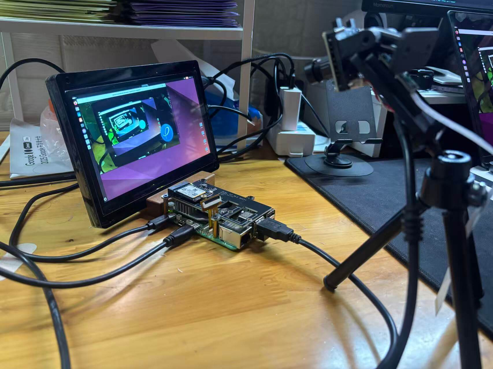
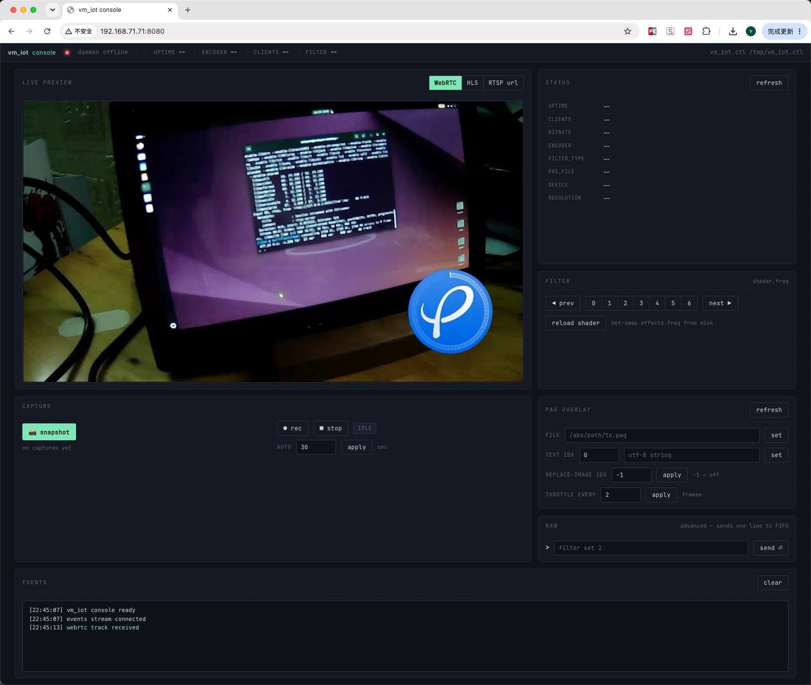
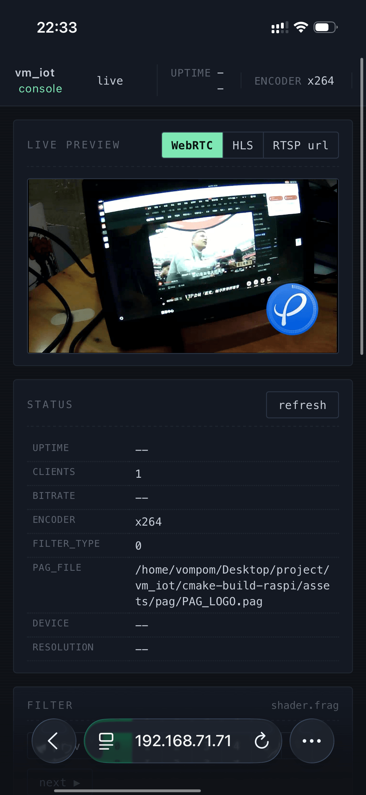
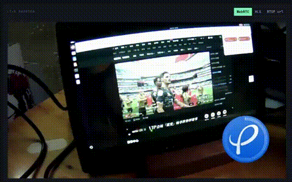
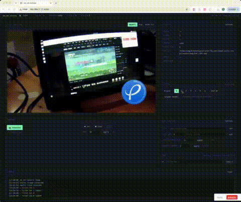
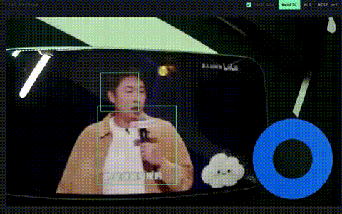

# vm_iot_camera

**English** · [简体中文](README.zh.md)

A small RTSP camera daemon. It reads frames from a V4L2 device, runs an
optional GLSL post-process and libpag effect overlay, encodes the result
with a software H.264 / H.265 backend, and serves the stream through
`gst-rtsp-server`. A companion web console gives you visual control over
the daemon, and a second binary `vm_iot_ctl` talks to the running daemon
over a pair of FIFOs so you can switch effects, take snapshots, query
status and more — all without restarting the stream. UVC hot-plug is
self-healing at runtime: the daemon keeps running, the browser tab does
not need to be refreshed, and the picture comes back on its own within
1–3s.

It is meant for Linux IoT and edge boxes where you want one
config-driven binary instead of a hand-maintained `gst-launch` shell
script.

The project is developed and validated on a **Raspberry Pi 5 (8 GB)**
running **Ubuntu 24.04**, with a USB UVC webcam plugged into the front
USB port. The daemon, the control FIFO, and the web console all run on
this single box.

<p align="center">
  
</p>

---

## Demo

The screenshots and screen recordings below are captured from a live
run, covering the desktop / mobile web console, live stream playback,
console interaction and face-detection overlay.

<table>
  <tr>
    <td align="center" width="50%">
      <b>Web console — desktop</b><br/>
      
    </td>
    <td align="center" width="50%">
      <b>Web console — mobile</b><br/>
      
    </td>
  </tr>
  <tr>
    <td align="center" width="50%">
      <b>Live stream playback</b><br/>
      <a href=".imgs/video1.mp4" title="Click to play video1.mp4">
        
      </a><br/>
      <sub>Click the GIF to open the full-quality MP4.</sub>
    </td>
    <td align="center" width="50%">
      <b>Console interaction</b><br/>
      <a href=".imgs/video2.mp4" title="Click to play video2.mp4">
        
      </a><br/>
      <sub>Click the GIF to open the full-quality MP4.</sub>
    </td>
  </tr>
  <tr>
    <td align="center" colspan="2">
      <b>Face detection demo</b><br/>
      <a href=".imgs/face.mp4" title="Click to play face.mp4">
        
      </a><br/>
      <sub>Real-time face detection with bounding-box overlay. Click the GIF for full-quality MP4.</sub>
    </td>
  </tr>
</table>

---

## Features

- **YAML config with CLI overrides.** Priority: `CLI > YAML > built-in defaults`.
- **Auto V4L2 capability negotiation.** `V4L2Prober` enumerates what the
  camera actually supports; `CapsRanker` picks the closest
  `(fmt, w, h, fps)` to the requested config (with a `prefer_jpeg`
  preference for USB webcams).
- **Three software encoder backends:** `x264`, `openh264` (both H.264),
  and `x265` (H.265). Hardware backends (VAAPI / NVENC / V4L2 M2M) are
  not included; the target environment (Ubuntu under UTM on aarch64)
  has no usable hardware encoder.
- **GL shader filter, hot-switchable at runtime.** A single
  `effects.frag` file holds all variants (passthrough / mosaic /
  invert / ...); `filter_type` selects which branch runs. The shader
  program is *not* recompiled on switch, so there is no frame hiccup.
- **Live control over a FIFO.** A daemon-side `ControlChannel` listens
  on a named pipe; `vm_iot_ctl` is the matching client. Commands
  include `filter`, `reload`, `status`, `snapshot`.
- **Snapshot.** A `tee` + `valve` branch sits next to the encoder; the
  `snapshot` command opens the valve for one frame and writes a JPEG.
- **UVC hot-plug recovery.** Unplug/replug the USB camera at runtime
  without restarting the daemon or refreshing the browser; the picture
  stalls for 1–3s and comes back on its own. See
  [docs/reference/hotplug_recovery.md](docs/reference/hotplug_recovery.md).
- **Face detection side branch.** A raw-anchor branch runs OpenCV Haar
  `facedetect` (from `gst-plugins-bad`, `opencv` submodule) at a
  throttled rate (default 5 fps). The main RTSP line is untouched
  (`display=false`, zero pixel writes); rectangles are posted on the
  pipeline bus, forwarded to an events FIFO as NDJSON, streamed to the
  browser over WebSocket, and drawn as a canvas overlay on top of the
  `<video>` element. Toggle at runtime with `vm_iot_ctl face on/off`.
- **One shared pipeline for all RTSP clients**
  (`gst_rtsp_media_factory_set_shared(TRUE)`), so CPU does not grow
  with the viewer count.
- **Clean shutdown** on `SIGINT` / `SIGTERM` through a `GMainLoop`.
- **Logging** via `spdlog`.
- **Unit tests** with GoogleTest. CMake fetches it through
  `FetchContent`, so no system-wide install is needed.
- The build symlinks `assets/` next to the executable, so the runtime
  resources (`config/`, `pag/`, `shaders/`) sit beside the binary.
  Editing those files and restarting the binary is enough; you don't
  need to rebuild.

---

## Repository layout

```
vm_iot/
├── CMakeLists.txt              # Top-level build script
├── assets/                     # Runtime resources (single symlink target)
├── docs/
├── scripts/
│   ├── gst_launch/             # Standalone gst-launch helpers (probe / preview / record / rtsp)
│   └── bench/                  # Encoder benchmarks (e.g. h265_compare.sh)
├── src/
│   ├── main.cpp                # Entry point: init, parse args, run main loop
│   ├── app/                    # YAML loader + CLI merge + signal handler
│   ├── common/                 # Logging + pretty pipeline-string printer
│   ├── pipeline/               # PipelineBuilder: builds the full gst-launch string
│   ├── filter/                 # ShaderFilter: hot-switchable glshader wrapper
│   ├── branches/
│   │   └── snapshot/           # Snapshot branch (tee + valve + jpegenc)
│   │   └── pag/                # PAG branch
│   ├── control/                # ControlChannel: FIFO-based command server
│   ├── rtsp/                   # gst-rtsp-server wrapper
│   ├── util/                   # V4L2Prober, CapsRanker
│   └── cli/
│       └── iotcamctl.cpp       # vm_iot_ctl source (no business logic, just protocol)
└── plugins/
    └── pagfilter/              # Custom GstElement that renders a .pag onto the I420 main line
```

---

## Requirements

- Linux with a working V4L2 source (`/dev/videoN`)
- CMake ≥ 3.22
- A C++17 compiler (GCC or Clang)
- GStreamer 1.0 with the RTSP server, GL, and base/good/bad/ugly plugins
- `yaml-cpp`
- `spdlog`
- Internet access on the first build, so CMake can fetch GoogleTest
  through `FetchContent`.

### Install on Debian / Ubuntu

```bash
sudo apt update
sudo apt install -y \
    build-essential cmake pkg-config git \
    libgstreamer1.0-dev \
    libgstreamer-plugins-base1.0-dev \
    libgstrtspserver-1.0-dev \
    gstreamer1.0-plugins-base gstreamer1.0-plugins-good \
    gstreamer1.0-plugins-bad  gstreamer1.0-plugins-ugly \
    gstreamer1.0-libav        gstreamer1.0-tools \
    gstreamer1.0-gl \
    libyaml-cpp-dev libspdlog-dev
```

---

## Build

```bash
git clone <this-repo> vm_iot
cd vm_iot
cmake -S . -B build
cmake --build build -j
```

The build produces three binaries:

| Binary       | Source                       | Purpose                                                   |
|--------------|------------------------------|-----------------------------------------------------------|
| `vm_iot`     | `src/` (everything but `src/cli`) | The RTSP daemon.                                     |
| `vm_iot_ctl` | `src/cli/iotcamctl.cpp`      | Thin client. Talks to the daemon over FIFOs.              |
| `probe_dev`  | `tests/tools/probe_dev.cpp`  | Stand-alone V4L2 capability dump; useful for cross-checks against `v4l2-ctl --list-formats-ext`. |

After the build:

```
build/
├── vm_iot
├── vm_iot_ctl
├── probe_dev
└── assets -> ../assets      # single symlink covers config/ pag/ shaders/
```

`make install` (or the install step of CPack) copies `vm_iot` and
`vm_iot_ctl` into `bin/`. `probe_dev` is a debug helper and is not
installed.

To skip the unit tests:

```bash
cmake -S . -B build -DBUILD_TESTING=OFF
```

---

## Run

```bash
./build/vm_iot                                # Uses assets/config/default.yaml
./build/vm_iot -c assets/config/default.yaml  # Explicit config file
./build/vm_iot --port 8555 --bitrate 6000     # CLI overrides
```

The server binds to:

```
rtsp://<host>:8554/live
```

Quick playback:

```bash
# H.264 (backend: x264 / openh264)
gst-launch-1.0 -v rtspsrc location=rtsp://127.0.0.1:8554/live ! \
    rtph264depay ! avdec_h264 ! videoconvert ! autovideosink

# H.265 (backend: x265)
gst-launch-1.0 -v rtspsrc location=rtsp://127.0.0.1:8554/live ! \
    rtph265depay ! avdec_h265 ! videoconvert ! autovideosink

# Codec-agnostic (decodebin auto-detects):
ffplay rtsp://127.0.0.1:8554/live
```

---

## Pipeline topology

The daemon assembles a single `gst-launch`-style string at startup and
hands it to `gst-rtsp-server`. The shape below mirrors what
`PipelineBuilder::build` in
[src/pipeline/pipeline_builder.cpp](src/pipeline/pipeline_builder.cpp)
produces today; one `tee` for raw pixels (`name=t`) and one for the
encoded elementary stream (`name=enc_t`) are the only two anchors any
side branch is allowed to attach to.

```text
[source]
  v4l2src  ─►  image/jpeg, 1280x720@60   (or raw caps; chosen by V4L2Prober + CapsRanker)
              └─► jpegparse ─► jpegdec     (jpeg path only)
                  └─► videoconvert ─► videoscale ─► videorate
                      └─► video/x-raw, I420, 1280x720@30   (downstream caps = cfg.capture.pixfmt)
                          └─► videoconvert
                              └─► [optional GL filter] glupload ─► glcolorconvert
                                  └─► glshader (name=f0)
                                      └─► glcolorconvert ─► gldownload
                                          └─► videoconvert
                                              └─► [optional pagfilter (name=pag0)]
                                                # inserted when cfg.filter.pag.enabled=true; passthrough if pag-file is empty,
                                                # otherwise renders the .pag and alpha-blends onto I420.
                                                # Hot-swappable at PLAYING via cfg.filter.pag.* + iotcamctl pag *.
                                                  └─► tee  name=t        # raw anchor
                                                       ├──► [branch:snapshot]
                                                       │     queue (leaky=downstream, max-buffers=2, silent=true)
                                                       │       └─► valve(snap_valve, drop=true)
                                                       │           └─► videoconvert ─► jpegenc
                                                       │               └─► multifilesink(snap_sink, post-messages=true)
                                                       │
                                                       ├──► [branch:face]         # cfg.face.enabled=true
                                                       │     queue (leaky=downstream, max-buffers=2, silent=true)
                                                       │       └─► valve(face_valve, drop=<!enabled_at_start>)
                                                       │           └─► videorate ─► video/x-raw,framerate=<fps_limit>/1
                                                       │               └─► videoconvert ─► video/x-raw,format=RGB
                                                       │                   └─► facedetect(name=face0, display=false,
                                                       │                                  profile=<cascade>, min-size-*=<min_size_px>,
                                                       │                                  scale-factor=<scale_factor>,
                                                       │                                  min-neighbors=<min_neighbors>)
                                                       │                       └─► fakesink(face_appsink, async=false, sync=false, silent=true)
                                                       │                       # rectangles reported via GST_MESSAGE_ELEMENT('facedetect')
                                                       │                       # → FaceBranch → events FIFO (NDJSON kind:"faces") → web canvas overlay
                                                       │
                                                       └──► (main encode segment)
                                                             queue (leaky=downstream, max-buffers=2)
                                                               └─► videoconvert ─► video/x-raw,format=I420
                                                                   └─► x264enc / openh264enc / x265enc
                                                                       └─► h264parse | h265parse (config-interval=1)
                                                                           └─► tee  name=enc_t   # encoded anchor
                                                                                ├──► [branch:main]
                                                                                │     queue (leaky=downstream, max-buffers=2)
                                                                                │       └─► rtph264pay | rtph265pay
                                                                                │           name=pay0 pt=96 mtu=1400
                                                                                │
                                                                                └──► [branch:record]   ⏳ planned
                                                                                      # append_branch_record() is currently a no-op,
                                                                                      # so no recording elements are appended to the launch string.
                                                                                      # Reserved spot for a future mp4mux + filesink sub-bin.
```

Notes that read straight off the diagram:

- **Two anchors only.** Pixel-domain branches attach to `tee name=t`,
  bitstream branches attach to `tee name=enc_t`. New side branches are
  not allowed to spawn a third tee.
- **Each branch starts with a queue.** Lossy branches
  (snapshot / detect / motion) use `leaky=downstream` so the main line
  can never be back-pressured by them; lossless branches (record) are
  expected to use a non-leaky queue with a larger buffer.
- **`valve drop=true` by default.** The first element of every
  optional branch is a closed valve; `ControlChannel` opens it on
  demand. That is how `snapshot` produces exactly one JPEG per command.
- **Encode once, distribute many.** The encoder sits *before* the
  bitstream tee, so the future record branch can reuse the same
  H.264 / H.265 ES that RTP is already paying for.

Full list of branches (planned and live):

| branch     | anchor   | sink             | status     | queue policy             |
|------------|----------|------------------|------------|--------------------------|
| main(rtp)  | enc_t.   | rtph26Xpay       | live       | leaky=downstream(2)      |
| snapshot   | t.       | jpegenc + file   | live       | leaky=downstream(2)      |
| face       | t.       | facedetect + fakesink (bus msg → events FIFO) | live | leaky=downstream(2) |
| record     | enc_t.   | mp4mux + file    | planned    | non-leaky, large buffer  |
| motion     | t.       | msg / event      | planned    | leaky=downstream(2)      |

A per-element reference for everything that appears in the diagram
lives under [docs/gstreamer/](docs/gstreamer/README.md).

---

## Encoder backends

Only software encoders are supported. The target deployment (Ubuntu
under UTM on aarch64) has no usable hardware encoder, so the VAAPI /
NVENC / V4L2 M2M backends were dropped.

| backend    | codec  | GStreamer element | Notes                                                          |
|------------|--------|-------------------|----------------------------------------------------------------|
| `x264`     | H.264  | `x264enc`         | Default. Best compatibility, good speed/quality trade-off.     |
| `openh264` | H.264  | `openh264enc`     | Cisco's H.264 encoder. No B-frames; `bframes` is ignored.      |
| `x265`     | H.265  | `x265enc`         | Lower bitrate at the same quality, ~1.5–2× CPU; the client must support HEVC. |

`PipelineBuilder::build` ([src/pipeline/pipeline_builder.cpp](src/pipeline/pipeline_builder.cpp))
picks the matching parser and RTP payloader based on the backend: the
H.264 backends use `h264parse` + `rtph264pay`, `x265` uses `h265parse`
+ `rtph265pay`. The pixel format negotiated with the camera comes from
`capture.pixfmt` and is converted to `I420` (the input format all three
software encoders expect) through `videoconvert`. When `filter.enabled`
is true, a GL stage (`glupload ! glcolorconvert ! glshader !
gldownload`) is inserted between capture and encode.

---

## Live control: `vm_iot_ctl`

`vm_iot_ctl` is a stand-alone CLI client. It does no business logic on
its own: it translates a friendly subcommand into one line of the
`ControlChannel` protocol, writes that line to the request FIFO, reads
the reply from the reply FIFO, and maps the result to an exit code.
Cold start is under 100 ms; the binary depends only on libc and
libstdc++.

```bash
# Switch shader effect
./build/vm_iot_ctl filter 2          # set filter_type = 2
./build/vm_iot_ctl filter next       # cycle to next variant
./build/vm_iot_ctl filter prev
./build/vm_iot_ctl filter get        # query current variant

# Reload the shader file from disk (no daemon restart)
./build/vm_iot_ctl reload

# Print runtime status (uptime, clients, encoder, filter, ...)
./build/vm_iot_ctl status

# One-shot JPEG snapshot
./build/vm_iot_ctl snapshot                       # daemon picks the path
./build/vm_iot_ctl snapshot /tmp/frame.jpg        # explicit path

# Send a raw protocol line (for debugging)
./build/vm_iot_ctl raw "filter set 1"

# Face detection side branch (drives face_valve without restarting the pipeline)
./build/vm_iot_ctl face on           # open  face_valve → detection runs
./build/vm_iot_ctl face off          # close face_valve → detection paused
./build/vm_iot_ctl face get          # query current state (on / off)
```

### Face detection

When `face.enabled: true` (the default in `assets/config/default.yaml`),
the daemon builds an extra branch off the raw anchor `tee name=t` that
runs OpenCV Haar `facedetect`. Rectangles are posted via GStreamer bus
messages, aggregated by `FaceBranch` (top-N=8 by area, with a
`cooldown_ms` throttle), and pushed as a `kind:"faces"` NDJSON line
through the events FIFO. The web console subscribes over
`/ws/events` and draws the boxes as a canvas overlay on top of the
live `<video>` — the RTSP line itself never carries the boxes
(`display=false`), so recorded / re-encoded output stays clean.

Relevant config knobs live under `face.*` in
[assets/config/default.yaml](assets/config/default.yaml):

| key | meaning |
|---|---|
| `face.enabled` | Master switch. `false` = branch not built at all. |
| `face.detect.cascade` | Path to the Haar XML (usually `haarcascade_frontalface_default.xml`). |
| `face.detect.min_size_px` | Minimum face box side; larger = faster + fewer false positives. |
| `face.detect.scale_factor` / `min_neighbors` | Standard OpenCV multi-scale + voting knobs. |
| `face.rate.fps_limit` | Detection fps (`videorate` throttle). Default 5, keep it low. |
| `face.control.enabled_at_start` | Whether `face_valve` opens at startup or waits for `face on`. |
| `face.control.emit_when_empty` | Emit `count=0` events too (useful during bring-up). |
| `face.control.cooldown_ms` | Aggregation window that prevents bus-message storms. |

Events FIFO payload format is documented in
[docs/control/event_fifo.md](docs/control/event_fifo.md); the element
itself is documented in
[docs/gstreamer/facedetect.md](docs/gstreamer/facedetect.md).

### PAG overlay control

The `pagfilter` element accepts hot updates while the pipeline is in
`PLAYING`, so you don't need to restart the daemon to swap the asset,
edit a text layer, or toggle picture-in-picture. The same commands
drive the *pag overlay* panel of the web console.

```bash
# Inspect overlay status (attached / pag_file / replace_idx / replace_every)
./build/vm_iot_ctl pag get

# Hot-swap the .pag asset (absolute path; the daemon reloads in place)
./build/vm_iot_ctl pag set-file /abs/path/to/sticker.pag

# Replace text layer #IDX with a UTF-8 string
./build/vm_iot_ctl pag set-text 0 "Hello, world"

# Picture-in-picture: route the live video frame into PAG layer #IDX.
# Pass -1 to turn it off.
./build/vm_iot_ctl pag set-replace-image 0
./build/vm_iot_ctl pag set-replace-image -1

# Throttle the picture-in-picture upload: push 1 frame every N (>=1).
# Higher = lower CPU/GPU load, more stutter on the PAG side.
./build/vm_iot_ctl pag set-replace-image-every 2
```

Build-time toggle: the actual libpag link is gated by
`-DVM_IOT_ENABLE_LIBPAG=ON` at CMake configure time. With it OFF, the
`filter.pag.*` config is parsed but the stage is skipped at runtime
(handy for CI / minimal builds).

---

## V4L2 capability probing

Before building the pipeline, the daemon enumerates the camera through
`V4L2Prober` and feeds the result to `CapsRanker`, which scores each
`(fmt, w, h, fps)` combination against the requested config and picks
the winner. The same code is exposed as a stand-alone tool:

```bash
./build/probe_dev /dev/video0
```

Use this to sanity-check what the daemon will pick, or to diff against
`v4l2-ctl --list-formats-ext -d /dev/video0`.

---

## Tests

Tests are built by default and use GoogleTest, fetched automatically.

```bash
cmake -S . -B build
cmake --build build -j
ctest --test-dir build --output-on-failure
```

Current coverage: `test_config`, `test_caps_ranker`,
`test_pipeline_builder`, `test_v4l2_prober`. To add a test, drop a
`test_*.cpp` file into `tests/`. The `tests/CMakeLists.txt` script
picks it up automatically.

---

## Helper scripts

- `scripts/gst_launch/` — small standalone shell scripts that wrap raw
  `gst-launch-1.0` pipelines for quick experiments: probe a device,
  preview locally, record to a file, run `test-launch`, dmabuf/GL
  probe, etc. They are independent from the main binary and useful
  when you want to debug capture or encoding outside the daemon.
- `scripts/bench/` — encoder benchmarks (for example
  `h265_compare.sh`).
