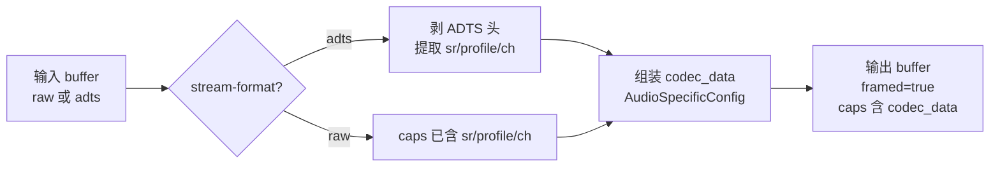

# aacparse

> 项目内位置：AAC 编码器之后、`tee enc_at`/`rtpmp4apay` 之前的解析层。
> 把 voaacenc/avenc_aac 输出的 raw 帧补齐 codec_data（AudioSpecificConfig），
> 让下游 RTP/MUX 元素能拿到 sample-rate / profile / channels。

## 1. 基本信息

| 项 | 值 |
|---|---|
| 分类 | **Parser** |
| 所在插件 | `gstreamer1.0-plugins-good`（`audioparsers`） |
| 全名 | `AAC audio stream parser` |

`aacparse` 类似 `h264parse`：自身不解码，只做帧边界对齐 + caps 补齐 +
ADTS/Raw 之间的 stream-format 转换。

### Pad 端口能力

- **sink**：`audio/mpeg, mpegversion={2,4}, stream-format={raw,adts}`。
- **src**：`audio/mpeg, mpegversion=4, stream-format={raw,adts}, framed=true`，
  附 `codec_data`。

### 关键属性

| 属性 | 类型 | 默认 | 说明 |
|---|---|---|---|
| `disable-passthrough` | bool | `false` | 禁用直通模式；项目保默认 |

属性少是好事——aacparse 行为基本由 caps 协商决定。

### 使用举例

```bash
# voaacenc raw → aacparse → rtpmp4apay 是 RTSP 标准链
gst-launch-1.0 audiotestsrc ! audioconvert ! voaacenc \
  ! aacparse ! rtpmp4apay ! fakesink
```

### 项目内用法

```cpp
// 仅 AAC 路径需要 aacparse；Opus 路径直接跳过：
if (e.backend == AudioEncoderBackend::AAC) {
    os << " ! aacparse";
}
```

aacparse 在协商时会做这些事：

1. 探测 voaacenc 输出是 raw（项目情况），不需要 ADTS 解包。
2. 根据帧内信息生成 `codec_data`（2 字节 AudioSpecificConfig）。
3. 设置 `framed=true`，让下游 rtpmp4apay 知道单 buffer 单帧。

## 2. 内部工作原理与数据流程



核心机制：

1. **codec_data 生成**：从 sample-rate/channels/profile 计算 ASC 2 字节，
   塞进 src caps 的 GST_BUFFER_FLAG_HEADER buffer 中。RTP 打包侧用它生成 SDP 的
   `config=...` 字段。
2. **零拷贝**：纯 caps 重写，buffer 数据不动。
3. **passthrough**：上游已经是 framed=true 的 raw，aacparse 几乎只是过路费。

## 3. 性能开销与其他补充

### 性能特征

- **CPU**：< 0.1%。
- **延迟**：0。
- **内存**：每条流多一份 ~32B 的 codec_data。

### 与 h264parse 的差异

| 维度 | h264parse | aacparse |
|---|---|---|
| codec 配置 | SPS/PPS NAL | AudioSpecificConfig（2~5B） |
| stream-format | byte-stream / avc / avc3 | raw / adts |
| 需要重新打包？ | byte-stream ↔ avc 时需要 | 只在 raw ↔ adts 时需要 |
| 项目内必要性 | 必需（rtph264pay 期望 byte-stream） | 必需（rtpmp4apay 期望 raw + codec_data） |

### 常见坑

1. **缺少 aacparse 直连 rtpmp4apay** → SDP 缺 `config=` 字段，VLC 报"unknown stream"。
2. **多次 `aacparse`** → 无害但浪费；本项目只在编码后接一个。
3. **mp4mux 也接 raw** → 没问题，aacparse 给它的 codec_data 直接进 esds box。
