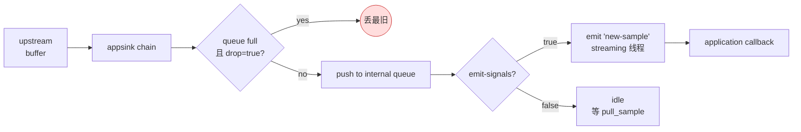

# appsink

> 项目内位置：face 副线终结点，元素名 `face_appsink`（主检测）/ `face_jpeg_sink`（画框预览）。
> 目前以"流终结点 + 不消费"模式使用，主要为 facedetect 的 bus message 提供数据驱动；
> 未来 HTTP `/face/preview.jpg` 接入时再切换到 `emit-signals=true` 路径。

## 1. 基本信息

| 项 | 值 |
|---|---|
| 分类 | **Sink（应用层接收点）** |
| 所在插件 | `gst-plugins-base`（`gstapp`） |
| 全名 | `AppSink` |
| 作用 | 把流数据从 GStreamer pipeline 拉到应用层（C/C++ / Python / GLib signal） |

`appsink` 是 GStreamer 与应用层数据交换的官方端点。两种用法：

1. **拉模式**：应用层主动 `gst_app_sink_pull_sample()` 阻塞拿样本。
2. **信号模式**：`emit-signals=true` 时 element 在 streaming 线程上 emit
   `new-sample` 信号，应用层在回调里 `pull_sample()`。

本项目目前对两个 appsink 都关闭了信号（`emit-signals=false`），仅当
"防 pipeline 卡死的流终结点"使用——facedetect 的检测结果走 pipeline bus，
不需要消费 buffer；preview JPEG 留作未来 HTTP 端点接入时再启用。

### Pad 端口能力

| Pad | 能力 | 备注 |
|-----|------|------|
| **sink** | `ANY` | 由上游 caps 决定；本项目里分别是 `video/x-raw,format=RGB`（face_appsink）与 `image/jpeg`（face_jpeg_sink） |

### 关键属性

| 属性 | 类型 | 默认 | 说明 |
|---|---|---|---|
| `emit-signals` | bool | false | true 时在 streaming 线程 emit `new-sample` 信号 |
| `max-buffers` | uint | 0 | 内部队列最多缓存多少个 buffer；0 = 无限 |
| `drop` | bool | false | true=队列满时丢最旧帧（对实时副线必须 true） |
| `sync` | bool | true | 是否按 PTS 同步播放；副线一律 false（追求最新数据） |
| `wait-on-eos` | bool | true | EOS 后是否阻塞等应用层取尾包 |
| `caps` | caps | none | 强制下游 caps 协商；项目里靠上游 capsfilter 控，不在 appsink 上设 |

### 信号

| 信号 | 触发时机 | 用途 |
|---|---|---|
| `new-sample` | 每收到一个 buffer | 主要消费入口，需自己 `pull_sample()` |
| `new-preroll` | PAUSED → PLAYING 前的预热样本 | 预览首帧 |
| `eos` | 上游 EOS 到达 | 清尾 / 切段 |

### 使用举例

最小 demo：

```bash
gst-launch-1.0 videotestsrc num-buffers=10 \
  ! videoconvert ! appsink emit-signals=false drop=true sync=false
# 仅作流终结点，无任何应用层代码
```

C++ 拉一个 sample（同步阻塞）：

```cpp
GstSample* sample = gst_app_sink_pull_sample(GST_APP_SINK(appsink));
GstBuffer* buf = gst_sample_get_buffer(sample);
GstMapInfo m;
gst_buffer_map(buf, &m, GST_MAP_READ);
fwrite(m.data, 1, m.size, stdout);   // 例如 JPEG 字节
gst_buffer_unmap(buf, &m);
gst_sample_unref(sample);
```

C++ 信号回调（异步）：

```cpp
g_signal_connect(appsink, "new-sample",
                 G_CALLBACK(+[](GstAppSink* s, gpointer user) -> GstFlowReturn {
                     GstSample* sample = gst_app_sink_pull_sample(s);
                     // ... 处理 ...
                     gst_sample_unref(sample);
                     return GST_FLOW_OK;
                 }), nullptr);
g_object_set(appsink, "emit-signals", TRUE, NULL);
```

### 项目内用法

face 主检测路径——纯流终结点，**不消费 buffer**：

```text
... ! facedetect name=face0 display=false ...
   ! appsink name=face_appsink emit-signals=false
             max-buffers=2 drop=true sync=false
```

face 画框预览——预留信号通道，本期未启用：

```text
... ! jpegenc quality=N
   ! valve name=face_prev_valve drop=true
   ! appsink name=face_jpeg_sink emit-signals=false
             max-buffers=1 drop=true sync=false
```

为什么主检测路径仍要 appsink 而不是 fakesink？

- `fakesink` 不暴露任何 GObject 信号，未来 face 副线如果要切到"buffer 路径
  + 自定义 ROI 算法"，必须重新改 launch 串；
- `appsink` 即便 `emit-signals=false`，也保留了未来"切到 emit-signals=true
  + new-sample 回调"的零成本升级路径，符合"副线宪法第 6 条 — 副线生命周期内
  不要重写 launch 字符串"。

## 2. 内部工作原理与数据流程



执行步骤：

1. **chain 函数**：buffer 进 internal queue（无锁单生产单消费 `GAsyncQueue`）。
2. **背压策略**：
   - `drop=false`：队列满时阻塞 chain 函数，反向压上游，最终让 tee 反压主线 → 危险。
   - `drop=true`：队列满时弹出最旧 buffer，丢掉 unref；副线必选。
3. **信号 / 拉取**：
   - `emit-signals=true`：streaming 线程同步 emit `new-sample`，回调里立刻 `pull_sample`
     消费完，否则信号会被合并（"几个 buffer 共触一个回调"）。
   - `emit-signals=false`：buffer 在队列里堆积到上限后被 drop；纯流终结点。
4. **EOS / FLUSH**：透传给应用层；`wait-on-eos=true` 时阻塞 EOS 直到应用层取完队列。

## 3. 性能开销与其他补充

### 性能特征

- **队列开销**：内部 `GAsyncQueue` 单读单写，O(1) push/pop；几乎可忽略。
- **CPU 开销 ≈ 0**（关闭信号时）；emit-signals 模式下额外多一次 GObject 信号开销
  + 应用层 callback 时间，30 fps 下整体仍 ≪ 1% 单核。
- **内存**：取决于 `max-buffers` × buffer 大小。本项目设 1–2，最多几 MB（RGB 720p 单帧 ≈ 2.6 MB）。

### 与 fakesink / filesink 的对比

| 元素 | 应用层拿数据 | bus message | 适用 |
|---|---|---|---|
| `fakesink` | ✗ | 仅 `silent=false` 时打印 | 纯流终结点 |
| `appsink` | ✓ | ✓ | 应用层消费 / 流终结点（双形态） |
| `filesink` | ✗ | ✗ | 落盘 |
| `multifilesink` | ✗ | `post-messages=true` 时每文件一条 | 序列落盘（snapshot） |

### 信号回调线程安全

- `new-sample` 信号在 **streaming 线程**触发，**不在 GMainLoop 线程**。
- 所以 face_jpeg_sink 未来接入 HTTP 时，必须在回调里抓锁后存入 `last_preview_jpeg_`，
  HTTP handler 在 GMainLoop 线程里只能读这个缓存——禁止在信号回调里直接做磁盘 IO 或网络 IO。

### 常见坑

1. **drop=false + 应用层处理慢** → 反压上游。本项目所有副线都强制 `drop=true`。
2. **信号回调里没 unref sample** → 内存泄漏。`pull_sample` 出来的 sample 必须显式
   `gst_sample_unref`。
3. **sync=true** → 副线变成"按 PTS 出帧"，realtime 副线不该这样；统一用 `sync=false`。
4. **emit-signals=true 与 max-buffers=0** → 队列无上限，慢消费会撑爆内存。
   永远要么"emit-signals + drop=true + max-buffers=N"，要么"信号关 + 不消费"。
5. **PAUSED / READY 状态下 pull_sample** → 阻塞或返回 NULL；不要在 pipeline 未起的时候盲拉。
