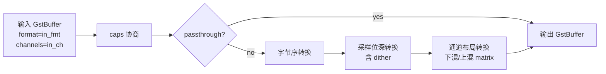

# audioconvert

> 项目内位置：音频通道的"videoconvert"。在 alsasrc 之后无脑 `! audioconvert`，
> 屏蔽设备原生格式（S16LE/S24LE/F32LE...）与下游编码器期望（AAC 多走 S16LE）的差异。

## 1. 基本信息

| 项 | 值 |
|---|---|
| 分类 | **Filter / Converter（音频）** |
| 所在插件 | `gstreamer-base`（`audioconvert`） |
| 全名 | `Audio converter` |

`audioconvert` 干三件事：
1. **采样格式转换**：S16LE ↔ S24LE ↔ F32LE ↔ F64LE 之间无损/截断转换。
2. **通道数转换**：mono ↔ stereo ↔ 5.1 ↔ 7.1 等，按矩阵下混/上混。
3. **字节序转换**：LE ↔ BE，PCM 内字节顺序变换。

不做采样率重采样——那是 `audioresample` 的事。

### Pad 端口能力

- **sink / src**：`audio/x-raw,format=...,channels=...,layout=interleaved` 全集。
- 通过协商在两端找最少代价的转换路径，无可转换时下游 caps 失败由调用方兜。

### 关键属性

| 属性 | 类型 | 默认 | 说明 |
|---|---|---|---|
| `dithering` | enum | `triangular-hf` | 16bit 截断时加抖动，几乎所有场景都保默认即可 |
| `noise-shaping` | enum | `none` | 与 dithering 配合，对低码率 AAC 帮助有限 |
| `mix-matrix` | gvalue | (auto) | 自定义下混矩阵，特殊声场需求才需要 |

### 使用举例

```bash
# 把 F32LE 转成 S16LE 再编码
gst-launch-1.0 audiotestsrc ! audio/x-raw,format=F32LE \
  ! audioconvert ! audio/x-raw,format=S16LE ! voaacenc ! fakesink
```

### 项目内用法

```cpp
// 主链：alsasrc 之后立刻收敛格式 / 通道
"alsasrc ! audio/x-raw,rate=48000,channels=2 ! audioconvert ! audioresample"

// 编码副线开头再来一次：保险，避免 tee 后 caps 漂移
"at. ! queue ! audioconvert ! voaacenc ..."
```

两次 `audioconvert` 是有意为之：第一次锁定采集端格式，第二次保证编码器永远拿到
它最爱吃的 S16LE。多余的一次几乎零开销（caps 一致时直接 passthrough）。

## 2. 内部工作原理与数据流程



核心机制：

1. **caps 协商**：与 videoconvert 同模式，事件驱动找最少转换链。
2. **passthrough 优化**：sink/src caps 完全相同时整段不复制，零成本。
3. **dithering**：S24→S16 截断时默认加 triangular HF 噪声，避免可闻量化失真。

## 3. 性能开销与其他补充

### 性能特征

- **CPU 开销可忽略**：48k 立体声 ≈ 192KB/s，整段处理纳秒级。
- **延迟**：0（同步元素，单 buffer 进出）。
- **内存**：单 buffer 临时复制，KB 级。

### 与 audioresample 的分工

| 元素 | 管什么 |
|---|---|
| audioconvert | format / channels / endianness |
| audioresample | rate（采样率） |

两者顺序无所谓，习惯写成 `audioconvert ! audioresample`，因为先收敛位深再做
插值能避免 24→32→24 的不必要转换。

### 常见坑

1. **不写 audioconvert 直连编码器** → 编码器只接 S16LE，alsasrc 给 F32LE 时
   caps 协商失败。**永远在编码器之前放一个 audioconvert。**
2. **下混 5.1→stereo 默认矩阵** → 一些项目觉得"对不上"，可用 `mix-matrix` 自定义；
   本项目只用 mono/stereo，不踩。
3. **audioconvert 是同步元素** → 不能丢帧（不像 videorate）；上游断流即下游断流。
