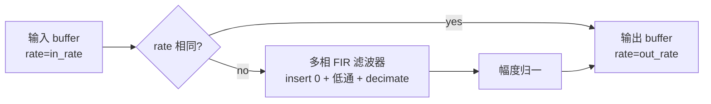

# audioresample

> 项目内位置：紧跟 `audioconvert` 之后，把 alsasrc 实际输出的采样率
> 收敛到 yaml `audio.capture.samplerate`（默认 48k）。

## 1. 基本信息

| 项 | 值 |
|---|---|
| 分类 | **Filter / Converter（音频）** |
| 所在插件 | `gstreamer-base`（`audioresample`） |
| 全名 | `Audio resampler` |

`audioresample` 做唯一一件事：**采样率重采样**（rate 转换）。
内部基于 SoX-style 多相滤波器实现，质量在 GStreamer 内置元素里属于
"够用偏好"那档。

### Pad 端口能力

- **sink / src**：`audio/x-raw, rate=[1, 2147483647]`，format/channels 透传。
- 上下游 rate 相等时自动 passthrough，零成本。

### 关键属性

| 属性 | 类型 | 默认 | 说明 |
|---|---|---|---|
| `quality` | int | `4` | 0~10，10=最佳但最慢；4 是默认平衡点 |
| `resample-method` | enum | `kaiser` | 滤波器类型；项目保默认 |
| `sinc-filter-mode` | enum | `interpolated` | 通常无须改 |

### 使用举例

```bash
# 16kHz → 48kHz，质量 8
gst-launch-1.0 audiotestsrc ! audio/x-raw,rate=16000 \
  ! audioresample quality=8 ! audio/x-raw,rate=48000 ! fakesink
```

### 项目内用法

```cpp
"alsasrc ! audio/x-raw,rate=48000,channels=2 ! audioconvert ! audioresample"
```

下游下行 caps 强制 `rate=48000`：

- 设备原生 48k → audioresample passthrough，**零开销**。
- 设备只有 44.1k → audioresample 启用 SoX 滤波，单核 ~1% CPU。

项目默认 quality=4 不改：48k/2ch 走插值开销可忽略；如果未来支持云端 ASR 拉
16k mono 副线，`at.` 旁挂 `audioresample quality=8 ! audio/x-raw,rate=16000`
即可，主链不动。

## 2. 内部工作原理与数据流程



核心机制：

1. **多相滤波**：把 rate 转换分解为 L 倍 upsample + 低通 + M 倍 downsample；
   `quality` 决定低通滤波器阶数。
2. **passthrough 优化**：rate 一致直接 passthrough，与 audioconvert 同模式。
3. **段（segment）边界**：跨 newsegment 时滤波器内部状态会 reset，避免相位不连续；
   PCM 输出端 PTS 按 rate 自适应重计算。

## 3. 性能开销与其他补充

### 性能特征

- **passthrough 零开销**：项目默认 48k 设备时整段免费。
- **真正重采样**：48k→16k 大约单核 0.5~1% CPU；quality=10 翻倍。
- **延迟**：滤波器引入半阶延迟（约几 ms），可忽略。

### 与 audioconvert 的搭配

`audioconvert ! audioresample` 是 GStreamer 官方推荐"音频万金油"。理由：

1. 先把 format / channels 收敛，避免重采样器额外做 layout 转换。
2. 下游元素只需声明 `rate=...,channels=...,format=...`，由前两个元素自动找路径。

### 常见坑

1. **没 audioresample 直连编码器** → 设备 44.1k、yaml 写 48k → caps 协商失败。
2. **quality=10 是噱头** → 听感差异需要 ABX 才听得出，CPU 翻倍不划算。
3. **rate 不一致 + tee 多副线** → 主线编码 48k、副线 ASR 16k，必须每条副线
   各自接一个 audioresample，**不能共享一个**。
4. **嵌入式 ARM 上 quality 高过 6 会显著上 CPU** → Pi/UTM 默认 4 即可。
