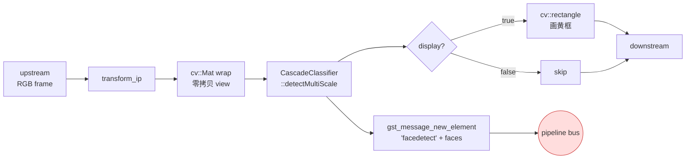

# facedetect

> 项目内位置：face 副线核心元素，元素名 `face0`（主检测路径）。
> 通过 pipeline bus 投 `Element/facedetect` 消息上报检测结果，由 [`FaceBranch`](../../src/branches/face/face_branch.cpp) 解析。

## 1. 基本信息

| 项 | 值 |
|---|---|
| 分类 | **Filter / Effect / Video（CV 检测）** |
| 所在插件 | `gst-plugins-bad` 中 `opencv` 子模块（`libgstopencv.so`） |
| 全名 | `OpenCV face detect` |
| 依赖 apt 包 | `gstreamer1.0-opencv`（提供 element） + `libopencv-data`（提供 haarcascade xml） |
| 作用 | 用 OpenCV 的 Haar 级联检测器在视频帧上找人脸 / 五官，并把矩形坐标通过 bus message 上报 |

可选属性 `display=true` 时会在画面上画黄框；`display=false` 时纯检测、零像素改动，
适合"侧线检测、主线零侵入"的副线模式。本项目主检测路径默认 `display=false`，
画框预览路径单独再起一个 facedetect 实例并 `display=true`。

### Pad 端口能力

| Pad | 能力 | 备注 |
|-----|------|------|
| **sink** | `video/x-raw, format=RGB`（Linux 上还接受 `BGR`/`GRAY8`） | 项目统一在 face 副线里 `videoconvert ! video/x-raw,format=RGB` 强制 RGB |
| **src** | 与 sink 完全相同 | 不改帧格式，仅消费像素做检测；`display=true` 时在像素上画框 |

### 关键属性

| 属性 | 类型 | 默认 | 说明 |
|---|---|---|---|
| `profile` | string | 内置 frontalface | 主级联 xml 路径。本项目把 `cfg.face.detect.cascade` 注入这里 |
| `profile-location` | string | "" | 侧脸级联 xml；为空时不做侧脸检测 |
| `nose-location` | string | "" | 鼻子级联 xml |
| `mouth-location` | string | "" | 嘴部级联 xml |
| `eyes-location` | string | "" | 眼部级联 xml |
| `display` | bool | false | true=在帧上画黄框；false=纯检测 |
| `min-size-width` | int | 30 | 检测矩形最小宽度（像素）；越大越快越粗 |
| `min-size-height` | int | 30 | 同上 |
| `scale-factor` | double | 1.25 | Haar 多尺度搜索步长；>1.05；越大越快越粗 |
| `min-neighbors` | int | 3 | Haar 投票阈值；越大越严越少误检 |
| `flags` | flags | `do-canny-pruning` | 检测标志位 |
| `updates` | enum | `every-frame` | 触发 bus message 的频率 |

### 使用举例

最小可运行 demo（按 `q` 退出）：

```bash
gst-launch-1.0 -e v4l2src device=/dev/video0 \
  ! videoconvert ! video/x-raw,format=RGB \
  ! facedetect display=true \
        profile=/usr/share/opencv4/haarcascades/haarcascade_frontalface_default.xml \
  ! videoconvert ! autovideosink
```

观察 bus message：

```bash
gst-launch-1.0 -m -e v4l2src device=/dev/video0 \
  ! videoconvert ! video/x-raw,format=RGB \
  ! facedetect display=false ! fakesink
# stdout 会持续打印：
# Got message #N from element "facedetect0"
#   Got an element message of type "facedetect" ...
#     faces=(structure){ "face\,\ x\=120\,\ y\=80\,\ width\=200\,\ height\=200\;" };
```

### 项目内用法

```text
t. ! queue (leaky=downstream, max-buffers=2, silent=true)
   ! valve name=face_valve drop=<取反 control.enabled_at_start>
   ! videorate ! video/x-raw,framerate=<face.rate.fps_limit>/1
   ! videoconvert ! video/x-raw,format=RGB
   ! facedetect name=face0 display=false
                profile="<cfg.face.detect.cascade>"
                profile-location="<cfg.face.detect.profile>"?
                nose-location="<cfg.face.detect.nose>"?
                mouth-location="<cfg.face.detect.mouth>"?
                eyes-location="<cfg.face.detect.eyes>"?
                min-size-width=<min_size_px>
                min-size-height=<min_size_px>
                scale-factor=<scale_factor>
                min-neighbors=<min_neighbors>
   ! appsink name=face_appsink emit-signals=false
             max-buffers=2 drop=true sync=false
```

可选画框预览副线（`face.preview_jpeg.enabled=true` 时再挂一条并列）：

```text
t. ! queue ... ! videorate ... ! videoconvert ! RGB
   ! facedetect display=true profile="..." min-size-...
   ! videoconvert ! jpegenc quality=<jpeg_quality>
   ! valve name=face_prev_valve drop=true
   ! appsink name=face_jpeg_sink ...
```

C++ 侧抓元素与读取消息：

```cpp
// 启动期一次性 g_object_set 由 launch 字符串完成；
// 运行期热改：
GstElement* fd = gst_bin_get_by_name(bin, "face0");
g_object_set(fd, "min-size-width", 200, "min-size-height", 200, nullptr);

// 解析 bus message（详见 FaceBranch::on_bus_message）：
if (GST_MESSAGE_TYPE(msg) == GST_MESSAGE_ELEMENT &&
    gst_message_has_name(msg, "facedetect")) {
    const GstStructure* s = gst_message_get_structure(msg);
    const GValue* faces = gst_structure_get_value(s, "faces");
    int n = gst_value_list_get_size(faces);  // 或 gst_value_array_*
    for (int i = 0; i < n; ++i) {
        const GstStructure* fs =
            gst_value_get_structure(gst_value_list_get_value(faces, i));
        /* facedetect 实际把 x/y/width/height 存为 G_TYPE_UINT，
         * 用 gst_structure_get_int 会拿不到值（返回 FALSE 且不改 out）。
         * 正确做法：先 uint、再 int 兜底，兼容不同 GStreamer 版本。 */
        guint x = 0, y = 0, w = 0, h = 0;
        gst_structure_get_uint(fs, "x",      &x);
        gst_structure_get_uint(fs, "y",      &y);
        gst_structure_get_uint(fs, "width",  &w);
        gst_structure_get_uint(fs, "height", &h);
    }
}
```

## 2. 内部工作原理与数据流程



执行步骤：

1. **transform_ip**：facedetect 是 `GstBaseTransform` 子类，启用 in-place 模式，
   像素就地处理；下游收到的 `GstBuffer` 与上游同一份内存。
2. **cv::Mat wrap**：把 GstBuffer 的数据指针 + width / height / RGB stride
   包成 `cv::Mat`。零拷贝，仅持有视图。
3. **detectMultiScale**：调用 OpenCV `cv::CascadeClassifier::detectMultiScale`
   按 `scale_factor` 多尺度滑窗，再用 `min_neighbors` 投票，最终输出
   `vector<cv::Rect>`。这一步 Haar 计算是**唯一耗 CPU 的操作**。
4. **bus message**：把 rects 打包成 `GValueArray of GstStructure(face)`，
   再 wrap 成 `GstStructure("facedetect")`，调
   `gst_element_post_message(GST_MESSAGE_ELEMENT)` 投递到 pipeline bus。
5. **display**：仅在 `display=true` 时调 `cv::rectangle` 在像素上画黄框；
   下游拿到的就是带框 RGB。本项目主检测路径恒为 false。

bus message 是异步的：facedetect 自己只负责 post，由谁取（GMainLoop / GstBus
watch / 应用层 source 函数）由调用方决定。本项目用 `gst_bus_add_watch`
注册到默认 GMainContext，FaceBranch 的回调和 ControlChannel 共享同一个事件循环。

## 3. 性能开销与其他补充

### 性能特征（树莓派 5 8G / Ubuntu 24.04 / Haar frontalface 默认级联）

| 输入 | 单帧耗时 | 单核占用 |
|---|---|---|
| 720p (1280×720) | 35–55 ms | ≈10–18% @ 5 fps |
| 480p (640×480) | 12–20 ms | ≈4–7% @ 5 fps |

副线必须靠 `videorate ! framerate=N/1` 节流到 5 fps 这一档，
30 fps 会让单核长期跑满（同帧检测多次毫无意义）。

### `display=true` 的额外开销

`cv::rectangle` 单矩形 < 0.1 ms，可忽略；
但开启后会让上下游 buffer 不再"零修改"，依赖原帧的副线（比如未来 motion detect）
将拿到带框图像。所以**主检测路径恒 `display=false`**，画框单独走 preview 副线。

### 为什么强制走 RGB 而非 BGR / GRAY8

OpenCV 内部检测器对单通道灰度更快，但级联 xml 通常按 RGB / BGR 通道顺序训练，
本项目统一走 RGB 与 ImageMagick / Pillow 等工具栈对齐，避免色彩通道翻转引发
"蓝脸检测不出来"之类的诡异 bug。GRAY8 路径未经验证，不在此范围。

### 与现代 DNN 检测器的对比

| 维度 | Haar (本元素) | YOLO / MediaPipe |
|---|---|---|
| 准确率（正脸近距） | 高 | 高 |
| 准确率（侧脸 / 弱光） | 弱（需 profile 级联补） | 强 |
| CPU 开销 | 低（≤20% 单核） | 高（需 NPU/GPU） |
| 训练 / 模型成本 | 0（apt 包自带） | 需要模型管理 |

本项目首版选 Haar，后续若要 DNN，会在 `face` 命名空间下再起一个独立 element，
`appsrc + appsink` 双侧接入,FaceBranch 框架不变。

### 常见坑

1. **profile 路径含中文 / 空格 / 引号**：launch 字符串在 gst-rtsp-server 里
   被二次解析，路径必须规整或加双引号。本项目把 cascade 路径用 `"..."` 包裹。
2. **跨版本属性名漂移**：1.16 之前 `profile` 名为 `profile-location`，
   1.18 之后改为 `profile`。本项目统一用 `profile=`，针对 1.20 验证。
   如部署到 1.16 老 ubuntu 22 镜像，请在 face_branch.cpp 增加版本兜底。
3. **bus 风暴**：高 fps 下每帧 1 条 message，1 小时 ≈ 10 万条。
   对策三道闸：① `videorate` 节流到 5 fps；② `cooldown_ms` 聚合；
   ③ `emit_when_empty=false`（仅有人时才进 last_state_）。
4. **多人场景内存抖动**：`faces` 数组无上限，极端场景（密集人群）一帧几十张脸
   会让 GstStructure 复制开销陡增。FaceBranch 在解析侧裁到前 N=8。
5. **EGL / surfaceless 与 OpenCV**：facedetect 不依赖 GL，所以与 main.cpp 里
   `EGL_PLATFORM=surfaceless` 无冲突；但若未来切到 dnn 元素 + cuda 后端，
   会和 libpag 抢 EGL，注意排序。
6. **`faces` 结构体字段是 `G_TYPE_UINT` 而非 `G_TYPE_INT`**：
   OpenCV 子模块历史遗留，`x/y/width/height` 全部以 `guint` 写入。用
   `gst_structure_get_int` 会返回 FALSE 且不改 out 参数，症状是 count 正确
   但 rect 全是 `0x0@(0,0)`。正确取法见上文 C++ 侧代码；FaceBranch
   已封装 uint 优先、int 兜底、GValue 泛读三级 helper。
