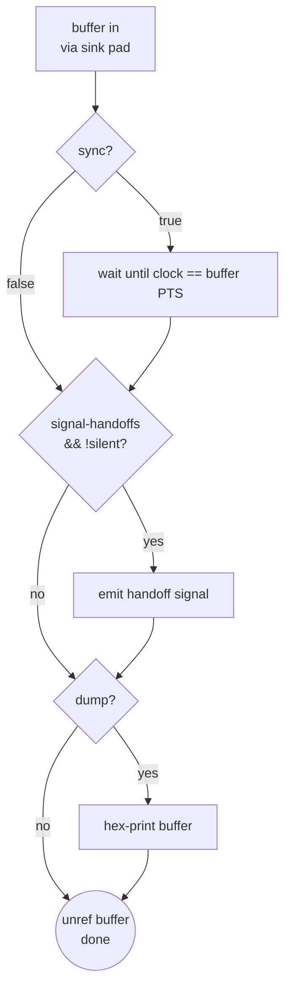

# fakesink

> 项目内位置：[branch:face] 末端，名称 `face_appsink`，作为 facedetect 之后的"流终结点"——只吃帧不做任何事，让 pipeline 数据流有一个合法出口，避免 EOS 卡住。人脸坐标不走 buffer，走 `pipeline bus` 的 `GST_MESSAGE_ELEMENT`。

## 1. 基本信息

| 项 | 值 |
|---|---|
| 分类 | **Debug / Sink（终结/丢弃元素）** |
| 所在插件 | `gst-plugins-core`（`coreelements`） |
| 全名 | `Fake Sink` |
| 作用 | 接收上游 buffer 后**直接丢弃**（默认可选打印/信号），常用于测试、探针、"接管走消息通道的数据流终结点" |

`fakesink` 在 GStreamer 里是最简单的 sink：没有输出，也不落盘，仅作为"数据黑洞"存在。
项目里的用途属于典型的**"我不需要这些字节，只是需要一个合法 sink 来结束 pipeline"**——
`facedetect` 上报坐标是通过 pipeline bus 的 `GST_MESSAGE_ELEMENT`，它 src 端仍然会把
处理过的视频帧继续 push 出来，如果 face 副线不接 sink，pipeline 会因缺少落点而无法进入
`PLAYING`（或者进入后 buffer 无处可去）。fakesink 就是这个"合规终点"。

### Pad 端口能力

- **sink**（always）：`ANY`——什么 caps 都吃。
- 无 src pad（是纯 sink）。

### 关键属性

| 属性 | 类型 | 默认 | 项目值 | 说明 |
|---|---|---|---|---|
| `sync` | bool | `true` | **`FALSE`** | true=按时钟同步落帧；副线不需要节流，false 让帧尽快消化 |
| `async` | bool | `true` | **`FALSE`** | true=状态切换等待 preroll；false 让 pipeline PAUSED→PLAYING 不被此 sink 阻塞 |
| `silent` | bool | `true` | `TRUE` | true=不发 `handoff` / `preroll-handoff` 信号；项目不需要逐帧钩子 |
| `signal-handoffs` | bool | `false` | （默认） | true 才会发送 handoff，跟 silent 组合使用 |
| `dump` | bool | `false` | （默认） | true=hex dump 每个 buffer，调试用 |
| `can-activate-push` | bool | `true` | （默认） | 是否允许 push 模式接入（几乎不改） |
| `can-activate-pull` | bool | `false` | （默认） | 是否允许 pull 模式接入 |
| `num-buffers` | int | -1 | （默认） | >0 时收到 N 个 buffer 后主动发 EOS，测试用 |

### 为什么关掉 `sync` 与 `async`

- **`sync=false`**：默认 sink 会用 base clock 对每个 buffer 的 PTS 做等待，face 副线只是**中间检测**通道，
  不需要"按时展示"，如果保留 sync=true 会人为把整条副线降到硬同步节奏，浪费一次时钟等待。
- **`async=false`**：默认 sink 在切到 PAUSED 时会向上层报"要等 preroll 完成"，pipeline 状态迁移会被该 sink
  拖住。face 副线晚一步 preroll 无所谓（主线 RTP 才是关键路径），关掉 async 让状态切换立即返回，
  避免主 pipeline 启动被拖慢。
- **`silent=true`**：不发 handoff 信号，省一次 GObject signal emit 的开销（小但白省）。

### 使用举例

```bash
# 最常见：调试时把某段流"废掉"，只看能不能跑通
gst-launch-1.0 videotestsrc num-buffers=100 \
  ! fakesink

# 打印每个 buffer 的元信息（不 dump 内容），观察时序
gst-launch-1.0 videotestsrc num-buffers=10 \
  ! fakesink silent=false signal-handoffs=true

# 排空 tee 的一路（避免不接下游导致 tee 阻塞）
gst-launch-1.0 v4l2src ! tee name=t \
  t. ! queue ! autovideosink \
  t. ! queue ! fakesink async=false sync=false
```

### 项目内用法

```cpp
// pipeline_builder.cpp - append_branch_face
/* 主检测坐标全走 pipeline bus（GST_MESSAGE_ELEMENT），
 * 这里的终结点仅作"数据流出口"防止 pipeline 卡死。*/
os << " ! fakesink name=face_appsink async=false sync=false silent=true";
```

命名 `face_appsink` 是**历史遗留**——早期实现曾用 `appsink` 通过 `new-sample` 信号回读像素，
后来发现 facedetect 已经把坐标用 `GST_MESSAGE_ELEMENT` 打到 pipeline bus 上了，副线拉像素完全
是重复劳动，就把 sink 换成了 fakesink，节省一次内存拷贝与信号回调（在 720p@5fps 下也不算多，
但零成本永远比"能跑就行"香）。名字保留下来是为了 [`FaceBranch`](../../src/branches/face/face_branch.h)
里 `gst_bin_get_by_name(pipeline, "face_appsink")` 的老代码不用改。

对应 pipeline 拓扑（截取自 [README.md](./README.md)）：

```text
tee(t.) ─► queue ─► valve(face_valve)
             ─► videorate ─► videoconvert(RGB)
                 ─► facedetect(name=face0, display=false)
                     ─► fakesink(face_appsink)   ← 本文档主角
```

## 2. 内部工作原理与数据流程



核心步骤：

1. **buffer 入**：sink pad 收到 buffer，走 `GstBaseSink::render` vfunc。
2. **可选 sync 等待**：`sync=true` 时把当前时钟对齐到 buffer PTS，face 副线跳过。
3. **可选 handoff 信号**：`signal-handoffs=true` 且 `silent=false` 时发 GObject 信号，把 buffer 引用透给应用层——项目 silent=true 完全跳过。
4. **可选 dump**：`dump=true` 打印 hex，仅调试。
5. **unref**：`gst_buffer_unref` 释放 buffer。**没有落地、没有转发**。

### 作为"合规终点"的关键性质

- **必须存在**：GStreamer 中所有 pad 上的 buffer 最终都需要被 sink 接住或者被 EOS 断流；
  一条中间副线如果 src 悬空（且不是 identity 那种一对一继续 push），pipeline 状态迁移与
  `pad_push` 会拒绝流动。fakesink 提供最便宜的合规终点。
- **不产生反压**：`async=false` + `sync=false` 下，fakesink 每次 render 都是"立即成功"，
  上游永远不会因 sink 慢而阻塞。这是 face 副线不能拖累 tee 上游的关键。
- **不缓存**：不像 appsink 有 `max-buffers` 队列，fakesink 收到就丢，副线内存占用为常数 0。

## 3. 性能开销与其他补充

### 性能特征

- **CPU**：< 0.01%（一次 unref）。
- **延迟**：无（不缓存、不 sync 时无等待）。
- **内存**：0（buffer 立即释放）。

### 与相关元素对比

| 元素 | 用途 | 与 fakesink 区别 |
|---|---|---|
| `appsink` | 应用层拉像素 | appsink 会缓冲 & 支持 `pull-sample` / `new-sample`；fakesink 一律扔 |
| `filesink` | 落盘 | filesink 写文件；fakesink 不落任何东西 |
| `identity` | 中间透传 | identity 有 src pad 继续下发；fakesink 是终点 |
| `valve drop=true` | 中间闸阀丢弃 | valve 在中间截断上游继续 push；fakesink 是"接住并释放" |

face 副线选 fakesink 而不是 appsink：坐标已经从 bus 拿到了，appsink 的 `max-buffers` 缓冲、
`new-sample` 回调、内部锁全是纯浪费；fakesink 是"最不做事"的 sink，最合适。

### 常见坑

1. **`async=true` 让 pipeline 卡在 PAUSED**：多副线场景里 fakesink 默认 async=true 会让整条 pipeline
   等这个副线 preroll，主线 RTP 启动被拖慢。副线 fakesink **一定**要 `async=false`。
2. **`sync=true` 让副线降到时钟节奏**：中间检测/统计副线不需要按时钟落帧，务必 `sync=false`。
3. **`silent=false` 时忘了打开 signal-handoffs**：想拿 handoff 钩子调试必须两个都设。项目 silent=true
   顺带跳过整套信号发射逻辑，性能最好。
4. **误把 fakesink 当 appsink 用**：想在应用层收像素必须用 `appsink` 或 `fakesink signal-handoffs=true silent=false`
   ——但后者会把主线程回调压到 GObject signal，比 appsink 的 `new-sample` 还麻烦，别选。
5. **fakesink 之后接不了下游**：它是纯 sink，没有 src pad；要"透传+丢弃可选"用 `identity`。
