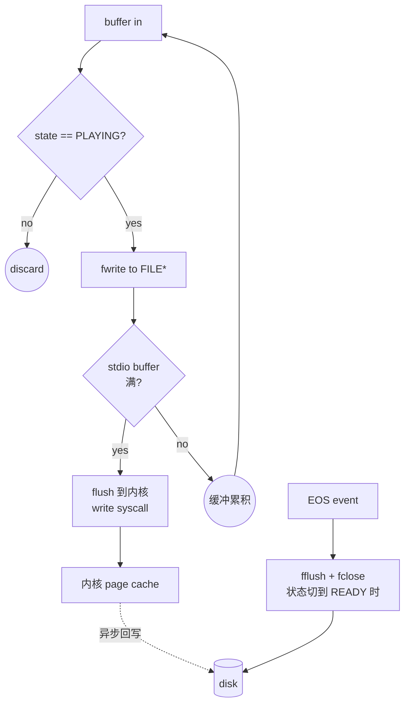

# filesink

> 项目内位置：[branch:record] 内部，由 Record 模块在 start 时与 mp4mux 一起动态创建，每段一个独立实例。

## 1. 基本信息

| 项 | 值 |
|---|---|
| 分类 | **Sink（落盘）** |
| 所在插件 | `gst-plugins-core`（`coreelements`） |
| 全名 | `File Sink` |
| 作用 | 把上游 buffer 顺序写入磁盘文件 |

`filesink` 是 GStreamer 最简单的 sink 之一：拿到 buffer 直接 `write()` 到 fd。
配合 muxer（mp4mux / matroskamux 等）就是"录像落盘"；配合原始流就是 raw dump。

### Pad 端口能力

- **sink**（always）：`ANY`——什么 caps 都吃，纯粹按字节写入。

### 关键属性

| 属性 | 类型 | 默认 | 项目值 | 说明 |
|---|---|---|---|---|
| `location` | string | — | `<dir>/<strftime>_<%05u>.mp4` | 输出文件绝对路径；启动期一次性设定 |
| `sync` | bool | `true` | `FALSE` | true=按时钟 PTS 节流写入；落盘录像不需要 |
| `async` | bool | `true` | `FALSE` | true=状态切换异步等 preroll；filesink 没有 preroll 概念，关掉避免多余等待 |
| `buffer-mode` | enum | `default` | （默认） | full/no buffering 等；默认走 stdio 缓冲 |
| `buffer-size` | uint | 64KiB | （默认） | stdio 缓冲大小 |
| `append` | bool | `false` | `FALSE` | true=以 append 模式打开文件，项目每段都是新文件，不需要 |
| `o-sync` | bool | `false` | `FALSE` | true=用 O_SYNC 打开（每次 write 都 fsync），项目不需 |

### 状态切换语义

- **READY → PAUSED**：打开 `location` 指向的文件（O_WRONLY | O_CREAT | O_TRUNC）。
  打不开（无权限 / 父目录不存在）会失败 → 整个 pipeline 状态切换失败。
- **PLAYING**：每个 buffer `write()` 一次（受 buffer-mode 影响可能批量）。
- **PAUSED → READY**：fclose 文件，**这一步会把 stdio 缓冲 flush 到内核**；
  内核态 dirty page 由 OS 调度回写。
- **收到 EOS**：把 buffer 全写完后转发 EOS message 给 bus，filesink 自身不会主动关 fd——
  fd 关闭发生在状态切到 READY/NULL 时。
- **收到 FLUSH-STOP**：当前文件未关，下次状态切换时关。

### 使用举例

```bash
# 录一段 raw I420 帧
gst-launch-1.0 videotestsrc num-buffers=300 \
  ! video/x-raw,format=I420,width=320,height=240 \
  ! filesink location=/tmp/raw_i420.bin

# 配 mp4mux 录制（注意 -e 让 Ctrl-C 发 EOS，否则 mp4 不可播）
gst-launch-1.0 -e videotestsrc num-buffers=300 \
  ! x264enc ! h264parse ! mp4mux \
  ! filesink location=/tmp/test.mp4 sync=false async=false
```

### 项目内用法

`filesink` 不在 [pipeline_builder.cpp](../../src/pipeline/pipeline_builder.cpp) 的 launch 字符串里，
而是由 [Record](../../src/branches/record/record.cpp) 模块在 `open_segment_locked_` 时
代码创建：

```cpp
// record.cpp - open_segment_locked_
GstElement* sink = gst_element_factory_make("filesink", nullptr);
g_object_set(sink, "location", seg.path.c_str(),
             "sync", FALSE, "async", FALSE, nullptr);
gst_element_link(mux, sink);
```

`seg.path` 形如 `/tmp/vm_iot/records/20260616_220730_00000.mp4`，
由 `make_segment_path_` 用 `cfg.dir + strftime(filename_pattern) + _%05u 段号` 拼成。

## 2. 内部工作原理与数据流程



核心步骤：

1. **打开文件**：READY→PAUSED 时 `fopen(location, "wb")`。失败立刻报错。
2. **写入 buffer**：每个 buffer 调用 `fwrite`。stdio 默认 64 KiB 缓冲，写满后才落到内核。
3. **EOS**：filesink 把"我已收到 EOS"作为 message 发到 pipeline bus。
   注意：**EOS 不会立刻关闭文件**，只是停止再写。文件关闭发生在状态切到 READY 时。
4. **状态切到 READY/NULL**：`fflush + fclose` → stdio 缓冲落到内核 → fd 关闭。
   内核 dirty page 由 OS 异步回写到磁盘（可能仍未真正落盘）。
5. **真正落盘**：除非显式 `fsync`，filesink 只保证"数据进了内核"，不保证"数据进了磁盘"。
   断电场景仍可能丢失最后几秒数据；项目暂不需要这种强保证。

### 与 mp4mux 配合时的关键点

- mp4mux 在 EOS 时才把 `moov` 写出来。filesink 在 EOS 之后状态切到 READY 才把
  fd 关掉（stdio 缓冲 flush 到内核）。**这两步必须按顺序完成，mp4 才完整可播**。
- 项目方案 1 用"sync-message::eos"在 pipeline bus 上等这个完整流程结束（≤2s 超时），
  详见 [record.cpp](../../src/branches/record/record.cpp) 的 `close_segment_locked_`。

## 3. 性能开销与其他补充

### 性能特征

- **CPU**：可忽略（一次 fwrite 就是几行 libc 代码）。
- **磁盘 IO**：取决于上游码率。x264enc 4 Mbps → 500 KB/s，远低于树莓派 SD 卡顺序写带宽（≥10 MB/s）。
- **延迟**：`sync=false` 下，buffer 进 filesink 立刻进 stdio 缓冲；
  实际落盘由内核回写策略决定（一般 5~30s）。

### 为什么 `sync=false async=false`？

- `sync=true`：filesink 会按 buffer PTS 与时钟对齐，PTS 在未来则等。
  录像是"尽快落盘"，没有播放需求，等时钟纯属浪费。
- `async=false`：filesink 没有 preroll（不像视频 sink 要先收到一帧才能切到 PAUSED），
  关掉 async 让 PAUSED 状态切换瞬间完成，避免 [pipeline state 切换] 卡几秒。

### 强一致性怎么做？

如果需要"每段录完都保证已落盘到物理介质"（比如行车记录仪断电场景），可以：

1. `o-sync=TRUE`：每次 write 都走 O_SYNC，**严重拖慢磁盘吞吐**，不推荐。
2. EOS 后业务层显式 `fsync(fd)`：filesink 没暴露 fd，需要在 EOS 后由
   filesystem 层主动 fsync 整个目录或调用 `sync(2)`。
3. 改用 fragmented mp4 + 较短 fragment-duration：每个 fragment 自包含，断电只丢最后一个 fragment。

项目当前不做强一致——SIGINT 走 EOS 路径，电源断电交给 OS / 文件系统。

### 常见坑

1. **`location` 父目录不存在**：filesink 不会自动 mkdir，状态切换会失败。
   项目在 [record.cpp::configure](../../src/branches/record/record.cpp) 里用
   `fs::create_directories(cfg.dir)` 提前建好。
2. **EOS 之后立刻 set_state(NULL)**：fd 还在 stdio 缓冲里，可能丢尾部几 KB。
   项目方案：等 sync-message::eos（filesink EOS 已 forward 到 bus）后再 NULL，
   GStreamer 会保证 stdio flush 到内核完成。
3. **磁盘满**：filesink 报错 `RESOURCE_NO_SPACE_LEFT`，这条错误冒到 pipeline bus，
   Record 模块当前没有 LRU 回收，需要外部脚本管。
4. **多次 PLAY 同一个 location**：filesink 默认 `O_TRUNC`，**会把旧文件清空重写**。
   项目用段号 `_%05u` 保证每段文件名唯一，不会覆盖。
