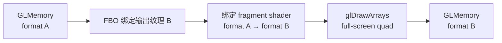

# glcolorconvert

> 项目内位置：GL 段内部，`glupload` 之后、`gldownload` 之前各一次。

## 1. 基本信息

| 项 | 值 |
|---|---|
| 分类 | **OpenGL（色彩 / 格式）** |
| 所在插件 | `gst-plugins-base`（`gstopengl`） |
| 全名 | `OpenGL color converter` |
| 工作位置 | GPU 显存 |

`glcolorconvert` 是 `videoconvert` 的 GPU 版本，在 GL 纹理之间做格式 / 色彩空间转换，
全部用片元着色器完成。

### Pad 端口能力

- **sink / src**：均为 `video/x-raw(memory:GLMemory)`，支持 RGBA / RGB / I420 / NV12 /
  YUY2 / Y444 等 GPU 友好格式。
- 不接受系统内存 caps（必须前置 `glupload`）。

### 关键属性

无用户可调属性。所有行为由 sink/src caps 协商决定。

### 使用举例

```bash
# I420 → RGBA（GPU）
gst-launch-1.0 videotestsrc \
  ! video/x-raw,format=I420 ! glupload \
  ! glcolorconvert ! video/x-raw(memory:GLMemory),format=RGBA \
  ! gldownload ! autovideosink
```

### 项目内用法

```text
... ! glupload ! glcolorconvert
    ! glshader name=f0
    ! glcolorconvert ! gldownload ! ...
```

两次出现：
- 第一次：把上传后的格式（可能是 I420 三平面纹理）转成 `glshader` 默认要求的 RGBA。
- 第二次：`glshader` 输出仍是 RGBA，给 `gldownload` 之前再转回 I420 / RGBA
  （由下游 caps 决定），下载到 CPU 时减少带宽。

## 2. 内部工作原理与数据流程



核心机制：

1. **着色器选择**：`gstglcolorconvert` 内置一组针对常见格式对的片元着色器源代码。
   协商完后按 `(in_fmt, out_fmt)` 查表选 shader。
   - `I420 → RGBA`：sampler2D × 3（Y/U/V），shader 里做矩阵乘 + 上采样。
   - `RGBA → I420`：渲染到三个 attachment 的 FBO，每个输出一个平面。
   - `NV12 → RGBA`：sampler2D × 2（Y, UV）。
2. **FBO 渲染**：把目标纹理绑到 FBO 的 color attachment，画一个全屏四边形（two
   triangles），片元着色器逐像素算输出值。
3. **多 attachment**：转成 planar 格式（如 RGBA→I420）时用 `glDrawBuffers` 一次写
   3 个目标平面，避免 3 次 draw call。
4. **零拷贝链路**：上下游纹理都驻留 GPU，`glcolorconvert` 之间无 CPU 介入，
   只是再加一次着色器执行。

## 3. 性能开销与其他补充

### 性能特征（典型 GPU）

| 操作 | 1080p 单次开销 |
|---|---|
| RGBA → RGBA passthrough | ~0（直接透传） |
| I420 → RGBA | <0.5ms |
| RGBA → I420（多 attachment） | ~1ms |
| RGBA → NV12 | ~1ms |

> UTM aarch64 + 软件 GL（llvmpipe）下，所有 GL 操作都跑在 CPU 上，开销与
> CPU `videoconvert` 接近，**不会更快**。需要真硬件 GPU 才有意义。

### 为什么 GL 段两侧各放一次？

- **第一次**：保证 `glshader` 默认看到的就是 RGBA，shader 代码可以写得最通用。
- **第二次**：`gldownload` 直接吐 RGBA 到 CPU 内存带宽更高（4 字节 / 像素），
  转回 I420 后再下载，**带宽 ÷ 2.67**，对总吞吐很友好。
- 两次单看是冗余，但配合 GPU 上的"格式重采样几乎免费 + CPU 下行带宽贵"的特性，
  整体反而更快。

### 与 `videoconvert` 的差异

| 维度 | videoconvert | glcolorconvert |
|---|---|---|
| 工作位置 | CPU（NEON/SSE） | GPU（fragment shader） |
| 输入/输出 | system memory | GL texture |
| 多线程 | 自动 | GPU 并行 |
| 启动成本 | 几乎无 | 第一帧需编译 shader（~10ms） |
| 适合场景 | 小尺寸 / 无 GPU | 大尺寸 / 与 GL 滤镜成组 |

### 常见坑

1. **caps feature 漏写**：忘记 `(memory:GLMemory)` 会导致协商把 `glcolorconvert`
   排除在外。
2. **shader 编译失败**：第一次跑会编译多个着色器，编译报错通常是 GLSL 版本不匹配，
   设 `GST_GL_API=gles2` 让 GStreamer 用 GLSL ES 100 兜底。
3. **隐式 colorimetry 偏移**：GL 用线性空间运算，sRGB ↔ linear 的转换由 shader
   隐式处理；如果 caps 上写了 `colorimetry=sRGB`，会再多一次 gamma 变换。
