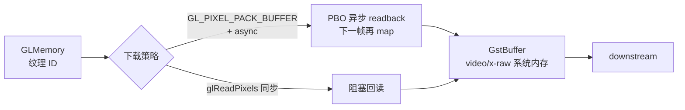

# gldownload

> 项目内位置：GL 段出口，紧跟第二个 `glcolorconvert`。

## 1. 基本信息

| 项 | 值 |
|---|---|
| 分类 | **OpenGL（GPU→CPU 桥）** |
| 所在插件 | `gst-plugins-base`（`gstopengl`） |
| 全名 | `OpenGL downloader` |
| 作用 | 把 GL 纹理回读到系统内存 |

`gldownload` 是 `glupload` 的反向操作：把驻留在 GPU 显存的 `GstGLMemory` 回读
到系统内存的 `video/x-raw`，让后续 CPU element（`videoconvert` / `x264enc` /
`jpegenc` / `appsink`）能继续处理。

### Pad 端口能力

- **sink**：`video/x-raw(memory:GLMemory), format=...`。
- **src**：`video/x-raw, format=...`（无 `memory:GLMemory` feature）。

格式由协商决定，常见 RGBA / I420 / NV12。

### 关键属性

无用户可调属性，行为完全由 caps 协商决定。

### 使用举例

```bash
# GL 链路 → 写文件
gst-launch-1.0 videotestsrc \
  ! glupload ! glcolorconvert ! glshader \
  ! glcolorconvert ! gldownload \
  ! video/x-raw,format=I420 \
  ! videoconvert ! autovideosink
```

### 项目内用法

```text
... ! glshader name=f0
    ! glcolorconvert ! gldownload
    ! videoconvert ! tee name=t ...
```

GL 段的最后一站。下游 `videoconvert` + `tee` 又回到 CPU 路径，开始分发到主线
（编码 + RTP）和副线（截图）。

## 2. 内部工作原理与数据流程



核心步骤：

1. **绑定 FBO**：把上游 GL 纹理挂到一个 FBO 的 color attachment 上，作为
   `glReadPixels` 的源。
2. **格式选择**：按 src caps 选 `GL_RGBA` / `GL_RG` / `GL_RED` 等格式 + `GL_UNSIGNED_BYTE`
   类型。多平面格式（I420）需要分别从三个 FBO 读三次。
3. **PBO 异步路径**（默认）：用 `GL_PIXEL_PACK_BUFFER` 让 driver 异步把数据
   DMA 到 PBO，**当前帧不阻塞**；下一帧时 `glMapBuffer` 取上一帧结果。
   这意味着 `gldownload` 引入 **1 帧延迟**，但能与 GPU 渲染并行。
4. **同步路径回退**：driver / context 不支持 PBO 时，退化到 `glReadPixels`，
   阻塞 CPU 直到 GPU 把数据写完。
5. **数据封装**：从 PBO/直读结果构造 `GstBuffer`，平面 stride 按
   GL 4 字节对齐 → caps 4 字节对齐转换。

## 3. 性能开销与其他补充

### 性能特征

| 路径 | 1080p@30 单帧开销 | 备注 |
|---|---|---|
| PBO 异步 + RGBA | 1~3ms（CPU 等待 map） | 渲染管线深度 +1 帧 |
| `glReadPixels` 同步 + RGBA | 5~15ms | 完全阻塞 CPU |
| I420（3 次读） | 上面 ×约 1.5 | 三个 FBO，三次 readback |

> UTM aarch64 软件 GL：所有 GL 操作都在 CPU 上，PBO 不会带来异步收益，
> `gldownload` ≈ `memcpy`，开销与 `videoconvert` 相当。

### 为什么默认走 RGBA→I420 由 `glcolorconvert` 提前做？

- 上游若直接给 RGBA（4 bpp）回读：1080p 一帧 8MB，PBO/带宽紧张。
- 在 GPU 上提前转 I420（1.5 bpp）：一帧 3MB，带宽下降 2.67×。
- 项目里 `glcolorconvert ! gldownload` 这对组合就是为了实现"GPU 先压格式，再下载"。

### 与 `glupload` 的对称性

- `glupload`：CPU→GPU，写带宽（Host→Device）。
- `gldownload`：GPU→CPU，读带宽（Device→Host）。
- 大多数集成显卡 / 虚拟机里 **读带宽显著低于写带宽**（PCIe / driver 限制），
  下载比上传贵 1.5~3 倍，是 GL 段的主要性能瓶颈。

### 常见坑

1. **PBO 不可用导致掉帧**：旧 driver 不支持 PBO，会自动退化到同步路径，
   性能大幅下降。可设环境 `GST_GL_DEBUG=1` 查看实际选择的路径。
2. **I420 三次读太慢**：高分辨率下用 NV12（2 平面）替代 I420（3 平面）能少一次
   readback，约省 30% 时间。
3. **buffer 复用**：`gldownload` 内部有 buffer pool，下游若长期持有 buffer 不
   release，会阻塞 GPU 端纹理回收，最终卡流。下游 `queue` 默认 ref/unref 行为正常，
   但自定义 sink 要注意。
4. **"先 download 再 colorconvert" 是反模式**：把转换放到 CPU 上做，等于 GPU 没用，
   而且 download 带宽更大。项目里严格"GPU 转 → 再下载"。
