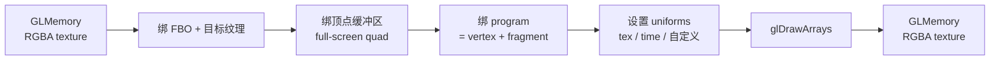

# glshader

> 项目内位置：GL 段中央，作为可热加载的片元着色器滤镜，元素名 `f0`。

## 1. 基本信息

| 项 | 值 |
|---|---|
| 分类 | **OpenGL（自定义滤镜）** |
| 所在插件 | `gst-plugins-base`（`gstopengl`） |
| 全名 | `OpenGL fragment shader filter` |
| 作用 | 在 GPU 上对每帧执行任意 GLSL 片元着色器 |

`glshader` 暴露一个"任意 GLSL 程序"，用户可在运行时设置自定义 fragment shader，
对 GL 纹理逐像素处理。是项目实现 LUT 调色 / 暗角 / 高斯模糊 / 边缘锐化等效果的
单点入口。

### Pad 端口能力

- **sink / src**：`video/x-raw(memory:GLMemory), format=RGBA`（默认 shader 假设 RGBA）。
- 也能通过自定义 shader 走其他 GL 友好格式，但需要重写 shader 逻辑。

### 关键属性

| 属性 | 类型 | 默认 | 说明 |
|---|---|---|---|
| `vertex` | string | 内置直通 VS | 顶点着色器源码 |
| `fragment` | string | 内置 RGBA 直通 FS | **重点**，片元着色器源码 |
| `uniforms` | GstStructure | NULL | 给 shader 喂 uniform 变量（float/vec/matrix/sampler） |
| `update-shader` | signal | — | 触发重新编译 shader |

### 默认 fragment shader（直通）

```glsl
#version 100
precision mediump float;
varying vec2 v_texcoord;
uniform sampler2D tex;
void main() {
    gl_FragColor = texture2D(tex, v_texcoord);
}
```

这就是项目当前 pipeline 默认的行为：**什么都不改，原样输出**。意义在于占住一个
后续可以"动态换 shader"的位置。

### 使用举例（灰度滤镜）

```bash
gst-launch-1.0 videotestsrc \
  ! glupload ! glcolorconvert \
  ! glshader fragment="
      #version 100
      precision mediump float;
      varying vec2 v_texcoord;
      uniform sampler2D tex;
      void main() {
          vec4 c = texture2D(tex, v_texcoord);
          float g = dot(c.rgb, vec3(0.299, 0.587, 0.114));
          gl_FragColor = vec4(g, g, g, c.a);
      }" \
  ! glcolorconvert ! gldownload ! autovideosink
```

### 项目内用法

```text
... ! glcolorconvert
    ! glshader name=f0
    ! glcolorconvert ! gldownload ! ...
```

`name=f0` 是约定，方便上层 C++ 通过 `gst_bin_get_by_name(bin, "f0")` 拿到
element，运行时调 `g_object_set(f0, "fragment", new_shader_src, NULL)` + emit
`update-shader` 信号热切换效果，无需重启 pipeline。

## 2. 内部工作原理与数据流程



核心步骤：

1. **shader 编译**：第一次进入 ready / playing 时编译 vertex + fragment 源码、链接成
   GL program。失败时打印日志、停留在 ready 状态。
2. **每帧渲染**：把上游纹理绑到 `tex` sampler，绑全屏四边形 VBO，调用
   `glDrawArrays(GL_TRIANGLE_STRIP, 0, 4)`，让 fragment shader 对每个目标像素执行
   一次。
3. **uniform 更新**：每帧自动注入 `time`（秒）、`width` / `height`，自定义 uniforms
   通过 `uniforms` 属性传 GstStructure。
4. **热替换**：用户通过 GObject 属性写新 fragment 源码 + emit `update-shader`，
   元素重新编译并替换 program。

## 3. 性能开销与其他补充

### 性能特征

| shader 复杂度 | 1080p@30 GPU 占用（典型 GPU） |
|---|---|
| 直通（采样一次） | <0.2ms / 帧 |
| 简单 LUT / 灰度 / 暗角 | 0.5~1ms |
| 高斯模糊（半径 5，9-tap） | 2~4ms |
| 多 pass（先模糊再合成） | 5~10ms（多 pass 需多个 glshader 串联） |

> UTM aarch64 软件 GL 下，每 1ms 的 shader 工作 ≈ CPU 端 5~20ms，谨慎使用复杂效果。

### 上层热切换接口（项目设想）

```cpp
// 伪代码：运行时换效果
GstElement* f0 = gst_bin_get_by_name(bin, "f0");
g_object_set(f0, "fragment", lut_shader_src, nullptr);
g_signal_emit_by_name(f0, "update-shader");
```

注意：

- 编译会卡住一帧；高频切换会导致掉帧。
- 切换 uniform 不需要重新编译，**优于切换 fragment 源码**。

### 常见坑

1. **GLSL 版本不一致**：桌面 GL 用 `#version 330`，GLES 用 `#version 100/300 es`。
   项目目标是 GLES（`GST_GL_API=gles2`），shader 应写 `#version 100` 或 `300 es`。
2. **多 element 共享 program**：每个 `glshader` 实例独立编译一份 program，
   多个相同效果可考虑合并成一个 shader。
3. **alpha 通道丢失**：默认 fragment 只采 `texture2D(tex, ...)`，注意保留 `.a`
   分量，否则下游可能拿到全 0 alpha。
4. **uniform 类型错误**：通过 GstStructure 传 uniforms 时，类型必须严格对应
   shader 里的 GLSL 类型（`int` ↔ `gint`，`float` ↔ `gfloat`，矩阵需要
   `GValue` 包成 `GstValueArray`）。

### 与 OpenCV / 自定义 appsink 滤镜的对比

| 方案 | 上手 | 性能 | 可热切换 | 适合 |
|---|---|---|---|---|
| `glshader` | 中（要会 GLSL） | 高（GPU） | ✅ | 像素级特效、LUT |
| OpenCV via appsink/appsrc | 易 | 低（CPU） | ❌（要重启 bin） | 检测/复杂算法 |
| `glfilter*` 内置滤镜 | 易 | 高 | 部分 | 现成效果（模糊/阴影） |
