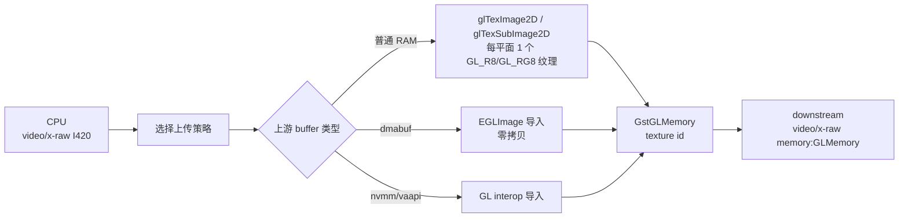

# glupload

> 项目内位置：GL 滤镜段入口，紧跟 `videoconvert`。

## 1. 基本信息

| 项 | 值 |
|---|---|
| 分类 | **OpenGL（CPU→GPU 桥）** |
| 所在插件 | `gst-plugins-base`（`gstopengl`） |
| 全名 | `OpenGL uploader` |
| 依赖 | `libGLES`/`libGL` + 平台 GL context（EGL/GLX/CGL/EAGL/WGL） |

`glupload` 把"系统内存里的 `video/x-raw`"包装成"GPU 显存里的 GL 纹理"，
是 GStreamer GL 段的标准入口。配合 `glcolorconvert` / `glshader` / `gldownload`
形成 GPU 滤镜段。

### Pad 端口能力

- **sink**：`video/x-raw` （绝大多数 raw 格式）+ 各类 dmabuf / vaapi / nvmm 上游 caps。
- **src**：`video/x-raw(memory:GLMemory)`，输出格式由协商决定，常见 `RGBA`。

`(memory:GLMemory)` 是 caps feature，意味着 GstBuffer 里挂的不是字节而是
`GstGLMemory`（指向纹理对象 ID + GL context）。

### 关键属性

`glupload` 几乎没有用户属性，行为由 caps 协商和 GL context 决定。
仅通用的 `name` / `parent` / `qos`。

### 使用举例

```bash
# 系统内存 raw → GL → 系统内存（绕一圈，验证 GL 链路通）
gst-launch-1.0 videotestsrc \
  ! video/x-raw,format=I420 ! glupload ! glcolorconvert \
  ! gldownload ! video/x-raw,format=RGBA ! autovideosink
```

### 项目内用法

```text
... ! videoconvert
    ! glupload ! glcolorconvert
    ! glshader name=f0
    ! glcolorconvert ! gldownload
    ! videoconvert ! tee ...
```

仅当 `c.filter.enabled=true` 时启用：

```cpp
if (c.filter.enabled) {
    os << " ! glupload ! glcolorconvert"
       << " ! glshader name=f0"
       << " ! glcolorconvert ! gldownload";
}
```

## 2. 内部工作原理与数据流程



核心步骤：

1. **创建/获取 GL context**：通过 GstGLDisplay + GstGLContext 拿到平台默认上下文，
   linux 一般是 EGL。
2. **选择上传策略**：内部维护一个 `upload_methods` 列表，按上游 caps feature
   挑最快路径：
   - `direct_dma_buf`（dmabuf 零拷贝） > `egl_image` > `raw_data_upload`（最慢，回退）。
3. **分配纹理**：按目标 caps 给每个平面（Y/U/V 或 RGBA）申请一个 `GL_TEXTURE_2D`，
   I420 需要 3 张单通道纹理，RGBA 一张四通道。
4. **拷贝数据**：`glTexSubImage2D` 把 CPU 数据 PUSH 到 GPU；dmabuf 路径只是
   绑定 EGLImage，零拷贝。
5. **打包 buffer**：把 `GstGLMemory` 装进 GstBuffer 推给下游。

> dmabuf 零拷贝路径在容器化 / UTM 虚拟机里很难启用，项目实测多数走
> `raw_data_upload`，每帧一次 1280×720×1.5 字节的 host→device 拷贝。

## 3. 性能开销与其他补充

### 性能特征

| 路径 | 1080p@30 开销 | 备注 |
|---|---|---|
| dmabuf 零拷贝 | ~0 | 需要驱动+UTM 都支持 EGLImage |
| `glTexSubImage2D` 上传 | 5~15ms（CPU+PCIe/Bus） | 项目实际命中这条 |
| 旋转/翻转纹理 | +1~2ms | 由 caps `flip-method` 触发 |

### 为什么前面要先 `videoconvert` 再 `glupload`？

- 大多数 GL 滤镜（包括 `glshader` 默认片元程序）按 `RGBA` 工作，I420 直接上传后
  仍需 `glcolorconvert` 转 RGBA。先用 CPU `videoconvert` 把 caps 谈到 GL 友好格式
  也行，但项目里把这步交给 `glcolorconvert`（GPU 上做），CPU 这步只做 passthrough。
- 严格说项目这里 `videoconvert ! glupload ! glcolorconvert` 是冗余的，但保留
  `videoconvert` 是为了兼容上游 caps 的 corner case（比如 GL 不支持的格式如 Y444），
  让 `videoconvert` 兜底。

### 常见坑

1. **没有 GL context（headless 容器）**：会以 `failed to create GL context` 启动失败。
   解决：装 `libegl1` + 设 `GST_GL_PLATFORM=egl GST_GL_API=gles2`。
2. **UTM aarch64 上 GL 性能很差**：纯软件渲染（llvmpipe / swrast）下 GL 段会变成
   性能瓶颈。项目里默认 `c.filter.enabled=false`。
3. **caps feature 不带 memory:GLMemory**：下游不接受 GLMemory 时，`glupload`
   会被踢出协商，整段 GL 失效。要在 GL 段两头都用 `glupload` / `gldownload` 包夹。
4. **同 pipeline 跨 GL context**：多个 GL element 必须共享同一 `GstGLContext`，
   `glupload` 自动管理，但跨进程或跨 bin 时要手动 `gst_element_set_context`。
