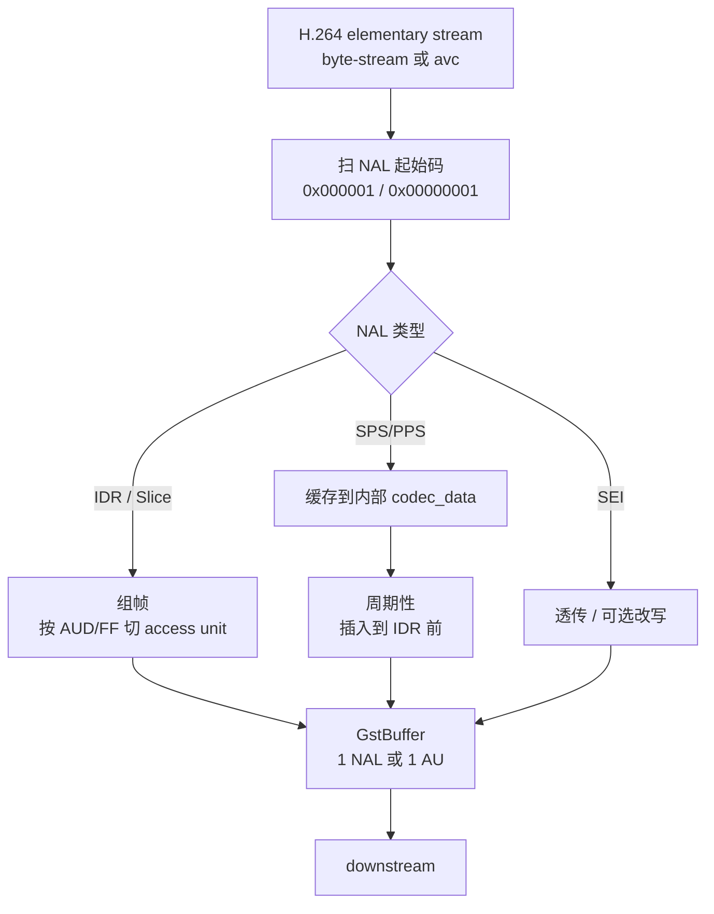

# h264parse

> 项目内位置：[branch:main] 编码后第一站，紧跟 `x264enc`。

## 1. 基本信息

| 项 | 值 |
|---|---|
| 分类 | **Parser（视频码流）** |
| 所在插件 | `gst-plugins-bad`（`videoparsersbad`） |
| 全名 | `H.264 parser` |
| Rank | `primary + 1`（高于其他备选） |

`h264parse` 在 H.264 码流上做**结构化重组**：识别 NAL 单元、推导帧/picture 边界、
按需在 byte-stream 与 avc 两种封装之间切换、把 SPS/PPS 周期性插入到流里
（`config-interval`），让下游打包/封装/解码器拿到完整自描述码流。

### Pad 端口能力

- **sink**：`video/x-h264, parsed=false` 或带 `byte-stream`/`avc` 的 H.264 流。
- **src**：`video/x-h264, parsed=true, stream-format ∈ {byte-stream, avc, avc3},
  alignment ∈ {au, nal}, profile, level, ...`

caps 协商时会按下游 peer 自动选 `byte-stream` 或 `avc`。

### 关键属性

| 属性 | 类型 | 默认 | 说明 |
|---|---|---|---|
| `config-interval` | int | `0` | 每 N 秒在流里重插一遍 SPS/PPS（IDR 前）；**`-1` = 每个 IDR 都插**；`0` = 仅首次 |
| `disable-passthrough` | bool | `false` | 上下游已是同一格式时默认透传，调试可关 |
| `update-timecode` | bool | `false` | 重写 SEI 时间码 |

### 使用举例

```bash
# 把 byte-stream 转成 avc1（用于 mp4mux）
gst-launch-1.0 filesrc location=in.h264 \
  ! h264parse ! video/x-h264,stream-format=avc,alignment=au \
  ! mp4mux ! filesink location=out.mp4
```

### 项目内用法

```cpp
// pipeline_builder.cpp - append_branch_main
os << " ! " << parser << " config-interval=1"   // parser = "h264parse"
   << " ! " << payer  << " name=pay0 pt=96 mtu=1400";
```

`config-interval=1`：每秒在流里重插一遍 SPS/PPS。这样 RTSP 客户端**中途加入**也
能立即拿到解码所需配置，否则要等下一个 IDR + 自然 SPS/PPS 才能起画。

## 2. 内部工作原理与数据流程



核心点：

1. **NAL 拆分**：扫描 `0x000001` 起始码（byte-stream）或读长度前缀（avc），
   切成单个 NAL。
2. **片→帧重组（AU）**：根据 `first_mb_in_slice=0` + `nal_ref_idc` + AUD 标记
   把多个 slice NAL 合并成一个 access unit（一帧）。下游 `alignment=au` 时
   每个 GstBuffer = 一帧。
3. **codec_data 维护**：缓存最近一组 SPS/PPS。avc 输出时拼成 `avcC` box 走
   caps `codec_data` 字段；byte-stream 输出时按 `config-interval` 插回流里。
4. **PTS/DTS 推断**：根据 SPS 的 `num_reorder_frames` 推算 DTS = PTS - 重排延迟，
   解决 B 帧导致的 dts/pts 不一致。
5. **profile/level 检查**：从 SPS 读出 profile_idc/level_idc 写到 src caps，
   下游（mux/pay）用来填 SDP 的 `profile-level-id`。

## 3. 性能开销与其他补充

### 性能特征

- **CPU 开销极低**：纯字节扫描 + 极少量解析，每帧 <100µs。
- **内存**：codec_data ≤ 几百字节，可忽略。
- **延迟**：B 帧场景下 DTS 推断会引入"重排延迟" ≈ B 帧组长度；项目里
  `x264enc bframes=0` 完全不用 B 帧，0 重排延迟。

### `config-interval` 怎么选？

| 值 | 适用场景 |
|---|---|
| `0` | 文件录制，开头一次就够 |
| `1` | **直播 / RTSP 推流（项目选这个）** —— 每秒插 SPS/PPS，1s 内可加入 |
| `-1` | 每 IDR 都插 —— 大码率下额外开销可忽略，断网恢复最快 |

经验：在 GOP=30、30fps、IDR 间隔 1s 的场景下，`config-interval=1` 与 `-1` 几乎等价。

### 为什么必须放在 `rtph264pay` 之前？

- `rtph264pay` 需要 `parsed=true` 且 `alignment=au` 才能做 STAP-A / FU-A 拆包。
- `rtph264pay` 自身也能配 `config-interval`，但语义是"在 RTP 流里另发 SPS/PPS"，
  与 `h264parse` 的"插回 H.264 流"层次不同。**项目两边都开 1**（pay 的默认 0
  会导致 SDP 已传完后客户端中途丢帧才能拿到 SPS/PPS）。

### 常见坑

1. **直接连 mp4mux 报 `not in avc format`**：mp4mux 要求 `stream-format=avc`，
   `h264parse` 后必须加 `video/x-h264,stream-format=avc,alignment=au` caps 过滤。
2. **错误降级**：若 SPS 不一致（编码器中途改分辨率），`h264parse` 会发
   `caps changed`，下游 mux 不一定能 hot-swap，会断链。项目里编码参数全程不变，无此问题。
