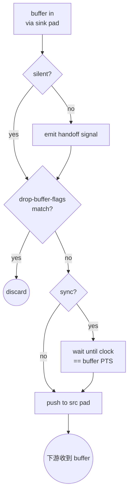

# identity

> 项目内位置：[branch:record] 末端，名称 `rec_tail`，作为 Record 模块动态接 mp4mux+filesink 子 bin 的稳定锚点。

## 1. 基本信息

| 项 | 值 |
|---|---|
| 分类 | **Generic（流控 / 占位元素）** |
| 所在插件 | `gst-plugins-core`（`coreelements`） |
| 全名 | `Identity` |
| 作用 | 把上游 buffer 原样传给下游；可选地 dump、drop、延迟、单步等 |

`identity` 在 GStreamer 里有点像 Unix 的 `cat`：默认就是"什么都不做"，
但可以打开各种调试开关。最常见的两种用法：
1. **占位元素**：在静态 launch 字符串里给一个稳定的命名锚点，运行期再 link 别的元素到它的 src 上。**项目用法。**
2. **调试**：开 `dump=true` 把流过的字节 hex dump 出来，定位 caps / 时序问题。

### Pad 端口能力

- **sink**（always）：`ANY`——什么 caps 都吃。
- **src**（always）：`ANY`——caps 直通上游。

### 关键属性

| 属性 | 类型 | 默认 | 项目值 | 说明 |
|---|---|---|---|---|
| `silent` | bool | `true` | `TRUE` | true=不发 `handoff` 信号；项目不需要逐 buffer 钩子 |
| `dump` | bool | `false` | `FALSE` | true=hex dump 每个 buffer，调试用 |
| `drop-allocation` | bool | `false` | （默认） | true=丢弃下游的 allocation query，强制上游自行分配 |
| `drop-buffer-flags` | flags | `0` | （默认） | 按 flag 过滤丢帧，如 `delta-unit` 丢 P/B 帧 |
| `single-segment` | bool | `false` | （默认） | true=多个 segment 合并为一个，时间戳重写 |
| `sync` | bool | `false` | （默认） | true=按 PTS 与时钟对齐节流；项目 record 副线无需 |
| `datarate` | uint | 0 | （默认） | >0 时按字节率限速，调试用 |
| `signal-handoffs` | bool | `true` | （默认 true 但 silent=true 时压制） | 是否发 handoff 信号 |

### 行为细节

- 默认状态下 identity **零开销**——只是把 GstBuffer 指针往下游一传，
  连 ref count 都不动（sink → src 两个 pad 共享 buffer ref 转移）。
- caps 完全透传：上游 negotiate 出什么，下游就看到什么。
- 可以接受 dynamic linking：在 PLAYING 态把另一个元素 link 到 identity.src，
  identity 会自动 push 当前 segment 给下游（项目动态接 mp4mux+filesink 子 bin 就是这么用的）。

### 使用举例

```bash
# 调试：把流过 identity 的字节 hex dump 出来
gst-launch-1.0 videotestsrc num-buffers=1 \
  ! identity dump=true silent=false \
  ! fakesink

# 占位锚点：稳定 src，下游运行期再决定怎么接
# (典型代码模式，命令行不太用)
```

### 项目内用法

```cpp
// pipeline_builder.cpp - append_branch_record
os << " enc_t. ! queue name=rec_queue max-size-buffers=0 max-size-bytes=0"
   <<                  " max-size-time=2000000000"     // 2s 缓冲（不丢帧）
   << " ! valve name=rec_valve drop=true"
   << " ! identity name=rec_tail silent=true";
```

`rec_tail` 是 Record 副线的"末端锚点"。pipeline 启动期它的 src pad 不接任何元素，
是一个空闲的 src（GStreamer 允许 src pad 不 link，只是没人收数据）。

运行期 [Record::open_segment_locked_](../../src/branches/record/record.cpp) 创建一个
mp4mux+filesink 子 bin，再把 `rec_tail.src` link 到子 bin 的 ghost sink：

```cpp
// record.cpp - open_segment_locked_
GstPad* tail_src = gst_element_get_static_pad(tail, "src");
GstPadLinkReturn lr = gst_pad_link(tail_src, ghost);
gst_object_unref(tail_src);
```

stop 时反过来 unlink 并销毁子 bin，`rec_tail` 自身常驻不变。

## 2. 内部工作原理与数据流程



核心步骤：

1. **buffer 入**：sink pad 收到 buffer。
2. **可选 handoff**：`silent=false` 时发 GObject signal `handoff`，让应用层钩子拿到 buffer 引用。项目用 silent=true 跳过。
3. **drop 过滤**：按 `drop-buffer-flags` 决定要不要丢这个 buffer（项目不设）。
4. **可选 sync 延迟**：`sync=true` 时按时钟节流（项目不设）。
5. **push to src**：如果 src 没接下游，直接 unref 丢弃；接了下游就 push 给下游。

### 作为"锚点"的关键性质

- **src pad 可以悬空**：一个常驻 element 的 src pad 没人接，GStreamer 不会报错——
  buffer 到 identity.src 时简单丢弃，pipeline 状态切换不受影响。
- **可在 PLAYING 态动态 link**：sink/src 都是 always pad，不需要请求/释放；
  动态 link 到下游后，identity 会自动给下游 push 一次当前的 caps + segment 事件，
  之后正常 push buffer——这正是录像副线方案 1 的关键。
- **零副作用**：默认属性下不缓存、不复制 buffer、不引入额外延迟。

## 3. 性能开销与其他补充

### 性能特征

- **CPU**：< 0.01%（pad 间转发是一次 vfunc 调用）。
- **延迟**：纳秒级（不缓存）。
- **内存**：0（不持有 buffer）。

实测在树莓派上挂一个 silent=true 的 identity 与不挂在性能上完全等价。

### 替代品对比

| 元素 | 用途 | 与 identity 区别 |
|---|---|---|
| `queue` | 解耦线程边界、缓冲 | identity 不缓冲、不换线程；queue 是"快慢线分隔" |
| `tee` | 一对多分流 | tee 强行复制；identity 是一对一 |
| `fakesink` | 丢弃流 | fakesink 不能继续 push 给下游；identity 可以接下游 |
| `valve` | 可控开关 | valve 默认按 drop 属性丢弃；identity 默认透传 |

项目用 identity 而非 queue 作为锚点：identity 不引入额外缓冲（rec_queue 已经在前面提供 2s 缓冲），
也不会让 EOS 路径多一道 queue 内部的 buffer 队列要排空。

### 常见坑

1. **`silent=true` 时 handoff 不发**：想用 handoff 钩子调试时务必把 silent 也设成 false。
2. **`drop-buffer-flags` 是 GstBufferFlags**：传值要按 GstBufferFlags 枚举，不是字符串。
3. **作为锚点时下游 link 时机**：必须在 pipeline 已经 PLAYING（或至少 PAUSED）后再 link 下游，
   否则下游 element 的状态可能没正确同步。项目里用 `gst_element_sync_state_with_parent`
   保证子 bin 跟上 pipeline 状态。
4. **多个下游需求**：identity 只能接一个下游；要分流必须用 `tee`。
