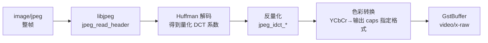

# jpegdec

> 项目内位置：MJPEG 路径专用，紧跟 `jpegparse` 之后。

## 1. 基本信息

| 项 | 值 |
|---|---|
| 分类 | **Decoder（图像）** |
| 所在插件 | `gst-plugins-good`（`jpeg`） |
| 全名 | `JPEG image decoder` |
| 底层库 | `libjpeg-turbo`（运行时优先链 turbo） |
| Rank | `primary` |
| 平台 | 全平台 |

把 `image/jpeg` 解码成 `video/x-raw`（`I420` / `RGB` / `Y444` / 灰度等），
本身不缩放、不重采样、不变帧率。

### Pad 端口能力

- **sink**：`image/jpeg`，建议带 `parsed=true`。
- **src**：`video/x-raw, format ∈ { I420, YV12, Y41B, Y42B, YUY2, RGB, BGR, RGBx, GRAY8 }`，
  默认输出 `I420`（4:2:0 是 baseline JPEG 的天然采样）。

### 关键属性

| 属性 | 类型 | 默认 | 说明 |
|---|---|---|---|
| `idct-method` | enum | `ifast` | 反离散余弦变换实现：`islow`（精度高慢） / `ifast`（默认，快） / `float`（最准但慢） |
| `max-errors` | int | `0` | 单帧允许的解码错误数，>0 时会试图"软撑过"坏帧 |

> 注：`jpegdec` 没有 `pixel-format` 选项，输出格式由下游 caps 协商决定。

### 使用举例

```bash
# 把一张 jpeg 解出来存成 BMP
gst-launch-1.0 filesrc location=in.jpg ! jpegparse ! jpegdec \
  ! videoconvert ! pngenc ! filesink location=out.png
```

### 项目内用法

```text
... ! jpegparse ! jpegdec ! videoconvert ! videoscale ! videorate
  ! video/x-raw,format=I420,width=1280,height=720,framerate=30/1 ! ...
```

`jpegdec` 的 src caps 没有限定 format，靠下游统一 caps（`format=I420`）反向协商。

## 2. 内部工作原理与数据流程



核心步骤：

1. **header 解析**：`jpeg_read_header` 读 SOI/SOF/SOS，取出宽高、分量数、采样、量化表。
2. **熵解码**：扫描 SOS 段的码流，按 Huffman 表恢复量化后的 DCT 系数。
3. **反量化 + IDCT**：每个 8×8 block 反量化后做 IDCT，回到像素域。
   `idct-method=ifast` 用整数近似（精度损失 <1 LSB）；`islow` 是精确整数版。
4. **色彩转换**：libjpeg 内部把 YCbCr 转到下游 caps 指定的格式。如果下游就是 I420，
   会**跳过转换**直接 dump（最快路径）。
5. **打包**：解出来的像素拷贝到 GstBuffer 的内存里 push 给下游。

> libjpeg-turbo 在 ARMv8 上启用 NEON 加速 IDCT 和 YCbCr→RGB 转换，
> 单帧 1080p 解码大约 1~3ms（视核数）。

## 3. 性能开销与其他补充

### 性能特征

- **CPU 开销中等**：1280×720 @30fps 在 UTM aarch64（4 核 ARM Cortex-A 虚拟机）
  上单线程约占 5~10% CPU。
- **内存**：每帧分配一块 raw buffer，I420 1280×720 = 1.3MB；
  buffer 池由 base class 管理，稳定后不会反复 alloc。
- **延迟**：单帧 1~3ms，可视为 0 帧延迟。

### 为什么 src_fmt 落到 I420？

- baseline JPEG 一般是 YCbCr 4:2:0，**直接输出 I420 等于零拷贝**。
- 让下游 `x264enc` 直接吃 I420，省掉一次 `videoconvert`。
- 项目里 `videoconvert ! videoscale ! videorate` 后再用 caps 锁回 `I420`，
  全链路 4:2:0 不变换色度采样，是最便宜的路径。

### 常见坑

1. **`max-errors=0` 默认遇错即丢帧**
   配合上游 `jpegparse` 可以做到坏帧整帧丢、不卡流。如果用户希望"花一帧也比黑屏好"，
   可以调 `max-errors=10`，但项目里没这么做。

2. **不要直接给 RGB**
   下游写 `format=RGB` 会触发 libjpeg 内部 YCbCr→RGB（CPU），白白多一步；
   如果非要 RGB，让独立的 `videoconvert` 来做反而能上 ORC/SIMD 优化路径。

3. **`idct-method=float` 没必要**
   差异肉眼不可见，CPU 翻倍。除非做静态图质量敏感场景。

4. **大尺寸 progressive JPEG**
   progressive JPEG 需要全帧扫描完才能解，延迟会明显增加。
   USB MJPEG 都是 baseline，无此问题。
