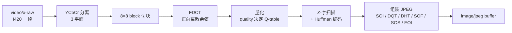

# jpegenc

> 项目内位置：[branch:snapshot] 副线，按需把单帧编成 JPEG 文件。

## 1. 基本信息

| 项 | 值 |
|---|---|
| 分类 | **Encoder（图像）** |
| 所在插件 | `gst-plugins-good`（`jpeg`） |
| 全名 | `JPEG image encoder` |
| 底层库 | `libjpeg-turbo` |
| 工作模式 | 每帧独立编码（无帧间依赖） |

`jpegenc` 把 `video/x-raw` 的单帧编成 baseline JPEG（`image/jpeg`）。
跟视频编码器不同，**没有帧间预测**，每张图自包含。

### Pad 端口能力

- **sink**：`video/x-raw, format ∈ { I420, YV12, YUY2, UYVY, Y41B, Y42B, Y444, RGB, BGR, ... }`。
  最优路径是 `I420`（与 baseline JPEG 4:2:0 天然对齐）。
- **src**：`image/jpeg, width, height, framerate, sof-marker=0`。

### 关键属性

| 属性 | 类型 | 默认 | 项目值 | 说明 |
|---|---|---|---|---|
| `quality` | int (0~100) | `85` | `90` | 质量。85 已经足够，90 略保守追求清晰度 |
| `idct-method` | enum | `ifast` | （默认） | 与 jpegdec 同义，编码端反向用 |
| `snapshot` | bool | `false` | （默认） | 编一帧后发 EOS（项目用 valve 控制单帧，不用这个） |

> JPEG quality 与码率不是线性的：85 → 90 文件可能大 30~50%，肉眼差异有限。
> 项目 90 是为了截图证据可读性。

### 使用举例

```bash
# 把视频每帧存成 jpg
gst-launch-1.0 videotestsrc num-buffers=10 \
  ! videoconvert ! jpegenc quality=90 \
  ! multifilesink location=/tmp/frame_%05d.jpg
```

### 项目内用法

```cpp
// pipeline_builder.cpp - append_branch_snapshot
os << " t. ! queue max-size-buffers=2 leaky=downstream silent=true"
   << " ! valve name=snap_valve drop=true"
   << " ! videoconvert"
   << " ! jpegenc quality=90"
   << " ! multifilesink name=snap_sink"
   <<       " location=/tmp/vm_iot_snap_unused.jpg"
   <<       " post-messages=true async=false sync=false";
```

副线日常关闭（`valve drop=true`），上层抓拍时：
1. 改 `multifilesink` 的 `location` 为目标路径；
2. `valve drop=false`；
3. 等 `multifilesink` 发出 element message 表示该帧已写完；
4. `valve drop=true`。

## 2. 内部工作原理与数据流程



核心步骤：

1. **直接接收 I420**：跳过 YCbCr↔RGB 转换（最快路径）。
2. **8×8 块 FDCT**：libjpeg-turbo 在 ARMv8 上用 NEON 实现 forward DCT，单块 ns 级。
3. **量化**：`quality` 通过经验公式生成 8×8 Q-table，每 DCT 系数除以对应 Q 值。
4. **Z 字扫描 + Huffman**：把 8×8 块按 Zigzag 顺序拉平、用预设 Huffman 表编码。
5. **JPEG 文件结构组装**：拼齐 SOI、量化表（DQT）、Huffman 表（DHT）、帧头（SOF0）、
   扫描数据（SOS+码流）、EOI。

> 与视频编码器不同，jpegenc 完全无状态，编一张图与编 N 张图是相同操作 N 次。

## 3. 性能开销与其他补充

### 性能特征（aarch64 + libjpeg-turbo NEON）

| 分辨率 | quality 90 单帧 |
|---|---|
| 720p I420 | 5~10ms |
| 1080p I420 | 12~20ms |

> 注意是"单帧偶发触发"，平均 CPU 负载 ≈ 0（valve 关时不跑）。

### 与 `multifilesink` 的协作

`multifilesink post-messages=true async=false sync=false`：

- `post-messages=true`：每写完一个文件发 `element` message（`GstMultiFileSink`），
  上层据此回调"截图完成"。
- `async=false`：不参与 pipeline 状态机的异步成功，避免单帧场景下 sink 卡在
  `ASYNC_START` 不返回。
- `sync=false`：不按 PTS 节奏写盘，立刻写。截图无需对齐时间。

### 为什么 jpegenc 前要先 `videoconvert`？

副线 caps 走的是 tee 的上游 caps（I420），通常已经对齐 jpegenc 期望，
但显式加 `videoconvert` 是为了应对极少数 caps 异常（GL 段切到非 I420）：

- caps 一致 → passthrough，零开销。
- caps 不一致 → 自动转回 I420，jpegenc 路径稳定。

### 常见坑

1. **质量过高文件巨大**：`quality=100` 会让一张 720p 截图达到 500KB+，且画质提升微弱。
   实测 90 是性价比最佳。
2. **进度条 / progressive JPEG**：`jpegenc` 默认输出 baseline JPEG。
   要改 progressive 需要 `option-string`，项目无需求。
3. **副线 valve 长期开**：jpegenc + multifilesink 持续工作时会高频写盘，磁盘 IO
   成为瓶颈。**项目设计是单帧抓拍，valve 默认关。**
4. **EXIF/方向**：`jpegenc` 不写 EXIF，需要写元信息要在外层用 ImageMagick / exiftool 后处理。
