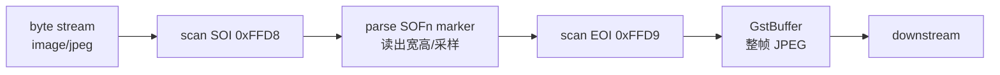

# jpegparse

> 项目内位置：MJPEG 输入路径专用，紧跟 `v4l2src` 之后。

## 1. 基本信息

| 项 | 值 |
|---|---|
| 分类 | **Parser** |
| 所在插件 | `gst-plugins-bad`（`jpegformat`） |
| 全名 | `JPEG stream parser` |
| Rank | `primary` |
| 是否纯软件 | 是，纯 CPU 字节扫描，不解码 |

`jpegparse` 干一件事：**把"可能不齐整的 MJPEG 字节流"切成"一帧一个 GstBuffer"**，
并把 caps 上的 `width/height/framerate` 等元信息补全。它不解码像素。

### Pad 端口能力

- **sink**：`image/jpeg`（caps 可不带尺寸）
- **src**：`image/jpeg, parsed=true, width, height, framerate, sof-marker`
  下游 `jpegdec` 看到 `parsed=true` 才能跳过自己内部的扫描逻辑。

### 关键属性

`jpegparse` 没有用户可调属性（除了通用的 `name` / `parent` / `qos`），
是一个"无配置"的纯逻辑 element。

### 使用举例

```bash
# 修复一段坏的 MJPEG 流
gst-launch-1.0 filesrc location=broken.mjpeg \
  ! jpegparse ! jpegdec ! videoconvert ! autovideosink
```

### 项目内用法

```text
v4l2src ... ! image/jpeg,width=1280,height=720,framerate=60/1
  ! jpegparse ! jpegdec ! ...
```

仅当上游 caps 是 `image/jpeg` 时才接，分支判定写在
`build_source_segment()`：

```cpp
if (chosen.cap.media_type == "image/jpeg") {
    // jpegparse 容错性比 jpegdec 直接吃要好（处理偶发坏帧）
    os << "jpegparse ! jpegdec ! ";
}
```

## 2. 内部工作原理与数据流程



核心循环：

1. **状态机扫字节**：从输入 buffer 里查找 `0xFF 0xD8`（SOI）作为帧起点，
   一直读到 `0xFF 0xD9`（EOI）作为帧终点。中间所有 marker 段（DQT/DHT/SOFn/SOS）
   按 JPEG 规范按长度跳过。
2. **抽取元信息**：从 `SOF0`/`SOF2` marker 里读出 `width / height / sampling`，
   写到 src caps 上；如果上游 caps 已经给了，会做一致性校验。
3. **buffer 重组**：上游一个 `GstBuffer` 可能含 0/1/N 帧——
   `jpegparse` 内部维护一个滚动缓冲区，跨 buffer 拼接，保证下游 push 出去的
   每个 buffer 都是**完整的一帧 JPEG**。
4. **坏帧处理**：扫到非法 marker 或 EOI 之前先撞到下一个 SOI 时，
   丢弃当前累积内容、从新 SOI 开始。这是它"容错"的关键。

## 3. 性能开销与其他补充

### 性能特征

- **CPU 开销极低**：只读 marker 字节，**不解码**像素，单帧通常 <1µs。
- **内存**：内部一个滚动 buffer，最大约一帧大小（<1MB 量级）。
- **延迟**：0 帧延迟（一帧到齐立刻 push）。

### 为什么要加它？

直接 `v4l2src ! jpegdec` 在很多 USB 摄像头上工作正常，但项目里强制加 `jpegparse`，
原因有三：

1. **坏帧容错**：USB 偶发丢字节，`jpegdec` 直接报错断流，`jpegparse` 会丢一帧继续走。
2. **元信息归一**：v4l2 给的 caps 有时缺 `framerate` 或 `pixel-aspect-ratio`，
   parser 会补全，下游 `jpegdec` / `videorate` 才能正常工作。
3. **上下游解耦**：parsed=true 让 `jpegdec` 走"快速路径"（跳过它自己的扫描），
   理论上能省一遍 marker 扫描，虽然差异微小。

### 常见坑

- **caps 不匹配**：上游已经有 `parsed=true` 时再接一遍 `jpegparse` 不会报错但浪费一层。
- **不解决花屏**：`jpegparse` 只判定帧边界，**不修复帧内损坏**。如果 USB 数据本身有比特错误，
  解出来还是花屏。
