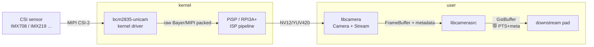

# libcamerasrc

> 项目内位置：pipeline 最上游，[`pipeline_builder.cpp`](../../src/pipeline/pipeline_builder.cpp) 的 `build_source_segment_libcamera()`。
> 与 [`v4l2src`](./v4l2src.md) 互斥并列，由 yaml 中 `capture.source` 选择（`auto` 时启动期自动决策）。

## 1. 基本信息

| 项 | 值 |
|---|---|
| 分类 | **Source（视频源）** |
| 所在插件 | `gstreamer1.0-libcamera`（独立 apt 包，**非** good/bad/ugly 三件套） |
| 全名 | `libcamera Source` |
| Rank | `primary`（与 v4l2src 同级，但只在装了插件时才存在） |
| 平台 | Linux + libcamera 栈；典型场景：树莓派 Bookworm（Pi4 / Pi5 + CSI sensor） |
| 线程 | 内部独立 streaming thread |

`libcamerasrc` 把 [libcamera](https://libcamera.org) 用户态相机栈封装成一个 GStreamer source。
对树莓派 CSI 摄像头（IMX219 / IMX477 / IMX708 / OV5647 ...）来说，
直接 `v4l2src device=/dev/video0` 拿到的是 Bayer / PiSP 自定义压缩格式，
**不能**直接喂 `videoconvert`；必须经 ISP（PiSP / RPI3A+） debayer + tone mapping
之后才会变成普通 NV12 / YUV420。这一整套都被 libcamera 封装进了 `libcamerasrc`，
所以在 Pi 上**这是当前唯一推荐的 CSI 摄像头接入方式**。

### Pad 端口能力

- **src pad（n 个）**：libcamerasrc 支持多 stream（main / viewfinder / raw），
  项目里只用 main pad（默认那个）。
- 常见 caps（Pi5 PiSP 输出，按优先级）：
  - `video/x-raw, format=NV12, width=..., height=..., framerate=N/1`
  - `video/x-raw, format=YUY2, ...`
  - `video/x-raw, format=RGBx, ...`
- 项目固定写 `format=NV12`（Pi 上几乎一定支持），下游 `videoconvert` 自动转到
  `cfg.capture.pixfmt`（默认 I420）。

### 关键属性

| 属性 | 类型 | 默认 | 说明 |
|---|---|---|---|
| `camera-name` | string | 空 | 多摄像头时强制选某个 sensor；**单摄像头不要传**，libcamera 自动选 0 号即可 |
| `auto-focus-mode` | enum | `default` | 仅支持自动对焦的 sensor（IMX708 等）有效；普通模组无效 |
| `af-mode`，`af-range`，`af-speed` | enum | - | 自动对焦相关，普通项目用不到 |
| AE / AWB / 曝光等 | - | - | 通过 [Camera Controls](https://libcamera.org/api-html/namespacelibcamera_1_1controls.html) 体系暴露，运行期可调 |

⚠️ **不要传 `do-timestamp=true`**：
`libcamerasrc` 默认就会用 libcamera 的硬件时间戳（精度比 v4l2src 高），
显式打开该属性会被库内部 warn 一次。

### 使用举例

```bash
# 列出系统识别到的 libcamera 设备
libcamera-hello --list-cameras

# 直接预览（NV12 1280x720@30）
gst-launch-1.0 libcamerasrc \
  ! video/x-raw,format=NV12,width=1280,height=720,framerate=30/1 \
  ! videoconvert ! autovideosink

# 看插件是否装了 + 看 src pad 全部 caps
gst-inspect-1.0 libcamerasrc
```

### 项目内用法

```text
libcamerasrc
  ! video/x-raw,format=NV12,width=1280,height=720,framerate=30/1
  ! videoconvert ! videoscale ! videorate
  ! video/x-raw,format=I420,width=1280,height=720,framerate=30/1
  ! ...（与 v4l2src 路径合流）
```

何时走这条路（[`pipeline_builder.cpp::build_source_segment()`](../../src/pipeline/pipeline_builder.cpp)）：

| `capture.source` | 行为 |
|---|---|
| `auto`（默认） | 先跑 `v4l2_prober`，能力清单非空 → v4l2src；为空 → 自动降级到 libcamerasrc |
| `v4l2` | 强制 v4l2src + 探测；探测失败仍走 hard-coded caps 兑底（旧行为） |
| `libcamera` | 强制 libcamerasrc，跳过 v4l2 探测，启动更快 |

为什么 Pi CSI 在 `auto` 模式下会自动降级：
`/dev/video0` 在 Pi 上由 `bcm2835-unicam` / `pisp-be` 暴露的 fourcc 全是
`PiSP Bayer Compressed` / `8/10/12/14-bit Bayer .. Packed` / `MIPI Greyscale` 这类
ranker 完全不认的格式 → caps 清单空 → 走 libcamerasrc。

## 2. 内部工作原理与数据流程



执行流程：

1. **枚举与选择**：`libcamerasrc` 启动时调 `CameraManager::cameras()` 拿到全部 sensor，
   按 `camera-name`（空 = 取第 0 号）选一个 `Camera`。
2. **Stream 配置**：根据下游协商出的 caps（`format/width/height`）构建一个
   `StreamConfiguration`，调 `Camera::configure()`，把 ISP 的输出格式锁定。
   这一步可能会被 libcamera 调整（例如要求 stride 对齐），实际生效的 caps
   会再 push 到下游做最终 fixate。
3. **FrameBuffer 池**：libcamera 内部用 `FrameBufferAllocator`，所有 buffer
   都基于 dmabuf，**零拷贝**地从 ISP 输出端共享给用户态。
4. **Request 循环**：`Camera::queueRequest()` → ISP 处理 → `requestComplete` 回调
   → libcamerasrc 把 FrameBuffer 包装成 `GstBuffer`（透传 dmabuf-fd，仍然零拷贝）→
   PTS 取自 libcamera 的硬件时间戳 → 通过 src pad push 给下游。
5. **元数据**：libcamera 的曝光/增益/AE 决策结果会以 `GstMeta` 形式挂在 buffer 上，
   下游可读取（项目当前未消费）。

关键点：

- `libcamerasrc` 不是一个 V4L2 节点的简单封装，它把 sensor + ISP 当成一个整体
  控制——这也是为什么不能用 `v4l2src` 顶上去。
- 帧率严格依赖 caps 中的 `framerate=N/1`，不像 `v4l2src` 还能靠下游 `videorate` 救场
  （能救但精度差），所以**caps 必须写齐 `width / height / framerate`**。

## 3. 性能开销与其他补充

### 性能特征

- **CPU 开销极低**：dmabuf 全程零拷贝；libcamerasrc 自身只做控制与元数据组装。
- **延迟下限** ≈ ISP 处理时间 + 1 帧 buffer 排队，Pi5 在 720p30 上典型 30~50ms。
- **内存**：libcamera 默认 buffer 池 ~6 个；下游 queue 一定要 `leaky=downstream`
  避免堆积，与 v4l2src 一致。

### 常见坑

1. **`no such element libcamerasrc`**
   插件没装。Pi OS Bookworm 默认装好；Bullseye 或自编译镜像需要：
   ```bash
   sudo apt install gstreamer1.0-libcamera
   ```
   项目在 `PipelineBuilder::build()` 启动期会用 `gst_element_factory_find()`
   提前检查并 LOGW，避免到 launch 阶段才报错。

2. **`Camera in use`**
   `libcamera-vid` / `rpicam-hello` / 浏览器 / 其他进程已占用 sensor。
   libcamera 设备是独占的，关掉占用方再启动。

3. **caps 协商失败**
   - 写了 `format=I420`：部分 ISP 配置不直接出 I420。**项目用 NV12** 规避。
   - 不写 `framerate`：libcamera 会自己选一个（通常 30），但下游 `videorate`
     拿不到准确速率，调试很难。**caps 三件套写齐**。

4. **多 sensor 选错**
   `camera-name` 缺省时选 0 号；Pi5 双 CSI 时序号不固定（CAM0/CAM1 取决于 dtoverlay
   顺序）。多摄像头场景请显式指定，单摄像头无视。

5. **不要 `do-timestamp=true`**
   `libcamerasrc` 自带硬件时间戳，传该属性反而会被库内部 warn 一次，且可能
   覆盖更精确的时间戳。项目内**不传**。

6. **PiSP / RPi 内核版本**
   极少数旧内核（5.10 之前）+ 新 libcamera 组合下，PiSP 链路初始化会失败。
   遇到 `pisp_be: failed to allocate ...` 这类内核日志时，先升级 `rpi-kernel`。

### 排错命令

```bash
# 看 libcamera 识别情况
libcamera-hello --list-cameras

# 看 libcamera 内部日志（启动期慢/卡时打开）
LIBCAMERA_LOG_LEVELS='*:DEBUG' libcamera-hello -t 1000

# 看 GStreamer 那侧的 libcamerasrc 是否注册成功
gst-inspect-1.0 libcamerasrc

# 验证 GST 链路最小可用
gst-launch-1.0 libcamerasrc num-buffers=30 \
  ! video/x-raw,format=NV12,width=1280,height=720,framerate=30/1 \
  ! fakesink
```
