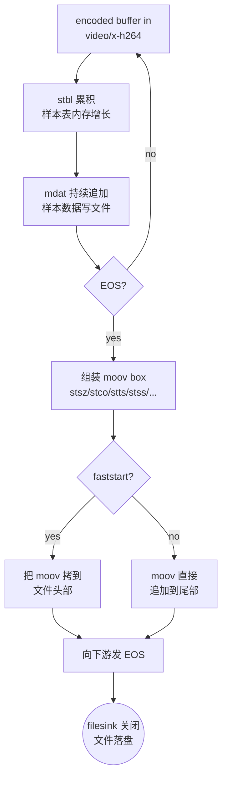

# mp4mux

> 项目内位置：[branch:record] 内部，由 Record 模块在 start 时动态创建，每段一个独立实例。

## 1. 基本信息

| 项 | 值 |
|---|---|
| 分类 | **Muxer（容器封装）** |
| 所在插件 | `gst-plugins-good`（`isomp4`） |
| 全名 | `MP4 Muxer` |
| 作用 | 把编码后的 H.264/H.265/AAC 等 ES 封装成 ISO BMFF（mp4/mov）容器 |

`mp4mux` 解决的问题：
mp4 容器需要在文件开头或末尾写 `moov` 索引（描述每个样本的偏移、时长、关键帧位置），
解码器没有 `moov` 就完全无法播放。`mp4mux` 在 EOS 时收尾把 `moov` 写出来，
保证产出的 mp4 是合规的、所有播放器都能放。

### Pad 端口能力

- **video_%u**（请求 pad）：编码后视频，常见 `video/x-h264, stream-format=avc/byte-stream` 或 `video/x-h265`。
- **audio_%u**（请求 pad）：AAC、ALAC、MP3 等（项目暂未用）。
- **subtitle_%u**：字幕（项目暂未用）。
- **src**（always）：`video/quicktime, variant=iso`。

### 关键属性

| 属性 | 类型 | 默认 | 项目值 | 说明 |
|---|---|---|---|---|
| `fragment-duration` | uint (ms) | 0 | `0` | >0 时切到 fragmented mp4（fmp4），写 moof+mdat 而非 moov；项目用 0 = 普通 mp4 |
| `faststart` | bool | `false` | `FALSE` | true=结束后把 moov 移到文件头（点播友好）；项目本地播放 false 即可，避免二次拷贝 |
| `streamable` | bool | `false` | （默认） | fragmented mp4 用：true=不在文件头写 mvex；非 fmp4 模式无影响 |
| `movie-timescale` | uint | 0 | （默认） | mp4 全局时间基；0=自动选 |
| `presentation-time` | bool | `true` | （默认） | true=用 PTS 写 ctts 偏移；H.264 有 B 帧时必须 true |
| `force-create-timecode-trak` | bool | `false` | （默认） | 写 timecode track，项目无需 |

### 切片 & EOS 行为

- mp4mux **没有 splitmuxsink 那种"切到下一段"的能力**——一旦写出 `moov`，
  这个 mp4mux 实例就用完了，再写新段必须重建一个新实例。
- 收到 EOS 时：把累积的样本表（stbl）转换成 `moov` box → 写到文件头/尾 →
  传 EOS 给下游 filesink → filesink 关闭 fd → mp4 文件落盘可播。
- **不发 EOS 直接销毁 mp4mux 实例**（如 SIGKILL / pipeline 强行 NULL）→
  没有 `moov` 写出 → mp4 文件**整个不可播**。这是项目方案 1 必须给子 bin 推
  EOS 并等 sync-message::eos 的根本原因。

### 使用举例

```bash
# 原始测试模式：videotestsrc 编码后封装成 mp4
gst-launch-1.0 -e videotestsrc num-buffers=300 \
  ! x264enc key-int-max=30 ! h264parse \
  ! mp4mux faststart=false fragment-duration=0 \
  ! filesink location=/tmp/test.mp4

# 注意 -e 让 Ctrl-C 时发送 EOS；没有 -e 就 kill 进程，文件不可播。
```

### 项目内用法

`mp4mux` 不在 [pipeline_builder.cpp](../../src/pipeline/pipeline_builder.cpp) 的 launch 字符串里，
而是由 [Record](../../src/branches/record/record.cpp) 模块在 `open_segment_locked_` 时
代码创建：

```cpp
// record.cpp - open_segment_locked_
GstElement* mux  = gst_element_factory_make("mp4mux", nullptr);
GstElement* sink = gst_element_factory_make("filesink", nullptr);
g_object_set(mux,  "fragment-duration", 0, "faststart", FALSE, nullptr);
g_object_set(sink, "location", seg.path.c_str(),
             "sync", FALSE, "async", FALSE, nullptr);

// 包成子 bin，开 message-forward 让 filesink 的 EOS 能冒到 pipeline bus
GstElement* bin = gst_bin_new(bin_name);
g_object_set(bin, "message-forward", TRUE, nullptr);
gst_bin_add_many(GST_BIN(bin), mux, sink, nullptr);
gst_element_link(mux, sink);

// 把子 bin 的 ghost sink 暴露出来，对接 rec_tail.src
GstPad* mux_sink = gst_element_get_static_pad(mux, "sink");
GstPad* ghost    = gst_ghost_pad_new("sink", mux_sink);
gst_element_add_pad(bin, ghost);
```

## 2. 内部工作原理与数据流程



核心步骤：

1. **buffer 入**：从 `video_0` sink pad 收到样本（H.264 ES）。计算 sample size、duration、
   关键帧标记（IDR=stss 入选）、CTS-DTS 偏移。
2. **stbl 累积**：每个样本的元数据进内存（不会写盘），`mdat` 段的实际样本数据立刻追加写到 filesink。
3. **EOS**：组装完整 `moov` box（包含 mvhd、trak/mdia/minf/stbl 等全套 box）。
4. **写 moov**：
   - `faststart=false`：直接追加到 `mdat` 后面（"moov 在尾部"），文件结构 `[ftyp][mdat][moov]`。
   - `faststart=true`：先写到临时文件，全部完成后把整个文件重排成 `[ftyp][moov][mdat]`（多一次拷贝）。
5. **EOS 下推**：filesink 收到 EOS → fclose → 文件可播。

### `moov` 与可播性

- 没有 `moov` 的 mp4 文件 = 一堆原始样本数据但没"目录"，所有播放器（VLC / ffplay / 浏览器）都拒绝播放。
- `moov` 的写入只发生在 EOS 之后。如果 mp4mux 状态被切到 NULL 而**没有先收到 EOS**，
  `moov` 就丢了——这就是早期"程序退出后视频不可播"问题的根因。

## 3. 性能开销与其他补充

### 性能特征

- **CPU**：极低。每个 buffer 只做 sample 表追加（几个字段 memcpy）+ 实际样本数据透传给 filesink。
- **内存**：随录制时长线性增长（每个 sample 在 stbl 里占 ~20 字节）。
  按 30 fps 算，1 小时约 30×60×60×20 ≈ 2 MB stbl 内存——远小于视频数据本身。
- **磁盘 IO**：mdat 部分边录边写；moov 在 EOS 时一次写入（≤几 MB，瞬间完成）。
- **EOS 同步开销**：< 100 ms（实测；取决于段时长和 sample 数）。

### 为什么不用 fragmented mp4（fmp4）？

- fmp4 把 mp4 切成 `[moof+mdat]+[moof+mdat]+...` 多个 fragment，**每个 fragment 自描述**，
  即使没收到 EOS 也能播一部分——抗崩溃能力强。
- 缺点：兼容性不如普通 mp4（VLC ≥ 3.0、ffplay 没问题，但部分老播放器拒绝放）；
  且 fragment-duration 决定 fragment 大小，过小会浪费空间。
- 项目方案 1 已经通过"子 bin EOS 同步等待"保证 mp4 可播，无需上 fmp4。
  如果后续要做"断电也能放"的场景，可考虑 `fragment-duration=2000`（2s/fragment）。

### `mp4mux` vs `qtmux` vs `isomp4mux`

- `mp4mux`：标准 ISO BMFF mp4，全平台兼容性最好。**项目默认。**
- `qtmux`：苹果 QuickTime 系，box 命名略有不同；Linux/Android 也能放，但浏览器某些情况下挑剔。
- `isomp4mux`（GStreamer 1.20+ 新加）：现代 mp4 muxer，支持更多 box；项目暂不用。

### 常见坑

1. **B 帧不写 ctts → 时间戳全乱**：x264enc 默认 `bframes=0`，没问题；如果用了 B 帧，
   必须保证 `presentation-time=true`（默认是），否则播放器会按 DTS 顺序显示，画面颠倒。
2. **未写 EOS → 文件不可播**：见上文。务必通过 EOS 路径销毁 mp4mux。
3. **运行期改 `faststart` 无效**：必须在 NULL 状态设置（启动期一次性）。项目里 mp4mux 一段一个新实例，
   不存在运行期改属性的需求。
4. **录制超长（小时级）时 stbl 内存膨胀**：项目通过 `segment_sec` 滚动切片（默认 60s 一段）控制，
   不会无限增长。
