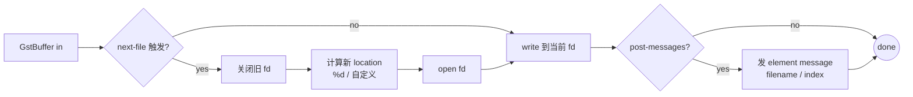

# multifilesink

> 项目内位置：[branch:snapshot] 终端，名称 `snap_sink`，单帧 JPEG 落盘。

## 1. 基本信息

| 项 | 值 |
|---|---|
| 分类 | **Sink（文件输出）** |
| 所在插件 | `gst-plugins-good`（`multifile`） |
| 全名 | `Multi-File Sink` |
| 作用 | 把每个 buffer / 每段输出写到序列化的多个文件 |

`multifilesink` 是 `filesink` 的"多文件"版本：
按 buffer 边界、`%d` 模式或事件驱动地切换文件名，把流切成 N 个独立文件。
项目用它做单帧 JPEG 抓拍（每次开 valve 一帧 = 写一个 jpg）。

### Pad 端口能力

- **sink**：`ANY`，对 caps 不做限制。常见输入：`image/jpeg` / `image/png` / `video/x-h264` /
  `video/x-raw` 等。
- 无 src pad（终端）。

### 关键属性

| 属性 | 类型 | 默认 | 项目值 | 说明 |
|---|---|---|---|---|
| `location` | string | `%05d` | `/tmp/vm_iot_snap_unused.jpg` | 文件路径模板 |
| `next-file` | enum | `buffer` | （默认） | 何时切下一个文件，详见下表 |
| `index` | int | 0 | （默认） | `%d` 占位符的起始值 |
| `max-files` | uint | 0 | 0 | 滚动最多保留多少个文件，0 = 无限 |
| `post-messages` | bool | `false` | `true` | 写完一个文件发 element message |
| `aggregate-gops` | bool | `false` | （默认） | H.264 时按 GOP 切文件 |
| `async` | bool | `true` | `false` | 是否参与 ASYNC 状态切换 |
| `sync` | bool | `true` | `false` | 是否按 PTS 节奏写盘 |

### `next-file` 切文件策略

| 值 | 含义 | 适合 |
|---|---|---|
| `buffer`（默认） | 每个 GstBuffer 一个文件 | **JPEG 截图（项目用这个）** |
| `discont` | 遇到 discont flag 切 | 录像段切割 |
| `key-frame` | 遇到关键帧切 | H.264 GOP 切割 |
| `key-unit-event` | 收到自定义 force-key-unit event 切 | 手动控制录像点 |
| `max-size` | 文件达到 `max-file-size` 切 | 按大小切片 |
| `max-duration` | 达到 `max-file-duration` 切 | 按时长切片 |

### 使用举例

```bash
# 每帧一个 jpg
gst-launch-1.0 videotestsrc num-buffers=10 \
  ! videoconvert ! jpegenc \
  ! multifilesink location=/tmp/frame_%05d.jpg

# H.264 按 GOP 切片
gst-launch-1.0 videotestsrc \
  ! x264enc key-int-max=60 ! h264parse \
  ! multifilesink location=/tmp/seg_%05d.h264 next-file=key-frame
```

### 项目内用法

```cpp
// pipeline_builder.cpp - append_branch_snapshot
os << " ! multifilesink name=snap_sink"
   <<       " location=/tmp/vm_iot_snap_unused.jpg"
   <<       " post-messages=true async=false sync=false";
```

运行时由 Snapshot 模块控制：

```cpp
GstElement* sink = gst_bin_get_by_name(bin, "snap_sink");
g_object_set(sink, "location", "/tmp/snap_001.jpg", nullptr);
// 然后开 valve 一帧、关 valve
// 监听 bus message GST_MESSAGE_ELEMENT，从 message structure 取 "filename" 字段
```

`location` 默认值 `_unused.jpg` 是占位符（valve 关时不会真的写盘）。

## 2. 内部工作原理与数据流程



核心步骤：

1. **render() per buffer**：每来一个 buffer，先判断当前模式是否要切文件。
2. **路径渲染**：`location` 含 `%d`/`%05d` 时用 `index` 替换；不含占位符则每次切都会
   覆盖同名文件（项目场景每次都写新 location，所以 location 没用 `%d`）。
3. **写盘**：`write(2)` 一次性把 buffer 数据落盘。`sync=false` 时不等内核 flush。
4. **post-messages**：写完后构造一个 element message：
   ```
   GstStructure: GstMultiFileSink, filename=(string)/tmp/snap_001.jpg, index=(int)0
   ```
   通过 bus 推到上层，是项目"截图完成回调"的核心机制。

## 3. 性能开销与其他补充

### 性能特征

- **CPU 开销极低**：内存 → 磁盘 syscall。
- **磁盘 IO**：单帧 720p JPEG（quality=90）约 100~200KB。
- **延迟**：与磁盘有关，本地 SSD < 1ms，网络盘 / SD 卡可能数十 ms。

### `async=false` 与 `sync=false` 为什么都关掉？

- **`async=false`**：默认 sink 在 PAUSED 时要"先收到一帧才算 ready"，单帧抓拍场景下
  valve 关闭时永远收不到帧，会卡在 `ASYNC_START`，整条 pipeline 启动失败。
  关掉后 sink 直接 ready，pipeline 正常起播。
- **`sync=false`**：不按 PTS 等待，立刻写。截图无需对齐时间，**早写早完事**。

### 与 `filesink` 的对比

| 元素 | 切文件 | 适用 |
|---|---|---|
| `filesink` | 不切，单文件 | 整段录制 |
| `multifilesink` | 多策略切 | 单帧 / 分段录制 / 按 GOP / 按大小 |
| `splitmuxsink` | 在 mux 边界切，时间/大小 | **MP4 分段录制（HLS / 录像）**，比 multifilesink 更智能 |

> 后续若加录像功能，分段 MP4 应该用 `splitmuxsink` 而不是 `multifilesink`。

### 常见坑

1. **`location` 没占位符 + `next-file=buffer`**：每帧都写到同一个文件，互相覆盖。
   项目避免这个的方式是：**每次写之前由上层改 location**，且默认 valve 关。
2. **`post-messages` 默认 false**：忘记开会让上层永远收不到"截图完成"事件。
3. **`max-files` 滚动 + `index` 不重置**：滚动删除文件时 index 不会回头，
   N 帧后 index 越来越大但磁盘上只有 max-files 个最新文件。截图场景一般 max-files=0。
4. **多线程改 location 竞态**：上层若并发请求多次截图，要给"改 location + 开 valve"
   加锁，否则可能出现"改了 A 的 location，但 valve 放过来的是 B 的帧"。
5. **`sync=true` 阻塞**：默认 sync=true 时 sink 会按 PTS 节奏 wait clock，
   如果上游 valve 关了很久再开一帧，PTS 已是过去时，sink 会因为"早到"立刻写
   或者因为"晚到"丢弃，行为不确定。**直接 sync=false 最稳。**
