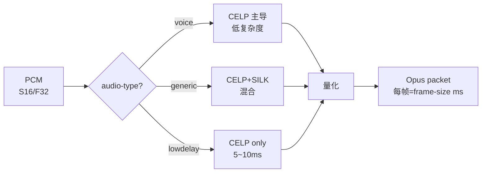

# opusenc

> 项目内位置：可选 AAC 替代品（`cfg.audio.encoder.backend=opus`）。
> 当前 RTSP 单元链路下与 AAC 等价；mp4 录像 backend 切回 AAC 是必然选择。

## 1. 基本信息

| 项 | 值 |
|---|---|
| 分类 | **Encoder（音频）** |
| 所在插件 | `gstreamer1.0-plugins-base`（`opusenc`） |
| 全名 | `Opus audio encoder` |

Opus 是 IETF 标准（RFC 6716），同码率下感知质量普遍优于 AAC，且端到端延迟
能压到 5~10ms（与 AAC 的 40~60ms 相比有明显优势）。代价是 mp4 兼容性弱
（必须 mkv/webm/ogg）。

### Pad 端口能力

- **sink**：`audio/x-raw, format=S16LE/F32LE, rate={8000,12000,16000,24000,48000}, channels={1,2}`。
- **src**：`audio/x-opus`。

注意 sample rate 集合极特殊：8/12/16/24/48k 是 Opus 唯一支持的几档。**项目默认
48k 命中**；若 yaml 设 44.1k 走 Opus，下游 audioresample 必须出现。

### 关键属性

| 属性 | 类型 | 默认 | 说明 |
|---|---|---|---|
| `bitrate` | int | `64000` | bps |
| `bitrate-type` | enum | `cbr` | cbr/vbr/cvbr；RTSP 用 cbr 体验最稳 |
| `frame-size` | enum | `20` (ms) | 2.5/5/10/20/40/60；越小延迟越低但开销大 |
| `audio-type` | enum | `generic` | generic/voice/restricted-lowdelay |

### 使用举例

```bash
gst-launch-1.0 audiotestsrc ! audio/x-raw,rate=48000,channels=2 \
  ! audioconvert ! opusenc bitrate=64000 ! rtpopuspay ! fakesink
```

### 项目内用法

```cpp
// pipeline_builder.cpp::audio_encoder_str
case AudioEncoderBackend::Opus:
    os << "opusenc bitrate=" << (e.bitrate_kbps * 1000);

// 注意：Opus 不需要 aacparse；直接接 rtpopuspay
if (e.backend == AudioEncoderBackend::AAC) {
    os << " ! aacparse";
}
```

bitrate 选择参考：

| 场景 | bitrate_kbps |
|---|---|
| 语音通话 | 16~32 |
| 监控立体声 | 48 |
| 默认/项目推荐 | 64 |
| 高保真 | 128 |

## 2. 内部工作原理与数据流程



核心机制：

1. **混合编码器**：低频用 SILK（语音），高频用 CELP（音乐），中码率自动 blending。
2. **frame-size**：默认 20ms 是延迟/效率折中；2.5ms 极低延迟（RT 通话）但码率开销翻倍。
3. **CBR/VBR**：CBR 在 RTSP 下抖动小；VBR 节省带宽但 jitter buffer 要求高。

## 3. 性能开销与其他补充

### 性能特征

- **CPU**：48k/2ch/64k 单核 ~3%（比 voaacenc 略高）。
- **延迟**：~25ms（一帧 + lookahead）。
- **内存**：~200KB。

### 与 AAC 对比

| 维度 | AAC | Opus |
|---|---|---|
| RTSP 兼容性 | ⭐⭐⭐⭐⭐（VLC/ffmpeg 通吃） | ⭐⭐⭐⭐（部分老客户端无） |
| mp4 录像 | ✅ 标准 | ❌ 必须 mkv |
| 同码率主观质量 | 良好 | 优秀 |
| 编码延迟 | 40~60ms | 25ms |
| CPU | 1~2% | 3% |
| 项目默认 | ✅ | 备选 |

### 常见坑

1. **mp4 路径选 Opus** → 直接 EOS。项目 record 副线在 backend=opus 时应拒启。
2. **sample rate 不在 {8,12,16,24,48}** → caps 协商失败；务必让上游 audioresample
   收敛到 48k。
3. **VBR + 弱网** → bitrate 抖动比 CBR 大，RTSP 接收端 jitter 调高才不卡。
4. **frame-size=2.5** → 极低延迟代价是 ~20% 额外 CPU + 弱网爆包；监控场景没必要。
