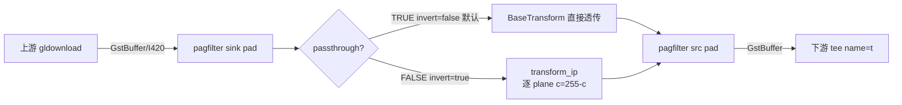
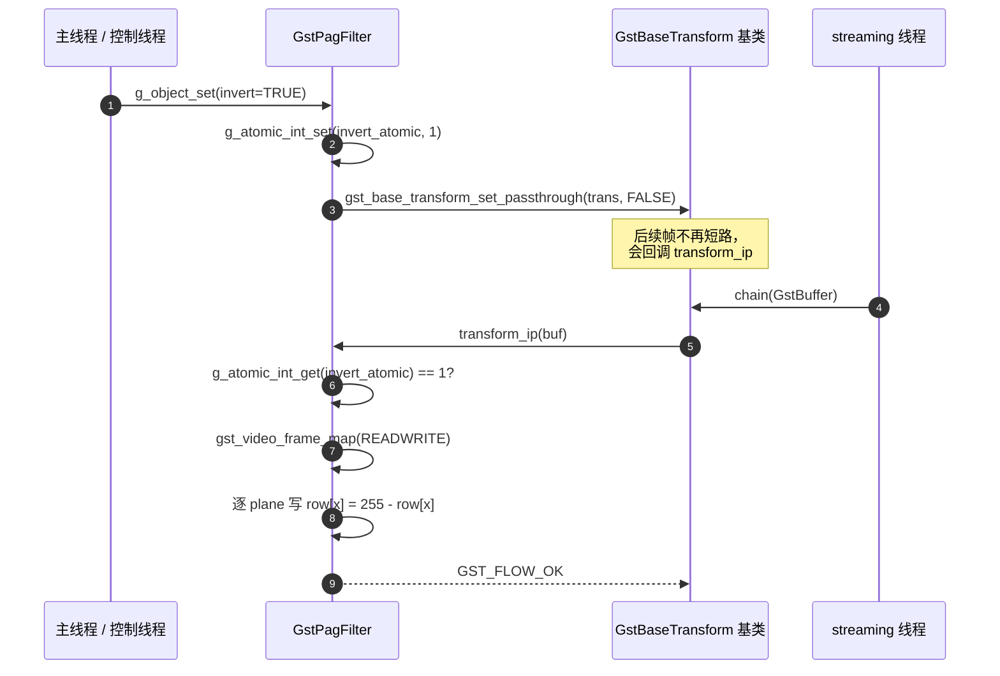

# pagfilter（自研 Element，Stage 2：可选颜色反相）

> 自研 GStreamer 滤镜元素，名称固定为 `pagfilter`。
> 路线图见 [`docs/task/libpag.md`](../task/libpag.md)：当前停在 **Stage 2**，
> 默认仍是 do-nothing pass-through；新增 GObject 属性 `invert`，置 `TRUE`
> 后对每帧 I420 三个 plane 做 `c = 255 - c` 颜色反相，作为"transform_ip
> 链路可用"的最小像素特效演示。Stage 3+ 接入 libpag 渲染。

## 1. 基本信息

- **所属分类**：Filter / Effect / Video（自研，非 GStreamer 上游）
- **所属插件包**：vm_iot 内置——**不是** apt 包。源码位于
  [`src/plugins/pagfilter/`](../../src/plugins/pagfilter/)，
  通过 [`pagfilter_register_static()`](../../src/plugins/pagfilter/gstpagfilter.h)
  在 `main()` 调用 `gst_init()` 之后做一次静态注册。
  > 因此 `gst-launch-1.0 ! pagfilter !` 在外部 shell 里**默认不可见**——
  > 必须通过 vm_iot 二进制自身或单测进程触发。
- **Pad 能力**（Stage 2 仍仅 I420）：
  - sink / src 模板均为 `GST_PAD_ALWAYS`，caps 同为：
    ```
    video/x-raw, format=(string)I420,
                 width=[1, 2147483647],
                 height=[1, 2147483647],
                 framerate=(fraction)[0/1, 2147483647/1]
    ```
  - 一进一出，输入 caps == 输出 caps（BaseTransform 默认行为）。
- **关键属性**（Stage 2 起）：

  | 属性     | 类型      | 默认值  | 可写时机             | 说明 |
  | ------ | ------- | ---- | ---------------- | ----------------------------------- |
  | invert | boolean | FALSE | `MUTABLE_PLAYING` | TRUE 时对每帧 I420 三个 plane 做 `c = 255 - c` 反相；FALSE 时元素短路成 passthrough，零开销。 |

  > 实现侧：`set_property` 把布尔值原子写入 `invert_atomic`，并立刻调用
  > `gst_base_transform_set_passthrough(trans, !invert)` 切换基类行为。
  > 因此 `invert=FALSE` 时 `gst_base_transform_is_passthrough()` 返回 TRUE，
  > 与 Stage 1 行为完全一致。
- **使用举例**：
  ```bash
  # 仅在 vm_iot 进程内部可见；外部 gst-launch 当前不可用，详见上文。
  videotestsrc ! video/x-raw,format=I420 ! pagfilter name=pag0 invert=true ! fakesink
  ```
- **项目内用法**：
  - 注册：[`src/main.cpp`](../../src/main.cpp) 的 `gst_init()` 之后，
    调用 `pagfilter_register_static()`，失败直接 `return 4`。
  - 拼接：[`src/pipeline/pipeline_builder.cpp`](../../src/pipeline/pipeline_builder.cpp)
    在 GL 滤镜段（`gldownload`）之后、`tee name=t` 之前，受
    `cfg.filter.pag.enabled` 开关控制；`cfg.filter.pag.invert` 直接以
    GObject 属性形式写进 launch 串：
    ```
    ... ! gldownload ! videoconvert ! pagfilter name=pag0 invert=false ! tee name=t ...
    ```
  - 配置：见 [`config/default.yaml`](../../config/default.yaml) 的 `filter.pag.*`：
    ```yaml
    filter:
      pag:
        enabled: true
        invert:  false      # Stage 2：true 启用颜色反相
        file:    PAG_LOGO.pag
    ```

## 2. 内部工作原理与数据流程

Stage 2 仍然继承 `GstBaseTransform`。`invert=FALSE` 时基类
完全短路，与 Stage 1 行为一致；`invert=TRUE` 时取消 passthrough，
基类把每个 buffer 派发到 `transform_ip`，由实现做逐 plane 反相。



invert 切换的执行序列：



Stage 2 实现的 vmethod：

- `set_caps(in, out)`：基类已校验通过模板，**新增**把
  `gst_video_info_from_caps(&self->in_info, in)` 缓存到实例字段；
  日志多打印一份 `widthxheight` / `format` 便于启动期排查。
- `transform_ip(trans, buf)`：核心实现。`gst_video_frame_map(GST_MAP_READWRITE)`
  按 plane 拆开后，用 `GST_VIDEO_FRAME_PLANE_DATA / STRIDE` +
  `GST_VIDEO_FRAME_COMP_WIDTH / HEIGHT` 逐行 `row[x] = 255 - row[x]`。
  **不要假设 stride == width**——I420 的 stride 经常会被对齐到 4/16 字节。
- `init`：`gst_base_transform_set_passthrough(self, TRUE)` +
  `set_in_place(self, TRUE)`，与 Stage 1 一致；
  `g_atomic_int_set(invert_atomic, 0)` + `gst_video_info_init(&in_info)`。
- `set_property(invert)`：原子写 + 同步调 `set_passthrough(!invert)`。
- `class_init` 显式声明 `transform_ip_on_passthrough = FALSE`：
  passthrough 模式下基类不会回调 `transform_ip`，与 Stage 2 设计耦合。

线程模型：streaming 线程跑 `set_caps` / `transform_ip`，主线程 / 控制线程
跑 `set_property`。`invert_atomic` 用 `g_atomic_int_*` 跨线程读写；
`in_info` 仅 streaming 线程访问（`set_caps` 与 `transform_ip` 串行），无锁。

## 3. 性能开销与其他补充

- **CPU**（720p I420，经验值，正式数据见 Stage 2 落地记录）：
  - `invert=FALSE`：与 Stage 1 一致，零像素读写。
  - `invert=TRUE` ：单帧需要遍历 ~1.4MB 像素一次（Y plane 921600 + U/V 各 230400）。
    实现走纯标量循环，未做 SIMD/多线程；UTM aarch64 单核大约消耗
    一个数字百分点级 CPU，**符合 Stage 2 验收标准 `< 15%`**。
- **GPU**：不涉及。pagfilter 故意放在 `gldownload` 之后，作用域是系统内存 I420，
  避开 GL Context 共享问题，留待 Stage 4 的 GL 路径再考虑。
- **内存拷贝**：
  - `invert=FALSE`：0 次（passthrough 模式 BaseTransform 不调用 `prepare_output_buffer`）。
  - `invert=TRUE` ：0 次额外分配（`transform_ip` 原地修改）。

### 常见坑

- **「外部 gst-launch 找不到 pagfilter」**：项目当前用静态注册，未把插件做成
  独立 .so 安装到 `GST_PLUGIN_PATH`。要在 vm_iot 进程外验证，需要先把
  [`gstpagfilter.cpp`](../../src/plugins/pagfilter/gstpagfilter.cpp)
  补一个标准的 `GST_PLUGIN_DEFINE` 入口并独立 build 一个 .so——这是
  Stage 4 的可选项。
- **stride ≠ width**：I420 的每行 stride 经常被对齐到 4/16 字节抬高，
  逐行处理时只能 `for (x=0; x<width; ++x) row[x]=...; row += stride;`，
  绝不能 `memset(plane, ..., width*height)`。
- **U/V plane 是 1/4 分辨率**：用 `GST_VIDEO_FRAME_COMP_WIDTH/HEIGHT(&frame, p)`
  取每 plane 自己的尺寸，不要自己拿 width/2。
- **caps format=I420 锁死**：Stage 2 仍只声明 I420，与 `cfg.capture.pixfmt`
  默认值对齐。Stage 3+ 加新格式时需同步升级模板与 `transform_ip` 的逐 plane 处理。
- **`set_property` 与 `transform_ip` 的竞争窗口**：set_property 切换
  passthrough 之前，可能有最后一帧已经进入 `transform_ip`。`transform_ip`
  内部再做一次 atomic 检查直接放行（防御性），避免漏处理产生闪烁。
- **`G_PARAM_CONSTRUCT` + `MUTABLE_PLAYING`**：属性带这两个 flag 才能在
  `g_object_new` 时拿到默认值、并允许 PLAYING 状态下热改。否则 launch 串
  里写的 `invert=true` 会无声失效。

### 调试技巧

- 单独打开本元素日志：`GST_DEBUG=pagfilter:5`，类目名固定为 `pagfilter`。
- 反相生效校验：`GST_DEBUG=pagfilter:5,basetransform:5` 可以看到
  `set_caps` 落点 + `set_property: invert -> true` + 后续 `transform_ip` 调用。
- 验证 caps 协商：开 `GST_DEBUG=GST_CAPS:5,pagfilter:5` 即可看到
  `set_caps` 落点。
- 单测覆盖：[`tests/test_pagfilter.cpp`](../../tests/test_pagfilter.cpp)
  - `InvertPropertyTogglesPassthrough`：黑盒验证属性 ↔ passthrough 联动；
  - `InvertPipelineFlipsAllPlanes`：用 appsrc/appsink 灌一帧 I420
    (Y=0x10, U=0x20, V=0x30)，断言每 plane 被映射到 0xEF/0xDF/0xCF。
