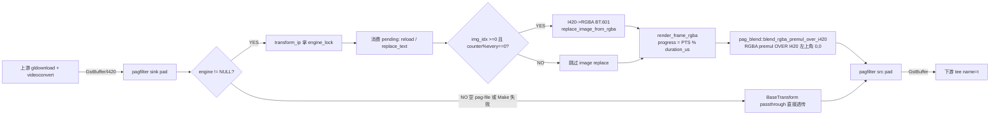
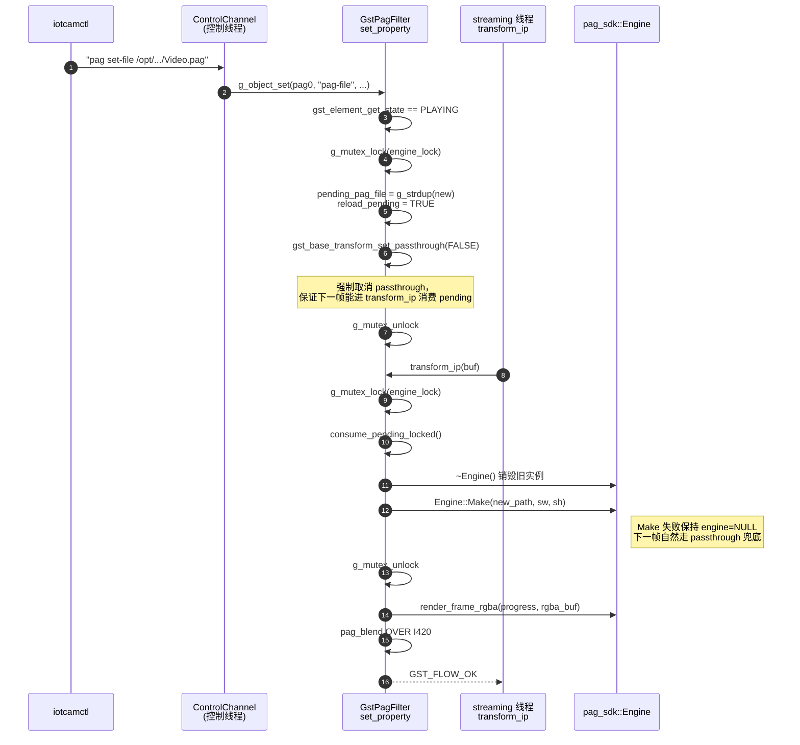

# pagfilter（自研 Element：libpag 渲染 + 文本/视频图层热替换）

> 自研 GStreamer 滤镜元素，名称固定为 `pagfilter`。
> 元素的能力闭环是：在 streaming 线程稳定渲染一份 Tencent/libpag .pag 资产、
> 并 alpha-blend 到主线 I420 之上，并支持
> **PLAYING 状态下的 pag-file 热切、文本图层替换、image placeholder
> 替换为当前摄像头帧**三种运行期控制能力（通过 GObject 属性或 ControlChannel
> 触发）。`pag-file` 为空 / NULL 时元素自动退回 passthrough，零开销。

## 1. 基本信息

- **所属分类**：Filter / Effect / Video（自研，非 GStreamer 上游）
- **所属插件包**：vm_iot 内置——**不是** apt 包。源码位于
  [`src/plugins/pagfilter/`](../../src/plugins/pagfilter/)，
  通过 [`pagfilter_register_static()`](../../src/plugins/pagfilter/gstpagfilter.h)
  在 `main()` 调用 `gst_init()` 之后做一次静态注册。
  > 因此 `gst-launch-1.0 ! pagfilter !` 在外部 shell 里**默认不可见**——
  > 必须通过 vm_iot 二进制自身或单测进程触发。
- **Pad 能力**（仅 I420）：
  - sink / src 模板均为 `GST_PAD_ALWAYS`，caps 同为：
    ```
    video/x-raw, format=(string)I420,
                 width=[2, 2147483647],
                 height=[2, 2147483647],
                 framerate=(fraction)[0/1, 2147483647/1]
    ```
  - 一进一出，输入 caps == 输出 caps（BaseTransform 默认行为）。
  - **width/height 下限抬到 2**：渲染路径里多处对宽高做 `& ~1` 偶数对齐，
    以匹配 I420 chroma 1/4 分辨率与 PAG Surface 偶数约束。
- **关键属性**（所有属性均 `MUTABLE_PLAYING`，PLAYING 也能改）：

  | 属性 | 类型 | 默认值 | 取值 | 说明 |
  |---|---|---|---|---|
  | `pag-file` | string | `""` | 绝对 / 相对路径 | 空串或 NULL 时元素维持 passthrough。非空时按当前 caps 的 `width×height` 创建 `pag_sdk::Engine`，每帧把 PAG 渲染到 RGBA premul 离屏 buffer 后 blend 到入帧 I420。**PLAYING 时改值不会立即重建 Engine**，而是写入 `pending_pag_file`，由 streaming 线程下一帧持锁消费后再 `Engine::Make` —— 避免 `set_caps / transform_ip / set_property` 三线程相互打架。 |
  | `pag-text` | string | `""` | `"<idx>:<utf8>"` | 替换 PAG 中第 `idx` 个文本图层为 UTF-8 字符串。`idx ∈ [0, num_texts)`，越界由 SDK 层 LOGW 拒绝。格式错（无冒号/idx 非整数/idx<0）会直接 LOGW 不入队。**写入只入 pending 队列**，下一帧 transform_ip 拿锁后调 `Engine::replace_text`。 |
  | `pag-replace-image-idx` | int | `-1` | `-1..1024` | 设为 `>=0` 时，开启"摄像头画中画"：每渲染 N 帧把当前帧 I420 反向转 RGBA，灌进 PAG 的第 `idx` 个 image placeholder。`-1` 关闭。 |
  | `pag-replace-image-every` | int | `2` | `1..60` | 上一项的节流间隔；`1` 表示每帧都替换（CPU 热点），`2` 即默认 30fps 输入时 ~15 次/秒，性价比较好。**libpag 每次 replace_image 都会触发内部纹理重建**，调小要慎重。 |

  > 早期的 `invert`（颜色反相）属性已随 libpag 接入**移除**，
  > 历史代码可在仓库历史里翻 `gstpagfilter.cpp` 早期版本，本文不再保留。

- **使用举例**：

  ```bash
  # 1) 启动期由配置 cfg.filter.pag.* 推动（推荐路径）
  vm_iot --config assets/config/default.yaml
  #    └─ filter.pag.enabled=true  → pipeline_builder 在 GL 段后插 ! pagfilter name=pag0
  #    └─ filter.pag.file 由 main.cpp 启动后 g_object_set(pag0, "pag-file", ...)

  # 2) 运行期热切（通过 ControlChannel + iotcamctl）
  iotcamctl pag get                                  # 查询当前 pag0 状态
  iotcamctl pag set-file /opt/vm_iot/assets/pag/Video.pag   # 热切 pag 资产
  iotcamctl pag set-text 0 "Hello, vm_iot"           # 替换文本图层 0
  iotcamctl pag set-replace-image 0                  # 把图像图层 0 替换为摄像头帧
  iotcamctl pag set-replace-image-every 4            # 把节流间隔调到 4 帧
  iotcamctl pag set-replace-image -1                 # 关闭画中画

  # 3) 外部 gst-launch 进程内单跑（**注意：默认不可见，需先静态注册或独立 build .so**）
  gst-launch-1.0 -e videotestsrc num-buffers=120 ! \
      video/x-raw,format=I420,width=640,height=360 ! \
      pagfilter name=pag0 pag-file=/abs/path/to/Video.pag ! fakesink sync=true
  ```

- **项目内用法**：
  - 注册：[`src/main.cpp`](../../src/main.cpp) 的 `gst_init()` 之后立刻调用
    `pagfilter_register_static()`，失败直接 `return 4`。
  - 拼接：[`src/pipeline/pipeline_builder.cpp`](../../src/pipeline/pipeline_builder.cpp)
    在 GL 滤镜段（`gldownload + videoconvert`）之后、`tee name=t` 之前，
    受 `cfg.filter.pag.enabled` 开关控制：
    ```
    ... ! gldownload ! videoconvert ! pagfilter name=pag0 ! tee name=t ...
    ```
    `pag-file` 等属性**不在 launch 串里**写——`main.cpp` 在 pipeline
    构建完成后通过 `gst_bin_get_by_name(bin, "pag0")` 取实例，
    `g_object_set` 一次性把 `pag-file` 写进去；运行期由 ControlChannel
    走相同入口热改。
  - 配置：见 [`assets/config/default.yaml`](../../assets/config/default.yaml) 的 `filter.pag.*`：
    ```yaml
    filter:
      pag:
        enabled: true                # 总开关；false 时 pipeline 不拼 pagfilter
        selftest: false              # true 时启动期单独 pag_sdk::selftest_load 冒烟
        file: "pag/Video.pag"        # 初始 pag-file（相对路径以 assets/ 为基目录）；运行期可经 ControlChannel 热改
    ```
  - 控制：[`src/cli/iotcamctl.cpp`](../../src/cli/iotcamctl.cpp) 的 `pag` 子命令族
    （`get` / `set-file` / `set-text` / `set-replace-image` /
    `set-replace-image-every`）封装 ControlChannel 协议，最终落到本元素的
    `set_property`。控制命令转 GObject 属性的映射约定见
    [`docs/task/libpag.md`](../task/libpag.md) 第 11 节。

## 2. 内部工作原理与数据流程

元素继承 `GstBaseTransform`，状态机里只有两条主路径：

- **空 `pag-file`** → BaseTransform 完全 passthrough，零开销。
- **非空 `pag-file` 且 Engine 构造成功** → 切到 `transform_ip` 模式，
  每帧"消费 pending → 渲染 RGBA → blend 到 I420"。

### 2.1 渲染主路径



关键时间轴推进规则：

- `progress = ((PTS - stream_start_pts) µs) % duration_us / duration_us`。
- `duration_us == 0`（静态 PAG）始终给 `0.0`。
- PTS 无效时退化为 `frame_counter * 33333 µs`（假定 30fps）。
- `stream_start_pts` 由首帧锚定，`set_caps` 重协商时清零。

### 2.2 PLAYING 状态热切的执行序列

热切的核心是把"控制线程的写"与"streaming 线程的读"通过 `engine_lock_`
（`GMutex*`）解耦：控制线程只动 `pending_*` 字段，真正动 Engine 永远在
streaming 线程。



`pag-text` 与 `pag-replace-image-*` 的入队/消费时序同形，区别仅在
streaming 线程消费时调用的 SDK 接口不同（`replace_text` /
`replace_image_from_rgba`）。

### 2.3 实现的 vmethod 摘要

- `set_caps(in, out)`：校验 `format == I420`，更新 `in_info`，按当前
  `pag_file_path` **持锁**调 `rebuild_engine_locked`；Engine 命中时切
  `set_passthrough(FALSE)`，否则维持 `TRUE`。
- `transform_ip(trans, buf)`：核心实现，**所有热控变更都在本函数入口持锁消费**。
  渲染 / blend 阶段放锁后跑（局部缓冲 + Engine 仅 streaming 线程访问）。
- `stop`：状态切回 READY 前释放 Engine 与 RGBA 缓存；让下次 NULL→READY 走
  干净路径。
- `set_property` / `get_property`：所有属性都持 `engine_lock_`；`pag-file`
  按状态分两支（`<= READY` 直接覆盖、`>= PAUSED` 入 pending）。
- `finalize`：兜底释放 Engine、`in_info`、`pending_*`、`engine_lock_`。
- `class_init`：声明四个 `MUTABLE_PLAYING` 属性 + sink/src 模板。
  **没有 `transform_ip_on_passthrough = TRUE`**——passthrough 模式下基类不会
  回调 `transform_ip`，热切靠 `set_property` 主动 `set_passthrough(FALSE)` 唤醒。

### 2.4 线程模型一句话总结

| 线程 | 触碰的字段 / 函数 | 同步手段 |
|---|---|---|
| streaming 线程 | `engine` / `rgba_buf` / `in_info` / `stream_start_pts` / `frame_counter` | 自身串行；`set_caps`↔`transform_ip` 由 GStreamer 保证 |
| 控制 / 主线程 | `pag_file_path` / `pending_*` / `replace_image_*` | `engine_lock_` 互斥 |

`engine_lock_` 只在「入队」「出队/重建」两个短临界区持有；真正的渲染、I420
读写、libpag flush 都在锁外。

## 3. 性能开销与其他补充

测量基线：UTM aarch64 Ubuntu 22.04，720p@30fps，Video.pag（动态 PAG，
~3s 循环，1 个文本图层 + 1 个 image placeholder）。

- **CPU**：
  - `pag-file=""` ：passthrough 零像素读写。
  - `pag-file=Video.pag, replace-image=-1`：单帧消耗 = `render_frame_rgba`
    （EGL / 软件 raster）+ `blend_rgba_premul_over_i420`，aarch64 单核约
    **个位数百分点**。
  - 开启 `replace-image-idx=0, every=2`：额外 ~3–5ms / 替换帧用于
    `i420_to_rgba_bt601`（纯标量，无 SIMD/libyuv）+ libpag 内部纹理重建。
    `every=1` 时容易把单核打到 30%+，**生产环境保持 ≥2**。
- **GPU**：libpag 默认走 GL/EGL；headless 环境若 EGL 不可用会每帧
  `PAGPlayer::flush failed`，pagfilter 已做单帧 LOGW 降级（buffer 原样透传），
  但不会停止重试。彻底关闭需要在 Engine 构造时返回 nullptr，本元素层会自动
  退化为 passthrough。
- **内存拷贝**：
  - passthrough：0 次。
  - 渲染路径：一次 `Engine` 持有的 RGBA premul Surface（`sw*sh*4`）+ 一次
    本元素 `std::vector<uint8_t>` 中转 `rgba_buf`（同样大小）+ 一次 blend 写回
    入帧 I420。
  - `replace-image` 路径再加一份临时 `std::vector<uint8_t> rgba_camera`
    （`w*h*4`），离 transform_ip 退出即析构。

### 常见坑

- **「外部 gst-launch 找不到 pagfilter」**：项目当前用 `gst_plugin_register_static`，
  未把插件做成独立 .so 安装到 `GST_PLUGIN_PATH`。要在 vm_iot 进程外验证，
  需要先在 [`gstpagfilter.cpp`](../../src/plugins/pagfilter/gstpagfilter.cpp)
  里补一个标准 `GST_PLUGIN_DEFINE` 入口并独立 build 一个 .so，或在脚本里
  用 `LD_PRELOAD` 把 vm_iot 一并拉起来。
- **stride ≠ width**：I420 的每行 stride 经常被对齐到 4/16 字节抬高，
  `i420_to_rgba_bt601` 与 blend 路径都走 `GST_VIDEO_FRAME_PLANE_STRIDE`，
  禁止用 `width * height` 直接寻址 plane。
- **U/V plane 是 1/4 分辨率**：`i420_to_rgba_bt601` 用 `x>>1 / y>>1` 取
  chroma；同理 `pag_blend` 内部也按 2×2 块平均回 chroma。**奇数宽高会越界**，
  这是 `& ~1` 偶数对齐到处出现的原因。
- **`pag-file` 热切失败时静默降级**：`Engine::Make` 失败只 LOGW，pagfilter
  自动退回 passthrough（不报 error 给上层）。线上要监控 `iotcamctl pag get`
  返回的 `attached` 字段，不要假设"set-file 成功 ack 了就一定渲染上了"。
- **`pag-text` 多空格被压缩**：`iotcamctl pag set-text 0 hello   world` 会被
  Shell + argv 解析压成一个空格。需要保留多空格请改用 `iotcamctl raw "..."`
  直接发原始命令。
- **热切 + pending text 的错乱窗口**：先 `pag set-text` 入队，紧接着
  `pag set-file` 切到新资产时，旧 pending text 的 idx 在新资产里语义可能
  完全不同。当前实现里 `consume_pending` 先消费 file 再消费 text，**且 text
  仅在 Engine 已就绪时下发**——如果你看到偶发"换文件后头一两帧文本没换上"，
  请重发 `set-text` 而不是依赖之前那次。
- **caps format=I420 锁死**：当前只声明 I420，与 `cfg.capture.pixfmt`
  默认值对齐。后续若要支持 NV12 / RGBA，需同步升级模板、blend 路径和
  `i420_to_rgba_bt601` 的反向公式。
- **`set_property("pag-file", ...)` 与 `set_caps` 的并发**：两者都会持
  `engine_lock_` 调 `rebuild_engine_locked`，串行无问题；但**注意调用顺序**
  ——状态机刚跨进 PAUSED 时，是 streaming 线程先跑 `set_caps`、还是控制线程
  先 `set_property`，依赖业务时序。当前实现里两条路径都把"按当前
  `pag_file_path` + `in_info`"重建 Engine 作为唯一入口，不会留半成品状态。
- **`G_PARAM_CONSTRUCT` + `MUTABLE_PLAYING`**：四个属性都带 `MUTABLE_PLAYING`
  flag，PLAYING 状态下 `g_object_set` 才不会被 GstObject 拒绝。

### 调试技巧

- 单独打开本元素日志：`GST_DEBUG=pagfilter:5`，类目名固定为 `pagfilter`。
  关心热切重建可加 `pagfilter:6,basetransform:5`，可以看到
  `engine rebuilt for '...' surface=WxH numTexts=N numImages=M`。
- 验证 pending 真的被消费：`GST_DEBUG=pagfilter:6` 下能看到
  `replace_text(idx=0, len=12) -> ok` / `replace_image_from_rgba(idx=0) failed`
  这类逐帧日志。
- 验证 caps 协商：`GST_DEBUG=GST_CAPS:5,pagfilter:5` 看 `set_caps in=... out=...
  pag-file='...'`。
- 出现卡顿 / 闪烁先看 `pag_sdk::Engine::render_frame_rgba` 是否每帧 LOGW
  `PAGPlayer::flush failed`：那是 EGL 初始化失败的征兆，参考
  [`docs/task/libpag.md`](../task/libpag.md) 「风险与坑」一节排查。
- 单测覆盖：[`tests/test_pagfilter.cpp`](../../tests/test_pagfilter.cpp)
  - 基础 caps / passthrough 联动；
  - `pag-file` 热切排队 → 下一帧 Engine 重建；
  - `pag-text` 入队 → `consume_pending` 调 `replace_text`；
  - `pag-replace-image-idx + every` 节流计数；
  - 控制线程与 streaming 线程并发写入不崩。
