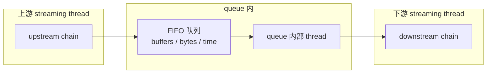

# queue

> 项目内位置：每条 tee 分支的第一站，是项目里出现频率仅次于 `videoconvert` 的 element。

## 1. 基本信息

| 项 | 值 |
|---|---|
| 分类 | **Generic（缓冲 / 线程边界）** |
| 所在插件 | `gstreamer-core`（`coreelements`） |
| 全名 | `Queue (asynchronous buffering)` |

`queue` 干两件大事：
1. **缓冲**：在内部维护一个 FIFO buffer 队列，吸收上下游速度差。
2. **线程边界**：上游的 streaming thread 把数据放进队列，**queue 内部新起一条线程**
   从队列拉数据 push 给下游。这是 GStreamer 切线程的标准方式。

### Pad 端口能力

- **sink / src**：均 `ANY`，对 caps 不做任何限制。

### 关键属性

| 属性 | 类型 | 默认 | 说明 |
|---|---|---|---|
| `max-size-buffers` | uint | `200` | 最多缓存多少帧 |
| `max-size-bytes` | uint | `10485760` | 最多缓存多少字节 |
| `max-size-time` | uint64 | `1000000000`（1s） | 最多缓存多长时间（ns） |
| `min-threshold-buffers` / `bytes` / `time` | uint | 0 | 起播水位线 |
| `leaky` | enum | `no` | `no`（满时阻塞） / `upstream`（丢最旧） / `downstream`（丢最新） |
| `flush-on-eos` | bool | `false` | EOS 来时是否扔掉队列里数据 |
| `silent` | bool | `false` | 关闭后不发 `running`/`overrun`/`underrun` 信号 |

### `leaky` 三种模式对比

| 模式 | 满时行为 | 适合场景 |
|---|---|---|
| `no`（默认） | 阻塞上游 | 不能丢帧的离线录制 |
| `upstream` | 丢队列最旧帧 | 实时显示（保新画面） |
| `downstream` | 丢正要进来的帧 | **直播推流（保旧画面节奏）** |

### 使用举例

```bash
# 给慢 sink 加缓冲
gst-launch-1.0 videotestsrc ! queue max-size-buffers=10 leaky=downstream \
  ! filesink location=out.raw
```

### 项目内用法

```text
t. ! queue max-size-buffers=2 leaky=downstream ! ... ! rtph264pay
t. ! queue max-size-buffers=2 leaky=downstream silent=true ! valve ! ... ! multifilesink
```

代码：

```cpp
// 主线
os << " t. ! queue max-size-buffers=2 leaky=downstream"
   << " ! videoconvert ! ... ";

// 截图副线
os << " t. ! queue max-size-buffers=2 leaky=downstream silent=true"
   << " ! valve name=snap_valve drop=true ! ... ";
```

`max-size-buffers=2` 是有意识的低水位：

- 直播场景宁可丢帧也不要堆积——堆积 = 端到端延迟变大。
- 2 帧 ≈ 67ms（30fps），是"让下游 GPU/编码 还能并行一帧"的最小值。

## 2. 内部工作原理与数据流程



核心机制：

1. **生产者**：上游线程调 `chain()` 把 buffer 入队；如果队列已满：
   - `leaky=no` → 阻塞，直到队列腾出空间。
   - `leaky=upstream` → 丢掉队列头部最旧 buffer，再入队。
   - `leaky=downstream` → 直接丢掉**这一个**新进来的 buffer。
2. **消费者**：queue 启动时会创建一个独立线程，循环 `pop` 队列、调下游
   `chain()`。这条线程 = 下游所有 element 的 streaming thread（直到下一个 queue）。
3. **水位通知**：`overrun` / `underrun` / `running` / `pushing` 信号由队列水位
   触发，上层可以监听做自适应。
4. **EOS / FLUSH**：EOS 沿队列尾部串行传递，FLUSH 立即清空队列。

## 3. 性能开销与其他补充

### 性能特征

- **CPU 开销低**：每帧两次互斥锁 + 一次条件变量，纳秒级。
- **内存**：取决于 `max-size-bytes`，项目 `max-size-buffers=2`，每帧 1.4MB（I420 720p）
  + GL 纹理引用，内存占用稳定 < 5MB。
- **延迟**：稳定状态下队列接近空，新 buffer 立即被消费；满载时 = `max-size-time`。

### 项目为什么把 `max-size-buffers` 设到 2？

- 直播 RTSP 要求端到端延迟 < 200ms。
- queue 默认 200 buffers / 1s，会把延迟直接抬到 1s 以上。
- 设 2 后：稳定状态下队列里 0~1 帧，瞬时抖动时丢一帧不堆积。

### 与 `tee` 的标准搭配

每条 tee 分支必须以 queue 起头，原因见 [`tee.md`](./tee.md)。
queue 在这里的作用是把 tee 分支彼此**异步化**。

### `silent=true` 的考量

- 副线（截图）valve 大部分时间关着，buffer 全被丢，会持续触发
  `overrun` / `underrun` 信号 → 日志噪音。
- 主线没设 silent，方便观察推流是否堆积。

### 与 `queue2` / `multiqueue` 的区别

| 元素 | 关键差异 |
|---|---|
| `queue` | 内存队列，本项目用这个 |
| `queue2` | 支持磁盘溢出 / 网络场景的"download buffering" |
| `multiqueue` | 一个元素管多对 sink/src，跨流同步（demux 后用） |

### 常见坑

1. **`leaky=no` 在直播链路里是定时炸弹**：上下游瞬时速度差时 queue 满 → 阻塞 →
   tee 阻塞 → v4l2src 驱动队列堆积 → 一系列丢帧。**实时链路必 leaky=downstream。**
2. **`max-size-buffers` 与 `max-size-bytes` 与 `max-size-time` 任一达标即满**：
   不要单独把 buffers 设 0 而期望"无限大"，会被 bytes/time 限制兜底。
   想真正无限：三个都设 0。
3. **多 queue 串联放大延迟**：一条链上 N 个 queue，每个最多 2 帧，最坏延迟 = 2N 帧。
   项目设计上每条分支只有一个 queue。
