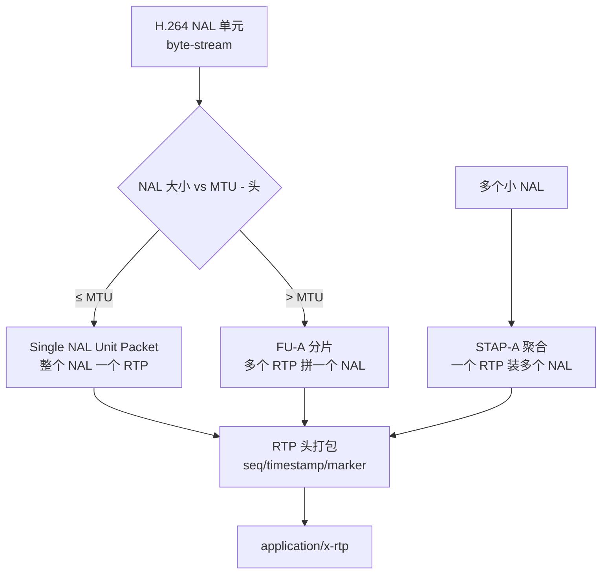

# rtph264pay

> 项目内位置：[branch:main] 终端，gst-rtsp-server 约定的 RTP 打包 element，
> 名称必须是 `pay0`。

## 1. 基本信息

| 项 | 值 |
|---|---|
| 分类 | **Payloader（RTP 打包）** |
| 所在插件 | `gst-plugins-good`（`rtp`） |
| 全名 | `RTP H264 payloader` |
| 协议规范 | [RFC 6184](https://datatracker.ietf.org/doc/html/rfc6184) |

`rtph264pay` 把 H.264 elementary stream（来自 `h264parse`）按 RFC 6184 切成 RTP 包。
对接 `udpsink` / `gst-rtsp-server` 走 RTP/RTSP 直播。

### Pad 端口能力

- **sink**：`video/x-h264, stream-format=byte-stream, alignment ∈ { au, nal }, parsed=true`。
  必须 `parsed=true`，所以前置必有 `h264parse`。
- **src**：`application/x-rtp, media=video, encoding-name=H264, clock-rate=90000, payload=N, ...`。
  caps 上还会带 `sprop-parameter-sets`（base64 SPS/PPS），SDP 会用到。

### 关键属性（项目重点）

| 属性 | 类型 | 默认 | 项目值 | 说明 |
|---|---|---|---|---|
| `pt` | uint | 96 | `96` | RTP payload type，动态范围 96~127 |
| `mtu` | uint | 1400 | `1400` | RTP 包最大字节数（< 1500 - IP/UDP/RTP 头） |
| `config-interval` | int | 0 | （默认 0） | 每 N 秒在 RTP 流里另发一遍 SPS/PPS（**通过 STAP-A**） |
| `aggregate-mode` | enum | `none` | （默认） | `none` / `zero-latency` / `max`，是否合并多个小 NAL |
| `ssrc` | uint | 随机 | （默认） | RTP 同步源标识 |

### `mtu` 怎么选？

- 以太网 MTU 1500 - IP 头 20 - UDP 头 8 - RTP 头 12 = 1460。
- 留 60 字节给 IP options / VLAN tag 等，**1400 是直播经验值**。
- 项目里设 1400 = 标准做法。
- 网络较差时设 1200，包变小、丢包重传影响范围更小。

### 使用举例

```bash
# 直接 RTP 推到 5000 端口
gst-launch-1.0 videotestsrc \
  ! x264enc tune=zerolatency ! h264parse \
  ! rtph264pay pt=96 mtu=1400 \
  ! udpsink host=127.0.0.1 port=5000
```

### 项目内用法

```cpp
// pipeline_builder.cpp - append_branch_main
os << " ! h264parse config-interval=1"
   << " ! rtph264pay name=pay0 pt=96 mtu=1400";
```

`name=pay0` 是 [`gst-rtsp-server`](https://gstreamer.freedesktop.org/modules/gst-rtsp-server.html)
约定：从 launch 字符串里抓第一条流的 payloader，就靠找 `name=pay0`。
**不能改名**，否则 RTSP 服务无法识别这条 media stream。

## 2. 内部工作原理与数据流程



核心打包模式：

1. **Single NAL Unit Packet**（NAL ≤ MTU）：把整个 NAL 直接放 RTP payload。
2. **FU-A（Fragmentation Unit A）**：NAL 太大（IDR 帧常见），切成多个 RTP，
   首包带 Start bit、末包带 End bit、其余是中间片。
3. **STAP-A（Single-Time Aggregation Packet）**：多个小 NAL（SPS+PPS+SEI 这种）
   合并成一个 RTP，省 header 开销。`aggregate-mode=zero-latency` 时启用。

时间戳与 marker：

- **timestamp**：H.264 PTS × 90000 / 1s（90kHz clock），同一帧的多个 RTP 包共享。
- **marker bit**：每帧最后一个 RTP 包的 marker=1，告诉接收端"一帧结束、可以渲染"。

## 3. 性能开销与其他补充

### 性能特征

- **CPU 开销极低**：纯字节切片 + RTP 头组装，每 RTP 包 ns 级。
- **内存**：每帧拆出几个 RTP buffer，用 buffer pool 复用，内存稳定。
- **延迟**：< 1ms，可忽略。

### 与 SDP 的关系

`rtph264pay` 的 src caps 会被 gst-rtsp-server 翻译成 SDP：

- `media=video` → `m=video ...`
- `clock-rate=90000` → `a=rtpmap:96 H264/90000`
- `sprop-parameter-sets=...` → `a=fmtp:96 packetization-mode=1;sprop-parameter-sets=...`

如果 `h264parse` 没跑过编码器输出 → caps 上没 SPS/PPS → SDP 缺 `sprop-parameter-sets`
→ 客户端拒收。**所以 `h264parse` 必须在 pay 之前。**

### `config-interval` 在 pay 这层 vs parse 那层

| 位置 | 含义 |
|---|---|
| `h264parse config-interval=1` | 在 H.264 流字节里周期插 SPS/PPS NAL |
| `rtph264pay config-interval=1` | 在 RTP 流里周期发 SPS/PPS（STAP-A），不影响字节流 |

项目目前 **parse 端开了 1，pay 端默认 0**：

- parse 端开 1 已经能让中途加入的客户端（拿到一帧就开始解）从下一秒的 SPS/PPS NAL 起播。
- pay 端再开 1 是双保险，按需打开。

### 常见坑

1. **`name=pay0` 写错**：gst-rtsp-server 找不到 payloader，整条 media 不暴露。
2. **MTU 设得过大（>1472）**：底层 IP 分片，UDP 丢包率上升、重组失败概率大增。
3. **未配 h264parse**：`rtph264pay` 协商失败（要求 `parsed=true`）；强行让 caps
   过去也会因没 SPS/PPS 导致客户端无法解码。
4. **B 帧导致 timestamp 倒退**：B 帧的 PTS < DTS，`rtph264pay` 用 PTS 算 RTP timestamp
   会出现非单调。**项目 `bframes=0` 完全规避。**
5. **同一 pipeline 多路 H.264 流**：每个流必须独立 `rtph264pay name=payN`，
   pt 也通常各异（96 / 97 / ...），否则 RTSP SDP 重复。
