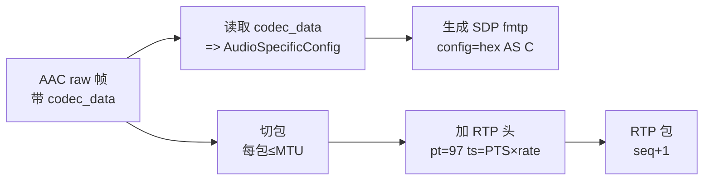

# rtpmp4apay

> 项目内位置：音频 RTSP 出口的 RTP 打包器。命名 `pay1`，与视频 `pay0` 对偶；
> gst-rtsp-server 自动把两者合并到同一个 SDP，客户端拉一次拉到双流。

## 1. 基本信息

| 项 | 值 |
|---|---|
| 分类 | **Payloader（RTP）** |
| 所在插件 | `gstreamer1.0-plugins-good`（`rtp`） |
| 全名 | `RTP MPEG4 audio payloader` |

`rtpmp4apay` 把 AAC 帧按 **RFC 3640 mpeg4-generic** 模式打成 RTP 包。
SDP 行示例：

```
a=rtpmap:97 mpeg4-generic/48000/2
a=fmtp:97 streamtype=5; profile-level-id=15; mode=AAC-hbr; \
   config=1190; SizeLength=13; IndexLength=3; IndexDeltaLength=3
```

### Pad 端口能力

- **sink**：`audio/mpeg, mpegversion=4, stream-format=raw, framed=true`，
  必须带 `codec_data`（来自 aacparse）。
- **src**：`application/x-rtp, media=audio, clock-rate=<rate>, encoding-name=mpeg4-generic`。

### 关键属性

| 属性 | 类型 | 默认 | 说明 |
|---|---|---|---|
| `pt` | int | `96` | RTP payload type；项目设 `97`，与 `pay0` 的 `96` 错开 |
| `mtu` | int | `1400` | UDP MTU；项目显式设 1400 兼容大多数 NAT |
| `name` | string | (auto) | 元素名；项目设 `pay1`（gst-rtsp-server 第二路约定名） |

### 使用举例

```bash
# 单测：RTP 包打到本地 UDP 端口
gst-launch-1.0 audiotestsrc ! voaacenc ! aacparse \
  ! rtpmp4apay pt=97 ! udpsink host=127.0.0.1 port=5004
```

### 项目内用法

```cpp
// pipeline_builder.cpp::append_branch_audio_main_rtp
"enc_at. ! queue ... ! rtpmp4apay name=pay1 pt=97 mtu=1400"
```

`name=pay1` 是关键：gst-rtsp-server 在 media-configure 阶段扫描 `payX` 元素
名按 idx 收集，自动生成对应的 SDP media 行。`pay0` 视频 + `pay1` 音频 是
约定的多媒体打包契约。

## 2. 内部工作原理与数据流程



核心机制：

1. **codec_data 转 SDP**：从 caps 里读出 ASC，转成 hex 串放进 fmtp `config=`。
   这是接收端唯一的"AAC 解码用 SR/profile"信息源。
2. **AAC 帧切包**：单 AAC 帧通常 < MTU，一帧一包。极少数高码率 + 5.1 通道
   会切多包，按 RFC3640 fragmentation 处理。
3. **RTP 时间戳**：`ts = PTS × clock-rate`；clock-rate 与 AAC sample rate 一致
   （48k 时 ts 单位 = 1/48000 秒）。

## 3. 性能开销与其他补充

### 性能特征

- **CPU**：< 0.1%。
- **延迟**：0（同步）。
- **内存**：每包临时 ~MTU。

### 与 rtpopuspay 的对比

| 维度 | rtpmp4apay | rtpopuspay |
|---|---|---|
| 编码 | AAC | Opus |
| RFC | RFC 3640 mpeg4-generic | RFC 7587 |
| SDP fmtp 复杂度 | 高（config/SizeLength...） | 低（一两个字段） |
| 客户端兼容 | 通吃 | 主流但部分老设备无 |
| 项目默认 | ✅ | 备选 |

### gst-rtsp-server 的 pay 命名约定

- `pay0`：第一路媒体（项目里是 H.264）。
- `pay1`：第二路媒体（项目里是 AAC）。
- `payN`：理论上可以无限扩展，每路自动出现在 SDP。

PT（payload type）用 96/97/98... 也是行业惯例（>= 96 是动态 PT 区间）。

### 常见坑

1. **不接 aacparse 直接接 rtpmp4apay** → fmtp `config=` 缺失，VLC 解码失败。
2. **pt 与 pay0 冲突** → 两路 RTP 包在同一会话里 PT 重复，少数客户端会 demux 错。
   项目用 96(H.264) + 97(AAC) 不踩。
3. **mtu 太大（>1500）** → 走过路由器后 IP 分片，丢一片整包丢；保 1400 安全。
4. **clock-rate 不是 48k**：rtpmp4apay 自动从 caps 取，但客户端可能不接受
   非 8k/16k/22.05k/32k/44.1k/48k 的速率。项目默认 48k 不踩。
