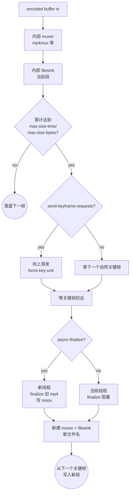

# splitmuxsink

> 项目内位置：[branch:record] 终端，名称 `rec_sink`，按时间切片录制 MP4。

## 1. 基本信息

| 项 | 值 |
|---|---|
| 分类 | **Sink（容器封装 + 文件切片）** |
| 所在插件 | `gst-plugins-good`（`multifile`） |
| 全名 | `Split-Muxer Sink` |
| 作用 | 内置一个 muxer + filesink，按时间/字节/事件触发 **在容器边界** 自动切换到下一个文件 |

`splitmuxsink` 解决的问题：
直接用 `mp4mux ! filesink` 不能边录边切（mp4mux 关流时才写 moov 索引），
强行切会得到一堆"打不开"的 mp4 半成品。
`splitmuxsink` 内部维护 muxer，每次到切片点会**先 finalize 当前 mp4（写好 moov）再开新文件**，
保证每一段都是独立可播放的合规 mp4/mov。

### Pad 端口能力

- **video sink**（pad name 模板：`video`）：编码后流，常见 `video/x-h264` `video/x-h265` `video/x-vp9`。
- **audio_%u**：编码后音频流（项目暂未用）。
- **subtitle_%u**：字幕流（项目暂未用）。
- 输入必须是 muxer 能吃的 caps；mp4mux 同时支持 H.264/H.265，因此 muxer-factory=mp4mux 能通吃。

### 关键属性

| 属性 | 类型 | 默认 | 项目值 | 说明 |
|---|---|---|---|---|
| `location` | string | — | `<dir>/%Y%m%d_%H%M%S_%05d.mp4` | 文件名模板，**必含 `%d` 占位符**（强制） |
| `muxer-factory` | string | `mp4mux` | `mp4mux` | 内部 muxer，可换 `matroskamux`/`mpegtsmux` 等 |
| `max-size-time` | uint64 (ns) | 0 | `segment_sec * 1e9` | 每段最长时间，**0=不按时间切** |
| `max-size-bytes` | uint64 | 0 | 0 | 每段最大字节，**0=不按大小切** |
| `max-files` | uint | 0 | 0 | 自带 LRU；0=不限。项目用自家后台线程做 LRU，更可控 |
| `send-keyframe-requests` | bool | `false` | `true` | 切片前向上游发 force-key-unit，让切点对齐 GOP |
| `async-finalize` | bool | `false` | `true` | 切片时另开线程写 moov，避免阻塞主流 |
| `mux-overhead` | double | 0.02 | （默认） | 估算 mux 开销，让按字节切更准确 |
| `start-index` | uint | 0 | （默认） | `%d` 占位符起始值 |
| `use-robust-muxing` | bool | `false` | （默认） | mp4 robust 模式（写更多 moov 备份），项目无需 |

### 切片触发条件（任一即可）

| 触发 | 行为 |
|---|---|
| `max-size-time` 到达 | 在最近一个**关键帧**处切（不会切中 GOP 中间） |
| `max-size-bytes` 到达 | 同上 |
| 应用层发 `splitmuxsink-split-now` 信号 | 立即切，等下一关键帧 |
| 应用层发 `split-after`（每次发一次切一次） | 强制切 |
| 收到 EOS | 关闭当前文件，不再开新的 |

> **关键点**：所有切片都对齐 GOP 关键帧。如果上游 GOP 远大于 `max-size-time`，
> 实际段长会比 `max-size-time` 长；项目里 `gop=30 / fps=30 = 1s`，远小于 `segment_sec=60`，
> 完全没问题。

### 使用举例

```bash
# 60 秒一段，h264 → mp4
gst-launch-1.0 videotestsrc \
  ! x264enc key-int-max=30 ! h264parse \
  ! splitmuxsink location=/tmp/rec_%05d.mp4 \
                 muxer-factory=mp4mux \
                 max-size-time=60000000000

# 一旦磁盘到 1GB 总量，自带 LRU 滚动
gst-launch-1.0 ... ! splitmuxsink location=/tmp/r_%05d.mp4 max-files=20
```

### 项目内用法

```cpp
// pipeline_builder.cpp - append_branch_record
os << " enc_t. ! queue name=rec_queue max-size-buffers=0 max-size-bytes=0"
   <<                  " max-size-time=2000000000"     // 2s 缓冲（不丢帧）
   << " ! valve name=rec_valve drop=true"
   << " ! splitmuxsink name=rec_sink"
   <<       " muxer-factory=mp4mux"
   <<       " max-size-time=" << seg_ns
   <<       " send-keyframe-requests=true"
   <<       " async-finalize=true"
   <<       " location=/tmp/vm_iot_rec_unused_%05d.mp4";
```

运行时由 [Record](../../src/branches/record/record.cpp) 模块控制：

```cpp
// 把占位 location 改写为最终模板（含目录 + strftime + %05d）
g_object_set(sink, "location", "/tmp/vm_iot/records/%Y%m%d_%H%M%S_%05d.mp4", nullptr);
// 然后通过 valve 控制录与不录
g_object_set(valve, "drop", FALSE, nullptr);
```

## 2. 内部工作原理与数据流程



核心步骤：

1. **buffer 收到**：转发给内部 muxer。muxer 把样本累积到内部状态（mp4 的 mdat 在不断追加）。
2. **检查切点条件**：每个 buffer 都检查 `running-time` 与 `bytes-written`。
3. **请求关键帧**（如果开了 `send-keyframe-requests`）：发一个 GST_EVENT 上溯到 encoder，
   让其立刻插入 IDR 帧，缩短切点等待时间。
4. **finalize 当前段**：muxer 把 moov、mvhd 等元数据 box 追加写到文件尾，filesink 关闭 fd。
   `async-finalize=true` 时这个动作在另起的线程做，主流不阻塞。
5. **切到新段**：strftime 渲染当前时间替换 `%Y%m%d` 等模板，sprintf 替换 `%05d`，
   open 新 fd，新建一个 muxer 实例（mp4mux 是有状态的，必须新实例）。
6. **EOS**：finalize 当前段后不开新文件，让流自然结束。

## 3. 性能开销与其他补充

### 性能特征

- **CPU 开销**：mux 本身极低（H.264 ES → mp4 box 拼装是纯 memcpy + 元数据写入）；
  finalize 写 moov 时有一次 seek + write，几十 KB 量级。
- **磁盘 IO**：边录边写，非阻塞。`async-finalize` 让切片瞬间不掉帧。
- **延迟**：切片瞬间约 1~2 帧的可见 GOP 边界对齐延迟（取决于 GOP 长度）。

### 为什么 record 副线 queue 用 no-leaky 大缓冲？

- 截图副线允许丢帧（`leaky=downstream`），录像不行——丢一帧 mp4 就花屏甚至 demuxer 报错。
- 本项目录像 queue 配置：
  ```
  queue max-size-buffers=0 max-size-bytes=0 max-size-time=2000000000
  ```
  即只按 2 秒"时间"上限缓冲，不限 buffer 数和字节数；磁盘 IO 抖动不超过 2s 就不会丢帧。

### 磁盘容量管理

本项目当前 **不在 daemon 内做 LRU 滚动**，留给运维侧通过外部脚本（cron / logrotate）按文件数或总容量清理 `cfg.dir`。
如果未来需要内嵌 LRU，可优先考虑 splitmuxsink 自带的 `max-files`（只支持"段数"约束）。

### `mp4mux` vs `qtmux` vs `matroskamux`

- `mp4mux`：兼容性最好，浏览器/手机/桌面都能直接放。**项目默认。**
- `qtmux`：苹果系，对 Final Cut / macOS 友好；Linux/Android 也能放。
- `matroskamux`：mkv，对断电/坏块更鲁棒（无需 moov 索引）。
  适合不可控掉电的嵌入式录像，但浏览器原生不支持。

### 常见坑

1. **`location` 没 `%d` 占位符**：splitmuxsink 启动期就报错"location pattern needs an integer placeholder"。
   即便用了 strftime 也必须再追加一个 `%d`，本项目自动在 `.ext` 前插 `_%05d`。
2. **`max-size-time` 单位是纳秒**：写 60 秒就是 `60 * 1000000000`，写错就成了"60ns 切一次"。
3. **不开 `send-keyframe-requests` + 大 GOP**：切片要等下个自然关键帧，可能比预期晚很多。
4. **录像不能丢帧**：副线 queue 切忌用 `leaky=downstream`，否则 mux 时序错乱，最终 mp4 demux 出错。
5. **finalize 期间 SIGKILL**：进程被强杀时，最后一段 mp4 没写 moov，**整段都打不开**。
   可改用 `use-robust-muxing=true` 或者切成 `matroskamux`，前者更通用。
7. **media unprepared 时如果还在录**：`splitmuxsink` 没收到 EOS 直接 unref，最后一段同样可能损坏。
   项目通过 `media-unprepared` 信号清理 valve，让这类异常时段尽量短（默认 60s 内）。
