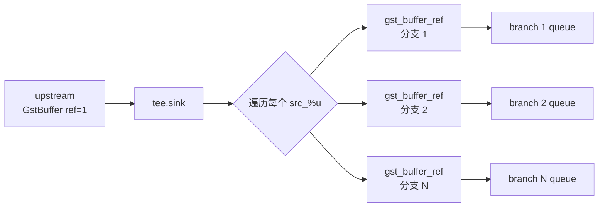

# tee

> 项目内位置：主链与副线的分流锚点，元素名 `t`。

## 1. 基本信息

| 项 | 值 |
|---|---|
| 分类 | **Generic（分流）** |
| 所在插件 | `gstreamer-core`（`coreelements`） |
| 全名 | `1-to-N pipe fitting` |
| 是否核心 | 是，core element，永远可用 |

`tee` 把单一输入分发到 N 条输出分支，**所有分支看到的都是同一份 GstBuffer**，
通过引用计数实现零拷贝。是 GStreamer 实现"一路源 → 多路输出"的标准方式。

### Pad 端口能力

- **sink**：1 个，always pad，接受任意 caps（`ANY`）。
- **src_%u**：request pad，按需创建，每个分支一个。caps 与 sink 一致。

### 关键属性

| 属性 | 类型 | 默认 | 说明 |
|---|---|---|---|
| `silent` | bool | `true` | 不发 messages |
| `pull-mode` | enum | `never` | `never` / `single` / `force`，下游 pull 模式时用 |
| `allow-not-linked` | bool | `false` | 某分支没接东西时是否允许（项目用 false 早报错） |
| `has-chain` | bool | `true` | 是否处理 chain（推流场景必为 true） |

### 使用举例

```bash
# 同时预览 + 录像
gst-launch-1.0 v4l2src ! videoconvert \
  ! tee name=t \
    t. ! queue ! autovideosink \
    t. ! queue ! x264enc ! mp4mux ! filesink location=out.mp4
```

`tee name=t` 后面用 `t.` 引用回去拉新分支，每条分支起头**必须**有 queue。

### 项目内用法

```text
... ! videoconvert ! tee name=t
    t. ! queue ... ! x264enc ... ! rtph264pay name=pay0   ← 主线（推流）
    t. ! queue ... ! valve   ... ! jpegenc ! multifilesink ← 副线（截图）
```

代码：

```cpp
os << " ! videoconvert ! tee name=t";
append_branch_main(os, src_fmt, enc, is_h265);   // t. ! queue ! ...
append_branch_snapshot(os);                      // t. ! queue ! valve ! ...
```

按"一个 source、多种用途"的设计原则，未来要加录像 / AI 推理副线，就再加一个
`t. ! queue ! ...` 分支。

## 2. 内部工作原理与数据流程



核心机制：

1. **chain 函数**：上游 push 一个 buffer 到 sink pad，`tee` 在 chain 里
   遍历所有 active 的 src pad。
2. **buffer 共享**：每条分支收到的是同一块 GstBuffer 指针，仅引用计数 +1。
   像素数据**只存一份**，零拷贝。
3. **写时复制（COW）**：若某条分支下游想修改 buffer（`gst_buffer_make_writable`），
   会自动 copy。项目里所有分支只读 buffer（编码/jpeg/落盘都不改原帧），
   完全零拷贝。
4. **背压**：`tee` 自身**不缓冲**。如果某条分支 queue 满，`tee` 的 chain 会阻塞，
   反向阻塞 sink，最终阻塞上游。**所以每条分支必须立刻接 `queue` 隔离线程。**

## 3. 性能开销与其他补充

### 性能特征

- **CPU 开销几乎为 0**：只是 ref 一下指针。
- **内存**：buffer 不复制，没有额外内存。
- **延迟**：0。

### 为什么每条分支必须有 `queue`？

- `tee` 是同步的：所有分支在 sink 的 streaming thread 里串行 push，
  最慢的分支决定整体节奏。
- `queue` 在分支头部把数据丢进队列、用独立线程消费，**让分支彼此异步**。
- 没 queue 时：截图分支磁盘慢一下，主线 RTP 也跟着抖。

### `leaky=downstream max-size-buffers=2` 是必需配置

- 主线和副线共用源端 buffer，副线一旦消费速度不够，buffer 会堆积，
  最终 tee.chain 阻塞、整条流卡住。
- `leaky=downstream` 让 queue 满时丢"最新进来的"或"最旧的"buffer，**绝不阻塞上游**。
- 项目所有分支 queue 都用 `leaky=downstream max-size-buffers=2`。

### 添加新分支的标准步骤

1. 在 `pipeline_builder.cpp` 写个 `append_branch_<name>()` 函数。
2. 第一行必须是：`t. ! queue max-size-buffers=2 leaky=downstream`。
3. 第二行（可选）放一个 `valve drop=true`，运行时按需开启。
4. 接后续业务元素，命名 `<branch>_<role>`（如 `record_valve`、`record_sink`）。
5. 在 `build()` 里调一次新函数。

### 常见坑

1. **`allow-not-linked=false` + 漏接分支**：会启动失败（"src_0 has no peer"）。
   项目用 false 是为了"早失败、早暴露漏拼分支"。
2. **某分支动态改 caps**：tee 的所有分支共享 sink caps，分支内不能用 caps filter
   改 caps 影响协商；如果想下游不同 caps，要先 `videoconvert` / `videoscale` 转再 caps。
3. **buffer 写改未 make_writable**：直接修改会污染其他分支的视图，必须
   `gst_buffer_make_writable`，但这就触发 copy，零拷贝优势没了。
