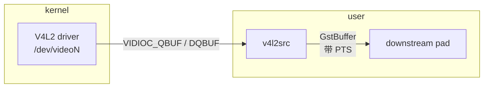

# v4l2src

> 项目内位置：pipeline 最上游，[`pipeline_builder.cpp`](../../src/pipeline/pipeline_builder.cpp) 的 `build_source_segment()`。

## 1. 基本信息

| 项 | 值 |
|---|---|
| 分类 | **Source（视频源）** |
| 所在插件 | `gst-plugins-good`（`video4linux2` 模块） |
| 全名 | `Video (video4linux2) Source` |
| Rank | `primary` |
| 平台 | 仅 Linux（macOS / Windows 不可用） |
| 线程 | 内部独立 streaming thread 推数据 |

`v4l2src` 是 GStreamer 在 Linux 上访问 V4L2 字符设备（`/dev/videoN`）的标准 source，
负责把内核 V4L2 驱动暴露的视频流拉到 GStreamer 域内。

### Pad 端口能力

- **src pad（唯一一个）**：always pad，方向 src，模式 push。
- 支持的 caps 由设备实际能力决定，常见三类：
  - `image/jpeg, width, height, framerate`（MJPEG）
  - `video/x-raw, format=YUY2/NV12/I420/..., width, height, framerate`
  - `video/x-h264, ...`（极少 UVC 摄像头支持硬编 H.264）
- 项目实测 UTM aarch64 + 虚拟摄像头：`image/jpeg, 1280x720, 60/1`。

### 关键属性

| 属性 | 类型 | 默认 | 说明 |
|---|---|---|---|
| `device` | string | `/dev/video0` | 设备节点路径 |
| `do-timestamp` | bool | `false` | **强烈建议开**，让每帧带上 `GST_CLOCK_TIME`，下游同步、RTP 打时戳全靠它 |
| `io-mode` | enum | `auto` | `mmap`（默认） / `userptr` / `dmabuf` / `dmabuf-import`，UTM 环境用 `auto` 即可 |
| `num-buffers` | int | `-1` | `-1` 表示无限；调试时设小值跑几帧 |
| `pixel-aspect-ratio` | fraction | 由 caps 决定 | 一般不动 |

### 使用举例

```bash
# 直接预览 MJPEG
gst-launch-1.0 v4l2src device=/dev/video0 do-timestamp=true \
  ! image/jpeg,width=1280,height=720,framerate=60/1 \
  ! jpegdec ! videoconvert ! autovideosink

# 列出某个设备的全部 caps
gst-device-monitor-1.0 Video/Source
```

### 项目内用法

```text
v4l2src device=/dev/video0 do-timestamp=true
  ! image/jpeg,width=1280,height=720,framerate=60/1
  ! jpegparse ! jpegdec ! ...
```

上游 caps 不是写死的，由 [`v4l2_prober`](../../src/probe/v4l2_prober.h) 探测设备能力 +
[`caps_ranker`](../../src/probe/caps_ranker.h) 排序后挑出最优组合再回填。

## 2. 内部工作原理与数据流程



执行流程：

1. **协商 caps**：`gst_base_src_negotiate()` 阶段，`v4l2src` 调 `VIDIOC_ENUM_FMT` /
   `VIDIOC_ENUM_FRAMESIZES` / `VIDIOC_ENUM_FRAMEINTERVALS` 拿到设备能力，与下游
   peer pad 求交集后挑一组。
2. **申请缓冲区**：`VIDIOC_REQBUFS` 申请一组（默认 4~8 个）DMA buffer，按
   `io-mode` 决定是 `mmap`（最常见）还是 `userptr` / `dmabuf`。
3. **入队/出队**：循环 `VIDIOC_QBUF`（把空 buffer 还给驱动）+ `VIDIOC_DQBUF`
   （从驱动取走填好数据的 buffer）。
4. **打包 GstBuffer**：把 V4L2 的 buffer 包成 `GstBuffer`，
   `do-timestamp=true` 时用 `GST_ELEMENT_CLOCK(self)` 当前时间作 PTS，否则
   用驱动给的 `v4l2_buffer.timestamp`（USB 摄像头不可靠）。
5. **下游 push**：通过 src pad push 给下一个 element，
   返回后再 `QBUF` 把 buffer 还回去。

关键点：`v4l2src` 自带一个 streaming thread，下游的处理速度直接影响
出队速度——一旦下游卡住，驱动队列填满就会**丢帧**（V4L2 默认行为）。

## 3. 性能开销与其他补充

### 性能特征

- **CPU 开销极低**：绝大部分情况下只是搬指针 + 元数据，不复制像素。
- **内存路径**：`mmap` 模式下 buffer 直接由驱动映射到用户空间，零拷贝；
  `userptr` 用户分配、`dmabuf` 跨进程共享，UTM 环境一般用不到。
- **延迟下限** ≈ 1 帧时间 + 驱动队列深度 × 帧时间。所以在低延迟场景下，
  下游 queue 一定要 `leaky=downstream max-size-buffers=2`，避免堆积。

### 常见坑

1. **`do-timestamp=false` 导致 RTSP 卡死**
   不打时戳时下游 mux/pay 拿不到 PTS，要么 muxer 报 `non-monotonic dts`，要么
   `rtph264pay` 算 RTP timestamp 错乱、客户端无画面。**项目里强制打开**。

2. **MJPEG 偶发坏帧**
   USB 摄像头会丢 SOI/EOI 字节，直接接 `jpegdec` 会触发 `BAD_HUFFMAN_CODE` 整流崩。
   项目里用 `jpegparse ! jpegdec` 容错。

3. **caps 没配齐导致协商失败**
   只写 `width=1280,height=720` 不写 `framerate` 会让 v4l2src 选默认 fps
   （某些设备是 5fps），看起来"卡顿"。项目里强制三件套：
   `format/media_type + width + height + framerate`。

4. **多进程独占设备**
   `/dev/videoN` 默认独占打开，已经被 `cheese` / 浏览器占用时
   `v4l2src` 会以 `Device or resource busy` 失败。

### 排错命令

```bash
# 看设备能力
v4l2-ctl --device=/dev/video0 --list-formats-ext

# 看当前在用的格式
v4l2-ctl --device=/dev/video0 --get-fmt-video

# 查谁占用了设备
fuser /dev/video0
```
