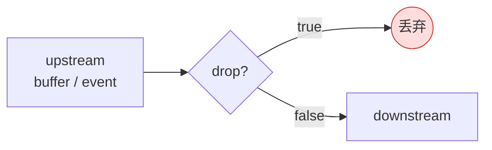

# valve

> 项目内位置：截图副线开头，元素名 `snap_valve`，默认 `drop=true`（关闭）。

## 1. 基本信息

| 项 | 值 |
|---|---|
| 分类 | **Generic（流控 / 闸阀）** |
| 所在插件 | `gst-plugins-good`（`debugutilsbad` 或 `coreelements` 视版本） |
| 全名 | `Valve element` |
| 作用 | 像水阀一样按需开/关数据流，不影响其他分支 |

`valve` 是一段"可控开关"：`drop=true` 时所有 buffer / event 全丢，
`drop=false` 时透传。开关可在运行时通过 `g_object_set` 切换，**不影响 pipeline 状态**，
不会导致协商重做。是项目实现"按需截图 / 按需录像"的主要手段。

### Pad 端口能力

- **sink / src**：均 `ANY`，对 caps 完全透明。

### 关键属性

| 属性 | 类型 | 默认 | 说明 |
|---|---|---|---|
| `drop` | bool | `false` | 是否丢弃数据。**唯一一个有用属性。** |
| `drop-mode` | enum | `drop-all` | 部分版本支持 `drop-all` / `forward-sticky-events`，控制是否透传 sticky events |

### 使用举例

```bash
# 默认关，运行时再开
gst-launch-1.0 videotestsrc \
  ! valve name=v drop=true \
  ! videoconvert ! autovideosink

# 在另一个进程：g_object_set(v, "drop", FALSE, NULL) 触发开闸
```

### 项目内用法

```text
t. ! queue ... ! valve name=snap_valve drop=true
    ! videoconvert ! jpegenc ! multifilesink name=snap_sink ...
```

代码：

```cpp
os << " t. ! queue max-size-buffers=2 leaky=downstream silent=true"
   << " ! valve name=snap_valve drop=true"
   << " ! videoconvert ! jpegenc quality=90"
   << " ! multifilesink name=snap_sink ...";
```

运行时上层 C++（Snapshot 模块）操作流程：

```cpp
GstElement* valve = gst_bin_get_by_name(bin, "snap_valve");
GstElement* sink  = gst_bin_get_by_name(bin, "snap_sink");

// 修改下一个 jpg 路径
g_object_set(sink, "location", "/tmp/snap_001.jpg", nullptr);

// 开闸 1 帧 → 关
g_object_set(valve, "drop", FALSE, nullptr);
// ... 等 multifilesink 发出 element message 表示该帧已写完 ...
g_object_set(valve, "drop", TRUE,  nullptr);
```

## 2. 内部工作原理与数据流程



核心实现非常简单：

1. **chain 函数**：进来一个 buffer，看 `drop` 属性：
   - `true`：直接 `gst_buffer_unref` 返回 `GST_FLOW_OK`，下游什么也收不到。
   - `false`：`gst_pad_push` 透传到下游。
2. **event 处理**：
   - 默认 `drop=true` 时连 sticky events（CAPS / SEGMENT / TAG）都丢，
     所以**第一次开闸时下游会重新收到一批 sticky events**，下游基本无感（valve
     内部会重新发送缓存的 sticky events）。
3. **状态切换**：`drop` 属性是 GObject 属性，写它只是改一个原子 bool，
   不会发送任何 caps/event，不影响 pipeline 状态。

## 3. 性能开销与其他补充

### 性能特征

- **CPU 开销 ≈ 0**：开闸时纯透传（一次 push），关闸时直接 unref。
- **内存**：无内部缓冲，开闸时不滞留任何 buffer。
- **延迟**：0。

### 与"动态加分支"的对比

要在运行时开关一条分支，常见两种做法：

| 方案 | 优点 | 缺点 |
|---|---|---|
| 用 `valve` 常驻 + 切 `drop` | 切换无 caps 协商、无 IO 抖动 | 关闸时分支 element 仍在运行（CPU 几乎 0） |
| `gst_pad_link` / `gst_bin_remove` 动态拼接 | 关闸时彻底无开销 | 需要 pad probe / blocking 切换，复杂、易错 |

直播 + 截图这类高频开关场景**强烈推荐 valve**，简单可靠。

### 配合 `multifilesink` 的"单帧抓取"模式

- `multifilesink location=/tmp/snap_%05d.jpg` 默认按帧累加序号。
- 项目里每次截图前先写 `location=/tmp/snap_xxx.jpg`，开 valve 一帧、关。
- `post-messages=true` + `async=false` 让 sink 写完后发 element message，
  上层据此回调"截图完成"。

### 常见坑

1. **关闸期间 caps 变化**：上游若改了 caps（比如 GL shader 切换某种引发 caps 变化的设置），
   再开闸时 valve 会把缓存的 sticky events 一次性发给下游，下游 element 必须能
   handle "突如其来的 CAPS event"。jpegenc / multifilesink 都没问题。
2. **drop-mode 选错**：旧版本 valve 关闸时连 EOS 都丢，导致下游一直挂着；
   新版默认会透传 EOS / FLUSH。
3. **跟 queue 顺序**：必须是 `queue ! valve`，不能 `valve ! queue`。
   原因：valve 关闸时 queue 仍在被 tee 喂数据；如果 valve 在前，关闸丢的是
   "tee 刚 ref 出来的 buffer"，会因为消费速度不匹配而把 tee 阻塞（在没有 leaky 的
   queue 时）。**项目所有副线都是 `queue(leaky=downstream) ! valve`。**
4. **不要用 valve 控制延迟**：valve 没有"开闸 N 秒"或"放过 N 帧"的语义，
   做这种控制要靠 pad probe 自己计数。
