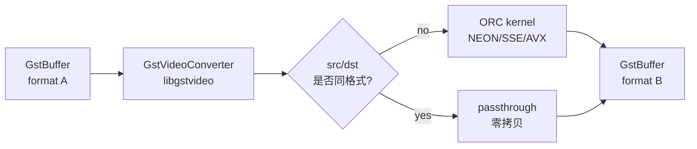

# videoconvert

> 项目内位置：在主链上出现 4 次，是色彩空间/像素格式的"通用胶水"。

## 1. 基本信息

| 项 | 值 |
|---|---|
| 分类 | **Filter / Converter** |
| 所在插件 | `gst-plugins-base`（`videoconvertscale` 或老版 `videoconvert`） |
| 全名 | `Colorspace converter` |
| 底层加速 | `liborc`（运行时 SIMD：NEON / SSE3 / AVX2） |
| Rank | `none`（手动放置） |

`videoconvert` 在 `video/x-raw` 域内做**像素格式 + 色彩空间**互转，不改分辨率、
不改帧率。常见职责：YUY2↔I420、I420↔NV12、YCbCr↔RGB、bt601↔bt709。

### Pad 端口能力

- **sink / src**：均为 `video/x-raw`，支持几乎所有原生 raw 格式
  （I420/NV12/NV21/YV12/YUY2/UYVY/RGB/BGR/RGBA/BGRA/Y444/Y42B/...）。
- 协商时按下游 caps 反向选输入；如下游也是 video/x-raw 通配，可能直接 passthrough。

### 关键属性

| 属性 | 类型 | 默认 | 说明 |
|---|---|---|---|
| `dither` | enum | `bayer` | 输出位深变浅时的抖动算法 |
| `chroma-mode` | enum | `full` | 色度上采样质量 |
| `matrix-mode` | enum | `full` | YCbCr↔RGB 的矩阵模式 |
| `n-threads` | uint | `0`(auto) | 并行线程数，0 = 跟核心数 |
| `qos` | bool | `true` | 是否响应下游 QoS（丢帧降级） |

通常**不需要调**，让 ORC 自动选最优路径即可。

### 使用举例

```bash
# 强制把摄像头 YUY2 转成 I420 给 x264 喂
gst-launch-1.0 v4l2src ! video/x-raw,format=YUY2 \
  ! videoconvert ! video/x-raw,format=I420 \
  ! x264enc ! fakesink
```

### 项目内用法

```text
... ! videoconvert ! videoscale ! videorate
    ! video/x-raw,format=I420,...
    ! videoconvert
    ! glupload ! ... ! gldownload
    ! videoconvert
    ! tee name=t
        ! queue ! videoconvert ! video/x-raw,format=I420 ! x264enc ...
        ! queue ! valve ! videoconvert ! jpegenc ...
```

为什么出现这么多次？

| 位置 | 作用 |
|---|---|
| jpegdec 之后 | jpegdec 输出可能是 `I420` 也可能是 `Y444`/`RGB`，统一转到下游 caps 期望的 `I420` |
| GL 上传前 | GL 段一般要求 `RGBA`，与系统内存里的 `I420` 之间要做一次转换 |
| GL 下载后 | `gldownload` 出来通常仍是 `RGBA`，要转回 `I420` 走编码 |
| 编码 / jpegenc 前 | tee 之后再保险一次，防止上游 caps 协商把分支搞成奇怪格式 |

## 2. 内部工作原理与数据流程



核心步骤：

1. **构造 `GstVideoConverter`**：caps 确定后，按源/目标格式选一组 ORC kernel：
   - 同色度采样：直接搬数据（I420↔YV12 之类）。
   - 不同色度采样：上采样/下采样（YUV422→YUV420）。
   - 色彩空间不同：先 RGB↔YCbCr 矩阵乘，再做色度采样。
2. **逐行处理**：ORC 在 ARMv8 上展开成 NEON 向量指令（一拍 16/32 字节），
   行间不依赖、可多线程。
3. **passthrough**：协商下来如果 input/output caps 完全一致，进入 passthrough，
   `transform()` 直接 ref input buffer 透传，零拷贝。

## 3. 性能开销与其他补充

### 性能特征

- **同格式 passthrough**：~0 开销。
- **I420 ↔ NV12**：只换色度交错方式，~0.3ms / 1080p（NEON）。
- **YCbCr ↔ RGB**：要做矩阵乘 + 色度上/下采样，~1~2ms / 1080p。
- **大幅色彩空间转换（YUY2→RGBA）**：~3ms / 1080p。

### 为什么链路上出现这么多 `videoconvert` 不会拖性能？

- 同 caps 下绝大多数会 passthrough，CPU 开销可忽略。
- 实际只有 GL 段两侧（I420↔RGBA）的两次会真正干活。
- 这是 GStreamer 的惯用做法："多写无害，让协商系统决定到底转不转"。

### 与 `videoscale` / `videorate` 的关系

- `videoconvert` 只管**格式**，不动尺寸。
- 下一档 `videoscale` 只管**尺寸**，不动格式。
- `videorate` 只管**帧率**，不动格式和尺寸。
- 三者通常成组出现，给链路最大兼容性，让协商自动决定哪步真正干活。

### 常见坑

1. **多线程导致 buffer 共享冲突**：`n-threads` 默认 auto 已经够好，自己设值可能反而抖。
2. **强制 caps 选了不存在的色彩矩阵**：例如下游写死 `colorimetry=bt2020`，
   `videoconvert` 会按 bt2020 矩阵转，肉眼颜色会变；项目里不指定 colorimetry，由 caps 协商决定。
3. **上下游都通配 raw**：会导致 negotiation 不定，建议在关键节点用具体 caps filter 锁住。
