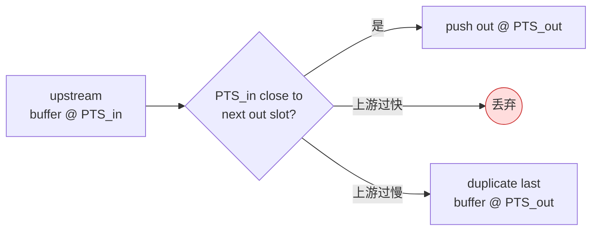

# videorate

> 项目内位置：face 副线节流元素，把 30 fps 主线降采样到 5 fps 给 facedetect 用，避免重复同帧检测白白烧 CPU。

## 1. 基本信息

| 项 | 值 |
|---|---|
| 分类 | **Filter / Effect / Video（帧率适配）** |
| 所在插件 | `gst-plugins-base`（`videoratecore`） |
| 全名 | `Video rate adjuster` |
| 作用 | 通过丢帧 / 复制帧的方式，把上游帧率"对齐"到下游 caps 要求的固定 framerate |

`videorate` 不做插帧 / 重定时计算，只是一个时间轴对齐工具：

- 上游帧率 > 下游目标 → **丢帧**；
- 上游帧率 < 下游目标 → **复制最近一帧**直到对齐；
- 上游帧率 = 下游目标 → 透传 + 仅修正 PTS 偏差。

下游目标帧率通过紧跟其后的 capsfilter `video/x-raw,framerate=N/1` 协商得出，
这是项目里 face 副线"5 fps 检测"的关键。

### Pad 端口能力

| Pad | 能力 | 备注 |
|-----|------|------|
| **sink** | `video/x-raw, framerate=[1/1, MAX]` 或 `image/jpeg` 等多媒体类型 | 支持的范围由编译时枚举决定 |
| **src** | 与 sink 对偶 | 真正的 framerate 由下游 capsfilter 固定 |

### 关键属性

| 属性 | 类型 | 默认 | 说明 |
|---|---|---|---|
| `silent` | bool | true | false 时打印每帧丢/复制日志（调试用） |
| `drop-only` | bool | false | 仅丢帧不复制；上游慢时下游产帧也会变慢 |
| `average-period` | uint64 | 0 | 平滑统计窗口；0 表示不平滑 |
| `max-rate` | int | -1 | 限制 src 端最大帧率；与 capsfilter 等价但更显式 |
| `skip-to-first` | bool | false | 起始时跳到首个 buffer 的 PTS（默认从 0） |

### 使用举例

```bash
# 把 30 fps 摄像头降到 5 fps
gst-launch-1.0 v4l2src ! videoconvert \
  ! videorate ! video/x-raw,framerate=5/1 \
  ! autovideosink
```

### 项目内用法

face 副线（30 fps → 5 fps）：

```text
queue (leaky=downstream) ! valve(face_valve)
   ! videorate ! video/x-raw,framerate=5/1
   ! videoconvert ! video/x-raw,format=RGB
   ! facedetect ...
```

face preview 副线（30 fps → 2 fps，节流 JPEG 编码与传输成本）：

```text
queue ! videorate ! video/x-raw,framerate=2/1
   ! videoconvert ! facedetect display=true
   ! videoconvert ! jpegenc ...
```

代码位置：[`pipeline_builder.cpp::append_branch_face`](../../src/pipeline/pipeline_builder.cpp)。

## 2. 内部工作原理与数据流程



执行步骤：

1. `videorate` 内部维护"下一个输出时间点 next_t"，间隔为 `1 / 下游 framerate`。
2. 每来一个 upstream buffer：
   - 若 `PTS_in` 跟 `next_t` 最近 → push 出去（PTS 改写为 `next_t`），更新 next_t。
   - 若 `PTS_in` 远早于 `next_t`（上游过快） → 丢弃。
   - 若 `PTS_in` 远晚于 `next_t`（上游过慢） → 复制最近 buffer 填补，直到追上。
3. EOS 时 push 一次最后缓存的 buffer 后转发 EOS。

## 3. 性能开销与其他补充

### 性能特征

- **CPU 开销 ≈ 0**：纯指针 + 计数；无像素级处理。
- **内存**：仅缓存一个上游 buffer 用于复制；微不足道。
- **延迟**：理论上引入 ≤ 1 帧延迟（要等下一个时间点）。

### 与"在源端直接限速"的对比

| 方案 | 优点 | 缺点 |
|---|---|---|
| `v4l2src ! framerate=5/1` capsfilter | 摄像头硬件直接限速，零拷贝 | 摄像头不一定支持任意分母 |
| `tee + videorate`（本项目） | 主线仍跑 30 fps 推流，副线独立节流 | 多一次时间轴对齐 |

主线 RTSP 必须 30 fps（用户视觉流畅度），副线 5 fps（OpenCV 检测频率），
所以项目里**只能选 tee + videorate 方案**——主线副线分别取自己想要的帧率。

### 常见坑

1. **drop-only 用错**：副线慢消费时如果设了 drop-only，整段副线就废了。
   本项目让 videorate 默认（丢 + 复制），与 valve / queue leaky 协同保护主线。
2. **上游 framerate 是变量（VFR）**：摄像头偶尔抖动到 28 fps，
   videorate 会自动均摊到 5 fps；不要手动写 `caps,framerate=30/1` 硬约束上游。
3. **跟 valve 顺序**：`valve ! videorate` 比 `videorate ! valve` 更省 CPU
   ——valve 先丢弃 buffer，videorate 不用做任何事。本项目按这个顺序拼。
4. **0 fps 的特殊语义**：cfg `face.rate.fps_limit=0` 时项目逻辑是"不限速"，
   PipelineBuilder 直接不插入 videorate；不是把 0 当 caps 写进去。
