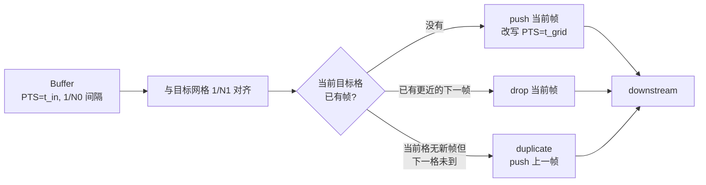

# videorate

> 项目内位置：`videoscale` 之后，把任意上游帧率重采样到固定的目标帧率。

## 1. 基本信息

| 项 | 值 |
|---|---|
| 分类 | **Filter / Converter（帧率）** |
| 所在插件 | `gst-plugins-base`（`videorate`） |
| 全名 | `Video rate adjuster` |
| 工作方式 | **不做时间内插**，只丢帧或重复帧 |

`videorate` 把上游不规则/不目标的帧率，**通过丢帧（drop）或重复帧（duplicate）**
对齐到下游 caps 上的目标 framerate。它不会"合成"中间帧，无法做真正的运动平滑。

### Pad 端口能力

- **sink / src**：`video/x-raw`（同格式同尺寸），caps 主要差异在 `framerate`。

### 关键属性

| 属性 | 类型 | 默认 | 说明 |
|---|---|---|---|
| `silent` | bool | `true` | 关闭后会发统计信息 |
| `drop-only` | bool | `false` | 只允许丢帧，不允许复制（保 PTS 精度） |
| `max-rate` | int | -1 | 输出最大帧率（FPS 上限） |
| `skip-to-first` | bool | `false` | 起始时间不固定从 0，跳到第一个 buffer |
| `average-period` | uint64 | 0 | 0 = 即时；>0 时按时间窗平均率 |
| `drop-duplicate-frames` | bool | `false` | 上游送来重复帧时丢弃（与 imagefreeze 配合） |
| `in` / `out` / `dup` / `drop` | uint64 | 只读统计 |

### 使用举例

```bash
# 把任意帧率的源转成 30fps
gst-launch-1.0 v4l2src ! videoconvert ! videorate \
  ! video/x-raw,framerate=30/1 ! autovideosink

# 上游 60fps 强制限到 15fps（drop-only 保证不重复）
gst-launch-1.0 ... ! videorate drop-only=true max-rate=15 ! ...
```

### 项目内用法

```text
... ! videoconvert ! videoscale ! videorate
    ! video/x-raw,format=I420,width=1280,height=720,framerate=30/1 ! ...
```

`v4l2src` 实测以 60fps 出 MJPEG，下游编码 / 推流都要 30fps，
`videorate` 把 60 对齐到 30（每两帧丢一帧）。

## 2. 内部工作原理与数据流程



核心思想：

1. **目标时间网格**：根据 src caps 上 `framerate=N1/D1` 算出每帧目标 PTS：
   `t_k = k * D1/N1` 秒。
2. **决策**：每来一个 input buffer，比较它的 PTS 与当前网格点 / 下一网格点：
   - 如果它比上一帧更接近当前格 → 用它替换上一帧候选；
   - 如果下一格点已到、当前格还没出帧 → 把"最佳候选"输出；
   - 如果上游慢（下一格还没新帧）→ 输出上一帧的拷贝（duplicate）。
3. **PTS 重写**：输出帧的 PTS/DURATION 严格对齐网格点。
4. **不做插值**：`videorate` **永远不会**生成"两帧之间的中间帧"，无运动平滑能力。
   想要插帧得用 GPU 上的 `vapostproc` / `nvvidconv` / 自实现。

## 3. 性能开销与其他补充

### 性能特征

- **CPU 开销几乎为 0**：只比较 PTS、ref/unref buffer，不动像素数据。
- **内存**：内部缓存最多 2 个 buffer（"上一帧 + 当前帧"做选择），常驻可忽略。
- **延迟**：最多 1 帧延迟（要等到下一帧来才能确定上一帧是否输出）。

### 为什么 60→30 选 `videorate` 而不是 caps 直接谈？

- 上游 `v4l2src` 协商时已经按设备能力定下 `60/1`，下游 `x264enc` 又要 `30/1`，
  caps 两边谈不拢。中间的 `videorate` 起到"翻译器"作用。
- 让 `v4l2src` 直接出 30fps 也行，但很多 USB 摄像头只在最高分辨率下支持高帧率，
  低帧率下抖动反而更严重。项目策略是"按设备最强能力采，软件降到目标帧率"。

### 常见坑

1. **不写明确 `framerate`**：下游 caps 写 `framerate=[ 0/1, 60/1 ]` 这种范围，
   `videorate` 不会做任何对齐，等于白接。**项目里写死 `30/1`** 才生效。
2. **PTS 不连续 / 倒退**：上游 `do-timestamp=false` 让 PTS 来自不可靠时钟，
   `videorate` 可能持续 drop 全部帧。项目里强制 `do-timestamp=true`。
3. **30→60 复制帧**：码流里会出现连续两帧完全相同，下游 `x264enc` 会编出
   超低 cost 的 P 帧（几乎 0 字节），看似"省码率"实则浪费 GOP 结构。
4. **`drop-only=true` + 上游慢**：上游 fps < 目标时不会复制帧，会输出**比目标更慢**
   的流，下游 `videorate` 之后的帧率不是 caps 写的那个。注意只在"上游一定 ≥ 目标"时用。

### 与 GOP 配合

`x264enc` 的 `key-int-max` 单位是"帧"，目标 fps=30 + key-int-max=30 = 1s 一个 IDR。
`videorate` 必须把帧率稳稳钉在 30，否则 IDR 间隔会随上游波动。
