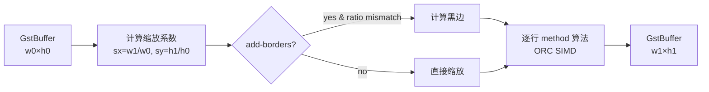

# videoscale

> 项目内位置：jpegdec 之后的"统一 caps"组合中，与 `videoconvert` / `videorate` 并列。

## 1. 基本信息

| 项 | 值 |
|---|---|
| 分类 | **Filter / Converter（分辨率）** |
| 所在插件 | `gst-plugins-base`（`videoscale` 或合并后的 `videoconvertscale`） |
| 全名 | `Video scaler` |
| 底层加速 | `liborc`（NEON / SSE / AVX） |

`videoscale` 在 `video/x-raw` 域内做**纯分辨率缩放**：宽和高变化，
格式与帧率保持不变。

### Pad 端口能力

- **sink / src**：`video/x-raw, format ∈ {绝大多数 raw 格式}`。
- 不支持透明色键、不解码压缩流。

### 关键属性

| 属性 | 类型 | 默认 | 说明 |
|---|---|---|---|
| `method` | enum | `bilinear` | 缩放算法：`nearest` / `bilinear` / `4-tap` / `lanczos` / `bilinear2` / `sinc` / `hamming` / `kaiser` / ... |
| `add-borders` | bool | `true` | 宽高比不一致时是否加黑边（letterbox） |
| `sharpness` / `sharpen` | double | 1.0 / 0.0 | 部分 method 下可调锐度 |
| `n-threads` | uint | 0(auto) | 并行线程数 |

### method 选择经验

| method | 速度 | 质量 | 推荐场景 |
|---|---|---|---|
| `nearest` | ★★★★★ | ★ | 调试 / 极低开销缩略图 |
| `bilinear` | ★★★★ | ★★★ | **默认**，实时流推流首选 |
| `4-tap` | ★★★ | ★★★★ | 离线转码 / 录像 |
| `lanczos` | ★★ | ★★★★★ | 高质量截图 / 海报 |

### 使用举例

```bash
# 1080p → 720p
gst-launch-1.0 videotestsrc ! video/x-raw,width=1920,height=1080 \
  ! videoscale ! video/x-raw,width=1280,height=720 \
  ! autovideosink
```

### 项目内用法

```text
... ! videoconvert ! videoscale ! videorate
    ! video/x-raw,format=I420,width=1280,height=720,framerate=30/1 ! ...
```

放在 `jpegdec` 之后是为了应对 `caps_ranker` 选到的尺寸 ≠ 期望尺寸的情况：
能力清单里若没有 `1280x720@30`，会退而求其次（如选 `1920x1080@30`），
然后由 `videoscale` 缩回标准尺寸，让下游编码参数稳定。

## 2. 内部工作原理与数据流程



核心步骤：

1. **协商目标尺寸**：从 src caps 上的 `width/height` 取目标尺寸。
2. **逐分量缩放**：YUV 4:2:0 时，Y 平面按完整尺寸缩，U/V 按一半尺寸缩。
3. **算法实现**（以 `bilinear` 为例）：
   - 对每个目标像素 (x,y)，反映射回源 (x',y')，取 `floor` 得四邻像素，
     按小数部分做线性插值。
   - ORC 把内层循环展开成 NEON 向量乘加指令（一次算 8 像素）。
4. **letterbox**：若 `add-borders=true` 且宽高比不一致，左右或上下补黑像素。

## 3. 性能开销与其他补充

### 性能特征（aarch64 NEON / 单核）

| 操作 | bilinear | 4-tap | lanczos |
|---|---|---|---|
| 1080p → 720p I420 | ~1.5ms | ~5ms | ~12ms |
| 720p → 1080p I420 | ~3ms | ~9ms | ~20ms |
| 同尺寸 (passthrough) | ~0 | ~0 | ~0 |

> 项目实际很多时候命中 passthrough（caps_ranker 通常已选到 1280x720），
> 此时 `videoscale` 几乎零开销。

### 为什么要保留 `videoscale` 即使大部分时候不缩？

- 探测降级时（设备不支持 1280x720）能自动接住，避免整条流协商失败。
- caps 不变化时进入 passthrough，**养着没成本**。

### 常见坑

1. **`add-borders=false` + 宽高比变化**：图像会被拉伸变形。项目默认 `true`。
2. **`method=lanczos` 在 720p@30 上 CPU 占用直接拉满**：除非离线转码，不要选。
3. **caps 不锁高/宽其中一个**：如 caps 只写 `width=1280` 不写 `height`，
   `videoscale` 会选最近能用值，可能不是你想要的。项目里两个都写。
4. **DAR vs PAR 混淆**：摄像头有时给 PAR=1:1，有时给 PAR=10:11，
   `videoscale` 会按 DAR 校正；如果想严格按像素，明确写 `pixel-aspect-ratio=1/1`。
