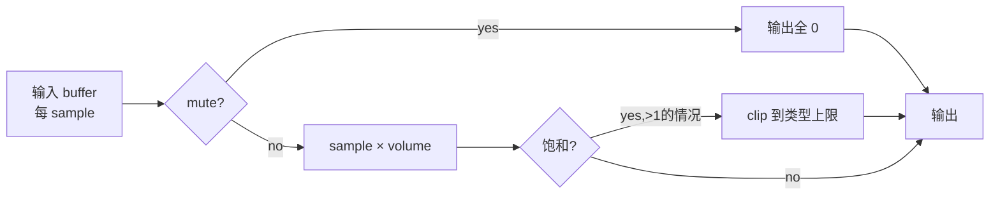

# volume

> 项目内位置：音频主链上的"音量旋钮"。命名为 `aud_vol`，由 `AudioBranch::set_volume`
> 在 PLAYING 状态下热调；启动期值取自 `cfg.audio.control.volume`。

## 1. 基本信息

| 项 | 值 |
|---|---|
| 分类 | **Filter（音频，元素属性热控）** |
| 所在插件 | `gstreamer-base`（`volume`） |
| 全名 | `Audio volume` |

`volume` 元素是一个简单的乘法器：每个采样点乘以一个 `volume` 浮点系数。
本身不做格式/通道转换，要求 sink/src caps 完全相同。

### Pad 端口能力

- **sink / src**：`audio/x-raw,format={S16LE,S24LE,S32LE,F32LE,F64LE,...}` 全集。
- 不限通道数，逐通道独立缩放。

### 关键属性

| 属性 | 类型 | 默认 | 说明 |
|---|---|---|---|
| `volume` | double | `1.0` | 缩放系数，通常 [0.0, 10.0]；>1 是放大可能溢出，由用户负责 |
| `mute` | bool | `false` | 内部静音（与 valve.drop 不同：mute 仍发包但全 0） |

`volume` 与 `mute` 都是 `GST_PARAM_MUTABLE_PLAYING`：PLAYING 状态下任意时刻 set。

### 使用举例

```bash
# 把音量调到一半
gst-launch-1.0 audiotestsrc ! volume volume=0.5 ! autoaudiosink
```

### 项目内用法

```cpp
// pipeline_builder.cpp
os << " ! volume name=aud_vol volume=" << c.audio.control.volume;

// audio_branch.cpp::set_volume
g_object_set(vol, "volume", static_cast<gdouble>(v), nullptr);
```

热控路径：

```
iotcamctl audio volume 1.5
   ─► ControlChannel::handle_audio
       ─► AudioBranch::set_volume
           ─► g_object_set(aud_vol, "volume", 1.5, nullptr)
               ─► volume 元素下一帧起按 1.5 倍乘
```

切换瞬间因为是逐 buffer 应用，不会爆音。

## 2. 内部工作原理与数据流程



核心机制：

1. **逐 sample 乘法**：单核 SIMD 加速（GLIB 检测 NEON/SSE）。
2. **饱和裁剪**：S16LE 时 volume>1 可能溢出，元素内部做 clip 到 INT16_MAX。
3. **PLAYING 热切**：GObject set 立即生效，不需要状态机切换，无停顿。
4. **链路定位**：项目放在 `audioconvert ! audioresample` **之后**、`valve` 之前。
   先把格式/采样率收敛再调音量是惯例（先 normalize 再 scale）。

## 3. 性能开销与其他补充

### 性能特征

- **CPU 开销极低**：48k/2ch ≈ 192KB/s，乘法操作 < 0.1% CPU。
- **延迟**：0（同步元素）。
- **内存**：原地修改，不额外分配。

### 与 valve（aud_valve）的角色分工

| 元素 | 静音方式 | 是否发 RTP 包 |
|---|---|---|
| `volume volume=0` | 输出全 0 sample | 是（仍编码 + 打 RTP） |
| `valve drop=true`  | 整个 buffer 丢弃 | 否（编码器收不到 PCM，无 RTP） |

项目静音命令 `audio mute on` 走 valve 而不是 volume，原因：

- 真正不发包，省带宽。
- 接收端 RTCP 看到 stream 暂停，行为更明确。
- 反正音量已经是独立的旋钮，没必要让 mute 二选一。

### 常见坑

1. **volume>1 + S16LE 输入** → clip 后波形截顶，听起来失真；属于设计内行为。
2. **set 太快（>1000 次/秒）** → GObject signal 抖动；项目命令通过 FIFO 节流，
   一般 ms 级，不踩。
3. **跨进程改 volume** → GStreamer 单进程内属性，跨进程要走 ControlChannel FIFO。
