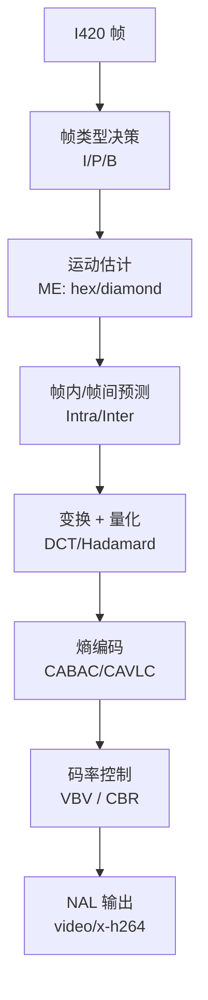

# x264enc

> 项目内位置：[branch:main] 的核心，负责 H.264 实时软编。

## 1. 基本信息

| 项 | 值 |
|---|---|
| 分类 | **Encoder（视频）** |
| 所在插件 | `gst-plugins-ugly`（`x264`） |
| 全名 | `x264 H.264 encoder` |
| 底层库 | [libx264](https://www.videolan.org/developers/x264.html) |
| 平台 | 全平台软编 |

`x264enc` 是 GStreamer 对 libx264 的封装，纯软件 H.264 编码。
是**质量/码率/CPU 三角平衡**最好的开源软编器之一，尤其在 zerolatency 模式下，
是直播软编的黄金标准。

### Pad 端口能力

- **sink**：`video/x-raw, format ∈ { I420, YV12, Y42B, Y444, NV12, ... }`
  （**最常用 I420**，其他要 libx264 编译时开 high422/high444 profile）。
- **src**：`video/x-h264, stream-format ∈ { byte-stream, avc }, alignment ∈ { au, nal }`，
  默认 `byte-stream / au`，profile/level 由参数推导。

### 关键属性（项目重点）

| 属性 | 类型 | 默认 | 项目值 | 说明 |
|---|---|---|---|---|
| `bitrate` | uint (kbps) | 2048 | `4000` | 目标码率 |
| `tune` | flags | none | `zerolatency` | **直播必开**：禁 lookahead、禁 B 帧、增加 IDR、关闭 mb-tree |
| `speed-preset` | enum | `medium` | `ultrafast` | 速度 vs 质量。直播只能选 superfast/ultrafast |
| `key-int-max` | uint | 60 | `30` | GOP 最大长度（帧），`30` ≈ 30fps × 1s |
| `bframes` | uint | 0 | `0` | B 帧数。直播零延迟必须 0 |
| `pass` | enum | `cbr` | （默认） | CBR / VBR / CQP，CBR 最稳 |
| `byte-stream` | bool | `false` | （默认 false，但下游 caps 会改） | 输出格式 |
| `vbv-buf-capacity` | uint (ms) | 600 | （默认） | VBV 缓冲，越小码率越平、瞬时质量波动越大 |
| `option-string` | string | "" | (空) | 直接传 libx264 高级参数（如 `nal-hrd=cbr`） |

### `speed-preset` 速查

`ultrafast → superfast → veryfast → faster → fast → medium → slow → slower → veryslow → placebo`

直播零延迟下，`ultrafast` 与 `superfast` 是常见选择：

| preset | 720p@30 CPU | 同码率画质 |
|---|---|---|
| ultrafast | ~30%（aarch64 单核） | 略糊 |
| superfast | ~50% | 清晰一档 |
| veryfast  | ~80% | 再清晰一档，吃满核风险 |

### `tune=zerolatency` 包含的内部改动

- `--bframes 0`、`--rc-lookahead 0`、`--sync-lookahead 0`
- `--sliced-threads 1`、`--mb-tree 0`
- `--scenecut 0`（不允许场景切换插额外 IDR，避免码率突刺）

### 使用举例

```bash
# 直播软编最小例子
gst-launch-1.0 videotestsrc \
  ! video/x-raw,format=I420,width=1280,height=720,framerate=30/1 \
  ! x264enc tune=zerolatency speed-preset=ultrafast bitrate=4000 key-int-max=30 bframes=0 \
  ! h264parse ! filesink location=out.h264
```

### 项目内用法

```cpp
// pipeline_builder.cpp - encoder_str("x264")
os << "x264enc"
   << " tune=zerolatency"
   << " speed-preset=ultrafast"
   << " bitrate=" << e.bitrate_kbps     // 默认 4000
   << " key-int-max=" << e.gop          // 默认 30
   << " bframes=" << e.bframes;         // 默认 0
```

入参 caps 提前在主线分支锁好：

```cpp
os << " ! videoconvert ! video/x-raw,format=" << src_fmt    // I420
   << " ! " << enc_str
   << " ! h264parse config-interval=1"
   << " ! rtph264pay name=pay0 pt=96 mtu=1400";
```

## 2. 内部工作原理与数据流程



核心步骤（每帧）：

1. **帧类型决策**：根据 `key-int-max` / `scenecut` / `tune=zerolatency` 决定本帧是
   IDR / I / P。`bframes=0` 时不会出 B 帧。
2. **运动估计 + 模式决策**：在前一帧（重建图）上找最佳预测块。`ultrafast`
   把 ME 简化到最低（diamond + 1 个 ref frame）。
3. **变换/量化**：对残差做 4×4 / 8×8 整数 DCT，按 QP 量化。CBR 模式下 QP 由
   码率控制器逐 macroblock 调整。
4. **熵编码**：`profile=baseline` 走 CAVLC，`main/high` 走 CABAC（`ultrafast`
   会强制 CAVLC，更快但压缩率低）。
5. **VBV 控制**：维护一个虚拟缓冲区，保证码率长时间内向 `bitrate` 收敛、
   瞬时不超过 `vbv-buf-capacity`。
6. **NAL 切片**：输出一组 NAL（SPS/PPS/SEI/VCL slices），按 `byte-stream` 或
   `avc` 形式打包。

## 3. 性能开销与其他补充

### 性能特征（aarch64 NEON，单核）

| 配置 | CPU | 码率 | 画质（PSNR @ 4Mbps） |
|---|---|---|---|
| ultrafast + zerolatency + 720p30 | ~30% | 4Mbps 稳 | 36~38 dB |
| superfast + zerolatency + 720p30 | ~55% | 4Mbps 稳 | 38~40 dB |
| medium（非实时） | 单核打满 + 落后 | 编码慢于实时，会丢帧 | — |

> UTM aarch64 4 vCPU 实测：`ultrafast + zerolatency + 4Mbps + 720p30` 单核占用约 30%，
> 其余三核空闲，留给 GL / RTSP / 业务足够余量。

### 关键参数怎么选

- **bitrate**：720p30 流畅清晰下限 ~2Mbps，舒适 4~6Mbps，画质优先 8Mbps+。
- **GOP / key-int-max**：直播一般 1~2s（30~60 帧）。GOP 越大压缩率越高，
  但断网恢复 / 客户端 seek 越慢。项目选 30，1s 一个 IDR。
- **bframes**：直播必为 0；离线录像可调到 2~3 节省码率。

### 与备选编码器的对比（项目支持矩阵）

| Backend | 算法 | 速度 | 兼容性 | 项目默认 |
|---|---|---|---|---|
| **x264enc** | H.264 | 快 | 最好 | ✅ |
| openh264enc | H.264 | 中 | 好（BSD 友好） | 备选 |
| x265enc | H.265 | 慢（即使 ultrafast） | 客户端兼容性参差 | 备选 |

UTM aarch64 不支持 vaapi/nvenc/v4l2m2m，所以**没有硬编后端**。

### 常见坑

1. **`speed-preset=medium` + zerolatency**：libx264 内部会按 `medium` 跑但 lookahead 关掉，
   质量下降明显，速度也没省太多。**preset 与 tune 要配套**，直播请用 ultrafast。
2. **未锁 `format=I420` 喂奇怪格式**：libx264 在某些 build 下不支持 NV12/Y444，
   会协商失败。**项目主线显式 caps 锁 I420。**
3. **bitrate 单位**：`x264enc` 用 **kbps**，不是 bps。openh264enc 用 bps，注意区分。
4. **SPS/PPS 不周期出现**：x264enc 默认只在序列开头出一次 SPS/PPS，所以下游
   `h264parse config-interval=1` 是必需的，否则 RTSP 中途加入的客户端无 SPS/PPS。
5. **不要在 x264enc 后再用 videorate**：x264enc 已按输入帧编出 PTS，
   后再 videorate 会破坏 GOP 与 RTP 时间戳对齐。
