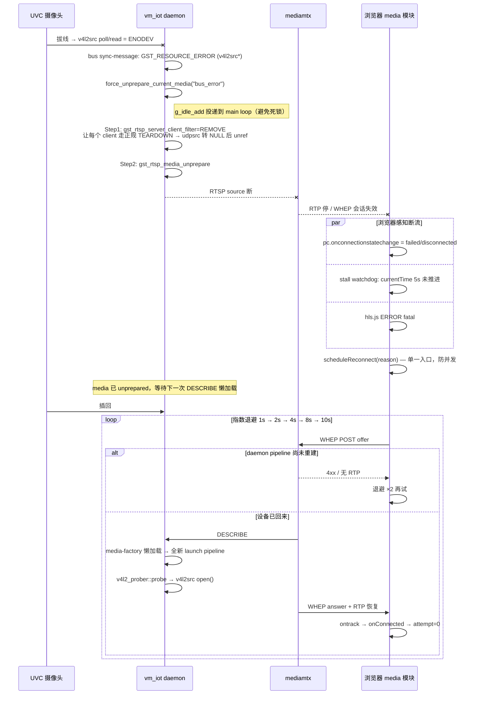

# UVC 热拔插自愈：daemon + client 协同方案

## 定位

`vm_iot` 在运行期支持 **UVC 摄像头随意拔插而不需重启 daemon、也不需要用户
手动刷新页面**。本方案覆盖：

- **daemon 侧**：`v4l2src` ERROR → 主动踢 client + unprepare media；避免
  `udpsrc dispose in PLAYING` 的 GStreamer-CRITICAL 噪音。
- **client 侧**（浏览器 `app.js`）：WebRTC / HLS 断流自动重连、指数退避、画面
  停滞看门狗、可见性协调。

链路：`UVC → v4l2src → gst-rtsp-server → mediamtx → 浏览器 <video>`。
中间任何一段断掉，都能在几秒内自愈到"画面继续"。

## 一、总体架构

daemon 感知设备"走了"（bus ERROR）主动拆 media，浏览器感知断流后指数退避重连触发 rtsp-server 懒重建 pipeline —— 分工明确，无需服务端轮询设备。



## 二、daemon 侧

### 2.1 组件矩阵

| 组件 | 位置 | 职责 |
|---|---|---|
| `RtspServer::s_on_sync_message` | [`rtsp_server.cpp`](../../src/rtsp/rtsp_server.cpp) | 从 bus 上截获 `v4l2src*` 的 `GST_RESOURCE_ERROR`，投递 unprepare |
| `RtspServer::force_unprepare_current_media` | 同上 | 幂等入口；`g_idle_add` 到 main loop 执行 |
| `RtspServer::s_do_unprepare_on_main` | 同上 | 先踢 client（filter=REMOVE），再 unprepare media |
| `v4l2_prober::probe_ex` / `device_accessible` | [`v4l2_prober.h/.cpp`](../../src/util/v4l2_prober.h) | 分类的 open 结果：`Ok / NoDevice / Busy / Permission / OpenFailed / NotSupported` |

### 2.2 恢复路径的分工

设备"走了"由 daemon 感知并**主动拆 media**；设备"回来了"**不由 daemon 主动
探测**——`gst-rtsp-server` 的 media-factory 本就是懒加载：下一个 client
DESCRIBE 到达时 pipeline 会全新 `launch`，`v4l2_prober::probe` 会重新
`open()` 到真设备。**真正驱动恢复的是 client 端的自动重连**（见 §3）。

|  | 触发时机 | 数据来源 | 动作 |
|---|---|---|---|
| **bus sync-message** | 设备**走了**的第一时间 | streaming 线程感知 ENODEV | 主动拆 media（先踢 client 再 unprepare） |
| **client 重连**       | 设备**回来了**的兜底路径 | 浏览器指数退避 WHEP/HLS | 触发 rtsp-server 懒 launch 新 pipeline |

> ⚠️ 反例警示：曾经存在过一个 `DeviceWatcher` 在 daemon 侧 1s 轮询
> `/dev/videoN` 尝试"主动感知设备回归"。已被移除——它只能打日志（media 早已
> unprepared），无法真正驱动恢复，反而让"watcher 就是恢复路径"这种误解成本
> 更高。**不要重新加回来**，除非同时能给出 client 完全离线情况下也需要恢复
> pipeline 的场景。

### 2.3 unprepare 的两步顺序（关键）

在 `s_do_unprepare_on_main` 里必须**先踢 client、再 unprepare media**：

```
Step 1: gst_rtsp_server_client_filter(server, &REMOVE_all, nullptr)
        └─ rtsp-server 在锁外挨个 gst_rtsp_client_close(client)
           └─ 每个 session 走 TEARDOWN
              └─ GstRTSPStreamTransport::set_active(FALSE)
                 └─ udpsrc / udpsink 先 gst_element_set_state(NULL)
                    └─ 然后才 g_object_unref  ✅

Step 2: gst_rtsp_media_unprepare(media)
        └─ 此时活跃 session 已清理，走"空 pipeline 拆除"路径  ✅
```

**如果反过来**（先 unprepare，session 兜底再清）：`udpsrc` 还在 `PLAYING` 就被
`g_object_unref` → 触发 `GStreamer-CRITICAL: Trying to dispose element udpsrcN,
but it is in PLAYING (locked)` 及配套的 `gst_mini_object_unref` 断言失败。
不会中止进程，但污染日志 + 极端情况漏一对 RTP/RTCP socket。

`s_client_filter_remove_all` 位于 rtsp-server 的内部锁保护段，**严禁**在里面
再调用 rtsp-server API（会重入死锁）；只需要 `return GST_RTSP_FILTER_REMOVE`。

### 2.4 幂等

`RtspServer::unprepare_pending_` 是 `std::atomic<bool>`。一次拔线会瞬发多条
`GST_MESSAGE_ERROR`（`resource-error code=9/14` + `stream-error code=1`），
`compare_exchange_strong` 保证只投递一次；`on_media_unprepared` 回调里清零，
下一轮 media 可再次触发。

### 2.5 关键日志

正常一次拔插期望的日志序列：

```
[E] pipeline resource-error from v4l2src src=v4l2srcN, scheduling media unprepare (auto-recovery)
[I] force_unprepare_current_media: already pending, skip (reason=bus_error)   ← 多条 ERROR 被幂等挡下
[W] force_unprepare_current_media: executing on main loop, reason=bus_error
[I] force_unprepare_current_media: closed N client(s) before unprepare        ← Step 1 生效
[I] gst_rtsp_media_unprepare returned TRUE                                    ← Step 2 生效
[I] media unprepared, cleanup done                                            ← media-unprepared 回调
```

设备插回后由下一次 client DESCRIBE 触发 media-factory 懒 launch，日志中会看到
新一轮 `v4l2_prober` 的 open + `pipeline reached PLAYING`。

**不应出现**：`GStreamer-CRITICAL: Trying to dispose element udpsrcN, but it is in PLAYING (locked)`。若出现说明 Step 1 没跑或跑晚了。

## 三、client 侧（浏览器 `app.js` 的 media 模块）

### 3.1 单一重连入口

所有断流触发源最终都调用 `media.scheduleReconnect(reason)`，避免多路并发同时
`startWHEP / startHLS`。已存在 pending timer 或正在 `connectCurrentMode`
时直接短路。

### 3.2 五条触发线

| # | 触发源 | 场景 |
|---|---|---|
| 1 | `pc.onconnectionstatechange` = failed/disconnected/closed | WebRTC 主状态机 |
| 2 | `pc.oniceconnectionstatechange` = failed | 某些 Chromium 只发这个 |
| 3 | `track.mute`（1.5s 缓冲后仍 mute）+ `track.ended` | track 级断流；1.5s 抵抗短暂丢包 |
| 4 | hls.js `Hls.Events.ERROR` fatal | 先 `startLoad` / `recoverMediaError` 自愈一次，仍不行才完整重连 |
| 5 | **stall watchdog**：`<video>.currentTime` 连续 5s 未推进 | **兜底**"连接假活但流已停" |

`stall watchdog` 是最关键的一条：**服务端 unprepare 那一瞬，浏览器不一定
立刻收到 ICE failed，但 `currentTime` 会停在原地**。没有它，触发 1/2/3/4
都失效时（比如 mediamtx 保持 SRTP 通道但没数据），页面会永久卡住。

### 3.3 指数退避

`1s → 2s → 4s → 8s → 10s`（`RECONNECT_BASE_MS=1000`, `RECONNECT_MAX_MS=10000`）。
`onConnected` 时 `reconnectAttempt=0` 归零；用户手动 `switchMode` 也归零。

### 3.4 pc 身份守卫

所有 `pc.on*` 回调里都做 `if (this.pc !== pc) return`。
**重连类代码最常踩的坑**：旧 pc 的 `closed` 事件在新 pc 建立后回来，把新连接
又拆掉。加了这行守卫后，旧 pc 的迟到事件被静默丢弃。

### 3.5 可见性协调

`document.visibilitychange`：切回 visible 且未连接时立即抢连一次（immediate
参数 = true，不动 attempt 计数）。抵消浏览器 hidden 时 `setTimeout` 被节流
到 ≥1s 造成的延误。

### 3.6 手动 vs 自动

`switchMode(mode, userInitiated=true)`：用户点按钮时清空 `reconnectAttempt` +
`cancelPendingReconnect()`，视为全新会话。自动重连路径永远不经过
`switchMode`，只走 `connectCurrentMode`，避免把重连状态一起清零。

## 四、参数总览

| 参数 | 值 | 说明 |
|---|---|---|
| `RECONNECT_BASE_MS` | 1000 | client 首次退避 |
| `RECONNECT_MAX_MS` | 10000 | client 退避上限 |
| `STALL_CHECK_MS` | 1000 | stall watchdog 轮询周期 |
| `STALL_LIMIT_SEC` | 5 | 连续多少秒 currentTime 未推进视为卡死 |
| track-mute 缓冲 | 1500 ms | mute 后再等这么久仍 mute 才重连 |

## 五、验证清单

拔插一次期望的用户体感：
1. 画面卡住 1~3 秒；
2. `overlay` 出现 `disconnected — retry in Xs` 或 `reconnecting webrtc… (attempt N)`；
3. 摄像头插回后 1~3 秒内画面自动恢复；
4. 日志面板可见 `reconnect: ... retry in ...` → `webrtc connected` 或 `hls connected`；
5. daemon 日志按 §2.5 序列出现；不应有 `udpsrc dispose in PLAYING` CRITICAL。

## 六、扩展点（不属于当前实现）

- **服务端自愈**（不依赖 client 重连）：在设备回归时跑一次内部 warm-up
  pipeline（`v4l2src ! fakesink` 短运行 500ms）证明设备真活，或引入
  `fallbackswitch`。当前不做，因为 client 重连已能覆盖 99% 的用户场景；如果
  未来出现"完全无 client 场景也需要恢复 pipeline"的需求，才值得重新引入
  设备轮询组件。
- **服务端主动推送 event 到 client**（比如通过现有 `/ws/events`），让 client
  收到 `device_absent` 立刻放弃当前 pending 请求。目前不做，避免耦合。

## 七、相关代码

- daemon：
  - [`rtsp_server.cpp`](../../src/rtsp/rtsp_server.cpp) — `s_on_sync_message`
    / `force_unprepare_current_media` / `s_do_unprepare_on_main` /
    `s_client_filter_remove_all`
  - [`v4l2_prober.h/.cpp`](../../src/util/v4l2_prober.h) — `ProbeStatus`
    / `probe_ex` / `device_accessible` 带 out_errno 重载
- client：
  - [`web/static/app.js`](../../web/static/app.js) — `media` 模块
    （`scheduleReconnect` / `stall watchdog` / `startWHEP` / `startHLS`）
